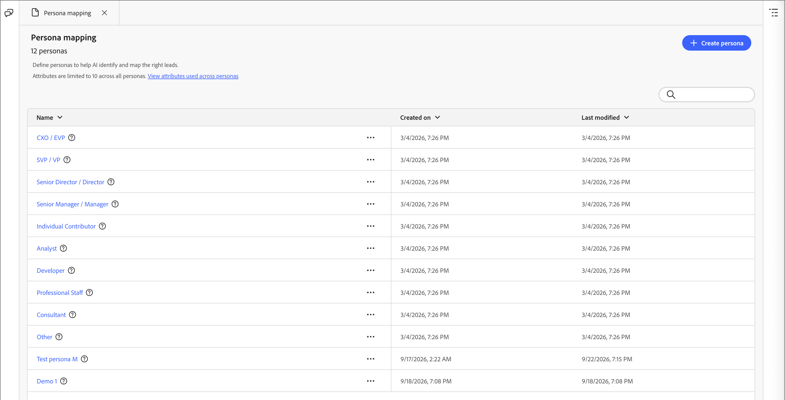

# Mappage de persona

Les personas sont un aspect clé dans une approche de marketing basé sur les comptes (ABM), car ils aident les spécialistes marketing à ajuster leurs stratégies en fonction des besoins, des préférences et des problèmes spécifiques des individus au sein des comptes cibles. Les marketeurs peuvent créer des profils détaillés pour chaque persona, y compris son passé, ses responsabilités, ses points faibles et ses canaux de communication préférés. Grâce à ces définitions, les administrateurs peuvent configurer des rôles en fonction des attributs de personne dans [!DNL Adobe Marketo Optimizer], de sorte que les listes de personnes et les parcours de personne puissent utiliser un filtrage rationalisé et cohérent qui capture ces rôles.

En [!DNL Marketo Optimizer], le mappage des rôles offre une fonctionnalité supplémentaire au-delà des conditions des modèles de rôle : vous pouvez filtrer les [listes de personnes](../audiences/people-lists.md) et [parcours de personne](../marketing/person-journeys.md) à l’aide de **[!UICONTROL Persona dérivé]** comme critère de filtrage. Un _persona dérivé_ est le persona déduit par le système pour un enregistrement de personne en évaluant ses attributs par rapport à toutes les définitions de persona configurées.

Définition des rôles et limites d’utilisation :

* Vous pouvez définir jusqu’à 20 personnes dans la liste _[!UICONTROL Mappage des personnes]_.
* Chaque personnage peut inclure jusqu’à cinq attributs dans sa définition.
* Pour tous les rôles définis, vous pouvez utiliser jusqu’à dix attributs de personne différents.

>[!BEGINSHADEBOX]

**Cas d’utilisation : variations d’intitulé de la fonction**

De nombreuses équipes marketing et commerciales utilisent les intitulés de poste pour identifier différentes personnes au sein d’un compte. Mais les titres des contacts peuvent être incohérents et utiliser de nombreuses variations pour des rôles similaires. Lors de la création de filtres de liste de personnes ou de conditions d’audience de parcours de personne, vous devrez peut-être définir chaque fonction associée possible pour un rôle donné. Vous pouvez simplifier ces définitions et regrouper des personnes ayant des titres de fonction similaires sous une seule persona déduite, que vous pouvez ensuite cibler en filtrant sur _La personne dérivée est le leadership_ au lieu de faire correspondre les valeurs des titres de fonction individuels.

>[!ENDSHADEBOX]

## Accéder aux personnages configurés {#access}

Ouvrez le panneau _Mappage de persona_ à partir de l’interface de conversation [chat](../agents/chat-interface.md) du collègue.

1. Dans le panneau de conversation, tapez `/persona-mapping` et appuyez sur **Entrée**.

   Il s’agit d’un raccourci de navigation répertorié sous **[!UICONTROL Ouvrir une page]** dans le menu barre oblique.

   {width="800" zoomable="yes"}

1. Coworker ouvre le panneau **[!UICONTROL Mappage de personas]** sous la forme d’un onglet d’espace de travail, affichant la liste des personas.

   À partir de ce panneau, vous pouvez [créer](#create-a-persona), [modifier](#edit-a-persona) ou [supprimer](#delete-a-persona) des personnages.

   La liste des personnages est organisée sous la forme d’un tableau présentant chaque nom de personnage, la date de création et la date de dernière modification. <!-- You can customize the displayed table by clicking the _Column settings_ (  ) icon in the top-right corner and selecting or clearing the column checkboxes. --> Vous pouvez réduire le panneau de conversation pour augmenter la taille du panneau _Mappage de persona_.

   {width="700" zoomable="yes"}

1. Pour accéder aux détails d’un persona, cliquez sur son nom.

### Personnages par défaut

La liste _Mappage de personas_ comprend dix personas par défaut définis en fonction de l’attribut de titre de la fonction. Vous pouvez modifier l’un de ces rôles par défaut en fonction des besoins de votre entreprise :

| Persona | Titres de poste |
| ------- | ---------- |
| PDG/PDG | PDG, DPI, directeur des technologies de l’information, directeur financier, vice-président exécutif de la stratégie |
| SVP/VP | Vice-président principal du marketing, vice-président directeur des ventes, vice-président directeur des opérations, vice-président directeur des produits, vice-président directeur informatique |
| Directeur principal/Directeur | Directeur de l’ingénierie, directeur principal des produits, directeur des finances, directeur du succès client |
| Gestionnaire principal | Responsable marketing principal, responsable informatique, responsable des opérations, responsable des ventes, responsable des ressources humaines |
| Contributeur Individuel | Responsable de compte, Ingénieur logiciel, Spécialiste marketing, Représentant du succès client |
| Analyste | Analyste commercial, Analyste des données, Analyste des études de marché, Analyste financier, Analyste des opérations |
| Développeur | Développeur front-end, Développeur back-end, Développeur full-stack, Développeur d’applications mobiles, Ingénieur DevOps |
| Personnel Professionnel | Spécialiste RH, Conseiller juridique, Responsable de la conformité, Chef de projet, Spécialiste des achats |
| Consultant | Consultant en gestion, conseiller en TI, consultant en processus d&#39;affaires, consultant en marketing |
| Autres | Spécialiste de l&#39;industrie, conseiller indépendant, consultant indépendant, expert en la matière |

### Filtrage de liste

Pour localiser la personne souhaitée, saisissez une chaîne de texte dans la barre de recherche pour faire correspondre les personnes par nom.

{width="680" zoomable="yes"}

## Créer une persona {#create-a-persona}

1. Cliquez sur **[!UICONTROL Créer une persona]**.

1. Saisissez un **[!UICONTROL Nom]** et un **[!UICONTROL Description]** uniques (facultatif) pour le persona.

   {width="680" zoomable="yes"}

1. Pour **[!UICONTROL Règles]**, sélectionnez les attributs à utiliser pour faire correspondre le persona.

   * Cliquez sur **[!UICONTROL Modifier les règles]**.

   * Dans la boîte de dialogue, cochez la case de chaque attribut à mapper (cinq au maximum).

     Vous pouvez personnaliser le tableau affiché en cliquant sur l’icône _Paramètres de colonne_ (  ) dans le coin supérieur droit.

     Pour filtrer la liste des attributs par nom, saisissez une chaîne de texte dans la barre de recherche. Vous pouvez également cliquer sur l’icône _Filtrer_ (  ) en haut à gauche pour filtrer la liste affichée par type, _Standard_ ou _Personnalisé_.

     {width="450" zoomable="yes"}

   * Cliquez sur **[!UICONTROL Terminé]**.

     Les attributs sélectionnés sont renseignés dans la section _[!UICONTROL Attributs de persona]_.

   * Pour chaque attribut, saisissez les valeurs séparées par des virgules que vous souhaitez mettre en correspondance pour l’attribut.

1. Cliquez sur **[!UICONTROL Créer une persona]**.

## Modifier une persona {#edit-a-persona}

Cliquez sur le nom du persona pour accéder aux détails du persona et les modifier.

Vous pouvez modifier le nom ou la description, ajouter des attributs ou mettre à jour les valeurs d’attribut. Cliquez sur **[!UICONTROL Soumettre]** une fois vos modifications terminées.

## Supprimer une persona {#delete-a-persona}

La suppression d’un persona le supprime de la liste _Mappage de personnages_ et il n’est plus disponible en tant que filtre de persona dérivé dans les listes de personnes ou les parcours de personnes.

1. Sur la page _[!UICONTROL Mappage de personas]_, recherchez le persona à supprimer.

1. En regard du nom, cliquez sur les points de suspension (**...**) et choisissez **[!UICONTROL Supprimer]**.

1. Dans la boîte de dialogue de confirmation, cliquez sur **[!UICONTROL Supprimer]**.

## Filtrer par persona dérivé {#derived-persona-filter}

Une fois les rôles configurés, [!DNL Marketo Optimizer] dérive un persona pour chaque enregistrement de personne en évaluant les attributs de l&#39;enregistrement par rapport aux mappages de persona définis. _Vous pouvez utiliser le résultat déduit (« Persona dérivé_) comme filtre lors de la définition de l’audience pour une liste de personnes ou un parcours de personnes.

Le filtre Persona dérivé apparaît dans le panneau de filtrage sous la catégorie **[!UICONTROL Attributs de personne]** avec d’autres attributs déduits tels que l’appartenance à un parcours.

### Listes de personnes

Pour cibler les personnes correspondant à un persona configuré spécifique lors de la gestion des listes de personnes, vous pouvez filtrer par persona dérivé.

**Liste statique — Ajouter des membres**

1. Ouvrez la liste statique et cliquez sur **[!UICONTROL Ajouter des personnes]** en haut à droite.

1. Dans la boîte de dialogue de filtrage, développez **[!UICONTROL Attributs de personne]** et faites glisser **[!UICONTROL Persona dérivé]** sur la zone de travail.

   Vous pouvez également saisir le nom du filtre dans le champ de recherche pour le localiser rapidement.

   {width="680" zoomable="yes"}

1. Dans la condition de filtre, choisissez **[!UICONTROL is]** et sélectionnez une ou plusieurs personnes dans la liste.

1. Cliquez sur **[!UICONTROL Terminé]** pour appliquer le filtre et qualifier les personnes correspondantes dans la liste.

**Liste dynamique — Définit les règles d&#39;appartenance**

1. Ouvrez la liste dynamique et sélectionnez l’onglet **[!UICONTROL Règles]**.

1. Cliquez sur **[!UICONTROL Modifier les règles]**.

1. Dans la boîte de dialogue de filtrage, développez **[!UICONTROL Attributs de personne]** et faites glisser **[!UICONTROL Persona dérivé]** sur la zone de travail.

   Vous pouvez également saisir le nom du filtre dans le champ de recherche pour le localiser rapidement.

1. Dans la condition de filtre, choisissez **[!UICONTROL is]** et sélectionnez une ou plusieurs personnes dans la liste.

1. Cliquez sur **[!UICONTROL Terminé]** pour enregistrer la règle.

   L’appartenance est automatiquement mise à jour lorsque les enregistrements de la personne sont évalués par rapport à la règle.

### Parcours de personne

Lorsque vous configurez l’audience d’un parcours de personne à l’aide d’une audience d’événement, vous pouvez utiliser les personas dérivées comme filtre de profil de personne afin de contrôler quelles personnes rejoignent le parcours.

1. Cliquez sur le nœud **[!UICONTROL Audience de la personne]** dans la zone de travail du parcours.

1. Dans le panneau des propriétés de nœud, sélectionnez **[!UICONTROL Audience de l’événement]** comme type d’audience.

1. Sous **[!UICONTROL Filtres de profil de personne]**, cliquez sur **[!UICONTROL Ajouter un filtre]**.

1. Développez **[!UICONTROL Attributs de personne]** et faites glisser **[!UICONTROL Persona dérivé]** sur la zone de travail du filtre.

   Vous pouvez également saisir le nom du filtre dans le champ de recherche pour le localiser rapidement.

   {width="680" zoomable="yes"}

1. Dans la condition de filtre, choisissez **[!UICONTROL is]** et sélectionnez une ou plusieurs personnes dans la liste.

   Seules les personnes dont la personnalité dérivée correspond aux valeurs sélectionnées peuvent entrer dans le parcours.

1. Cliquez sur **[!UICONTROL Enregistrer]** pour enregistrer les critères d’événement.
