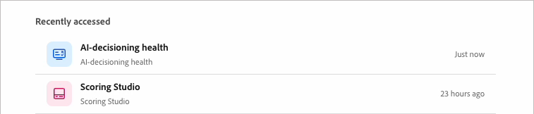

# Santé de la prise de décision par l’IA

L’intégrité de l’IA Decisioning vérifie les données qui alimentent la personnalisation dans [!DNL Adobe Marketo Optimizer]. Il rend compte de la couverture des prospects, de la classification des profils et de la richesse des histoires dans les catégories démographiques, thermographiques, technographiques et psychographiques. Il signale ensuite les données manquantes pour déterminer où commencer.

Utilisez l’intégrité de la prise de décision par l’IA pour voir quels flux de données proviennent de [!DNL Marketo Engage] et où se trouvent les lacunes. Combler ces lacunes améliore la façon dont [AI decisioning](./ai-decisioning.md) évalue et achemine chaque personne.

## Ouvrir l’intégrité de la prise de décision par l’IA {#open}

Ouvrez le rapport à partir de la page d’accueil ou de la conversation avec un collègue.

* Sur la page _Accueil_, sélectionnez la vignette **[!UICONTROL Intégrité de la prise de décision par l’IA]** dans la ligne Accès rapide . La carte se situe en tête de ligne et affiche le volume des histoires et la progression de la classification des personas, comme 929 histoires, dont 32 % sont classées persona.
* Dans la zone de conversation Collègue, demandez directement des informations sur vos données de personnalisation ou saisissez `/` et sélectionnez **[!UICONTROL Intégrité de la prise de décision par l’IA]**.

{width="600"}

Les deux chemins ouvrent le rapport dans l’espace de travail Collègue.

## Invites d’accueil et de suivi du chat {#chat-welcome}

L’ouverture de l’intégrité de la prise de décision par l’IA à partir du chat affiche un message de bienvenue, _[!UICONTROL *Bienvenue dans l’intégrité de la prise de décision par l’IA]_, un résumé des vérifications de rapport et une vignette pour ouvrir le rapport complet.

Sous la carte, sous _[!UICONTROL Que souhaitez-vous faire ensuite ?]_, l’intégrité de l’IA-decisioning suggère des invites de suivi en fonction des lacunes spécifiques de vos propres données. Par exemple, si 67,7 % de vos prospects ne sont pas classés par persona, une invite suggérée indique _Pourquoi 67,7 % des prospects ne sont-ils pas classés par persona ?_ Sélectionnez une invite suggérée, ou posez votre propre question, pour obtenir une réponse directe sans quitter le chat.

{width="800" zoomable="yes"}

## Présentation du rapport {#report-overview}

Le rapport Workspace s’ouvre avec une légende **[!UICONTROL Surlignages]** qui répertorie en langage clair les zones les plus fortes et les plus faibles de vos données. Par exemple, _Les données démographiques atteignent 100 % des prospects avec une forte profondeur de champ_ ou _67,7 % des prospects restent non classés dans une persona_. Une coche marque un résultat sain et un cercle coupé marque un espace.

À côté des faits saillants, un graphique radar trace la **[!UICONTROL Couverture]** dans six dimensions : démographique, firmographique, technographique, psychographique, personnelle et intentionnelle. Une zone ombragée plus grande signifie une couverture plus large.

## Classification de persona {#persona-classification}

La section **[!UICONTROL classification Persona]** indique combien de vos histoires sont classées dans une persona, par exemple : _300 sur 929 histoires classées · 32,3% classées · 67,7% non classées_. Une barre empilée ventile les histoires classées par personnage, avec une légende indiquant le nombre et le pourcentage de chaque histoire.

Sélectionnez un segment de persona pour ouvrir une carte détaillée avec des exemples de titres de poste pour ce personna. Par exemple, le segment **[!UICONTROL Autre]** _peut afficher : 272 articles/29,3 %_, avec des exemples tels que spécialiste du secteur, conseiller indépendant, consultant indépendant et expert en la matière.

## Couverture {#coverage}

La section **[!UICONTROL Couverture]** répertorie cinq catégories de données : démographiques, firmographiques, technographiques, psychographiques et intention et activité. Chaque catégorie affiche le pourcentage d&#39;histoires avec au moins un attribut disponible dans cette catégorie.

Sélectionnez une catégorie pour la développer, puis choisissez l’un des deux onglets suivants :

* **[!UICONTROL Attributs]** - Attributs regroupés par type, tels que les Détails personnels ou l’Emplacement sous données démographiques. Chaque attribut indique le nombre d’histoires ayant une valeur pour lui, par exemple : `firstName (906 stories)`.
* **[!UICONTROL Indicateurs]** - Écarts spécifiques à cette catégorie ou _Aucun indicateur ouvert sur cette catégorie_ lorsque la couverture est saine.

Utilisez le champ de recherche au-dessus de la liste des catégories pour accéder directement à une catégorie ou à un attribut par nom.

{width="800" zoomable="yes"}

## Indicateurs {#flags}

La section **[!UICONTROL Indicateurs]** au bas du rapport répertorie tous les écarts détectés dans toutes les catégories, classés par gravité :

* **[!UICONTROL Critique]** - Les lacunes qui bloquent une fonctionnalité, comme _la couverture technographique est de 0 % pour tous les prospects_.
* **[!UICONTROL Attention]** - Les lacunes qui réduisent l&#39;efficacité mais ne bloquent pas une capacité, comme _la couverture psychographique atteint seulement 7,2 % des prospects_.

Filtrez la liste par gravité, puis sélectionnez un indicateur pour le développer et lisez une explication en une phrase de son impact commercial, par exemple : _Les leads non classés ne peuvent pas entrer de parcours spécifiques à une personne ni recevoir de messages adaptés au rôle, ce qui réduit la pertinence de la campagne et les taux de conversion._

{width="800" zoomable="yes"}

## Récemment consultés {#recently-accessed}

Si vous ouvrez l’intégrité d’AI-decisioning puis que vous quittez le rapport, elle réapparaît sous **[!UICONTROL Récemment consulté]** dans l’espace de travail vide. Vous pouvez donc revenir au rapport sans revenir à la page d’accueil.

{width="500"}

>[!BEGINSHADEBOX]

Les améliorations prévues pour la santé de la prise de décision par l’IA comprennent :

* Entrée dédiée dans le catalogue des compétences des collègues.
* Actions guidées « demander comment » qui vous guident tout au long de la correction d’un indicateur.
* Onglet Étapes suivantes dédié.

>[!ENDSHADEBOX]
