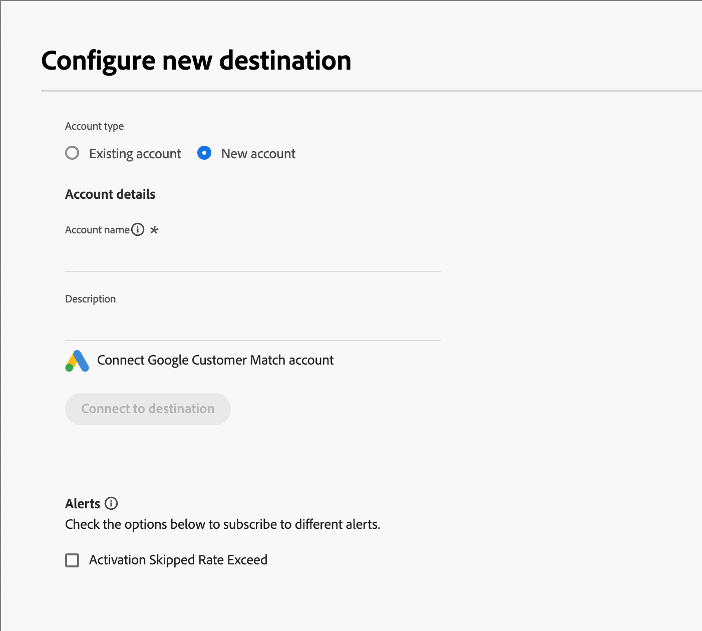

# Destinations

Les destinations sont des intégrations préconfigurées qui vous permettent d’envoyer des [listes statiques de personnes](./people-lists.md#static-lists) de [!DNL Marketo Optimizer] vers des plateformes publicitaires ou sociales externes, telles qu’une audience de campagne LinkedIn, une audience de correspondance client Google ou une audience personnalisée Facebook. L’activation d’une liste statique vers une destination synchronise l’abonnement : au fur et à mesure que des personnes sont ajoutées ou supprimées de la liste, elles sont ajoutées ou supprimées en conséquence de l’audience de destination et, par extension, de toute campagne alimentée par l’audience.

Il existe deux façons d’activer des personnes vers une destination connectée :

* **À partir d&#39;une liste statique** — Activez une liste statique existante directement depuis l&#39;onglet **_[!UICONTROL Listes de personnes]_**. Voir [Activer vers une destination](./people-lists.md#static-list-activate).
* **À partir d’un parcours de personne** — Ajoutez une action **_[!UICONTROL Activer vers la destination]_** à un chemin de parcours afin que toute personne atteignant ce nœud soit ajoutée à une liste et envoyée à la destination. Voir [_Ajouter un nœud d’action_](../marketing/action-nodes.md#add-an-action-node).

>[!BEGINSHADEBOX]

## Autorisations nécessaires {#required-permissions}

La fonctionnalité de destination complète nécessite les autorisations [!DNL Adobe Experience Platform] suivantes pour être activée.

| Catégorie | Autorisation | Obligatoire |
|--- |--- |--- |
| Sandbox | _d’accès au sandbox (activé par défaut)_ | Oui |
| Tableaux de bord | Afficher les tableaux de bord standard | Oui |
| Tableaux de bord | Gestion des tableaux de bord standard | Oui |
| Destinations | Affichage des destinations | Oui |
| Destinations | Gestion des destinations | Oui |
| Destinations | Activation des destinations | Oui |
| Destinations | Activer un segment sans mappage | Oui |
| Destinations | Gérer et activer la destination du jeu de données | Oui |
| Destinations | Création de destinations | Oui |
| Gouvernance des données | Affichage des politiques d’utilisation des données | Oui |
| Gouvernance des données | Gestion des politiques d’utilisation des données | Oui |
| Ingestion de données | Affichage des sources | Oui |
| Ingestion de données | Gestion des sources | Oui |
| Gestion des profils | Afficher les paramètres de profil | Oui |
| Gestion des profils | Gérer les paramètres de profil | Oui |

>[!ENDSHADEBOX]

## Destinations prises en charge {#supported-destinations}

Avant de pouvoir activer une liste statique, une destination doit exister dans le catalogue des destinations. Dans le volet de navigation de gauche, développez **[!UICONTROL Connexions]** et sélectionnez **[!UICONTROL Destinations]**. [!DNL Marketo Optimizer] prend actuellement en charge les destinations suivantes :

* **[!UICONTROL Correspondance client]** (Advertising)
* **[!UICONTROL Audience personnalisée Facebook]** (Social)
* **[!UICONTROL Audience appariée LinkedIn]** (Social)

{width="800" zoomable="yes"}

>[!NOTE]
>
>Ce catalogue n’est pas le catalogue complet des destinations [!DNL Adobe Experience Platform]. Si vous accédez directement aux destinations à partir de [!DNL Experience Platform], le catalogue s’agrandit, mais seules ces destinations sont actuellement disponibles pour activation dans [!DNL Marketo Optimizer]. D’autres destinations sont prévues pour les prochaines versions.

## Configurer une destination {#set-up-destination}

Chaque carte de destination prise en charge affiche **[!UICONTROL Configurer une nouvelle destination]**. La configuration d’une destination est une condition préalable à l’activation.

1. Dans la carte de connecteur, cliquez sur **[!UICONTROL Configurer une nouvelle destination]**.

1. Sélectionnez **[!UICONTROL Compte existant]** ou **[!UICONTROL Nouveau compte]** et saisissez les détails du compte, tels que le nom et la description du compte.

   {width="500"}

1. Cliquez sur **[!UICONTROL Se connecter à la destination]**.

   Un flux OAuth vous permet de vous connecter au compte correspondant : LinkedIn, Google ou Facebook.

   >[!IMPORTANT]
   >
   >À ce stade, **ne saisissez pas** les _[!UICONTROL détails de la destination]_. Seule la connexion est nécessaire.

1. Renseignez tout mappage de champs requis entre les attributs de personne et les champs requis par la destination.

1. Vérifiez les paramètres des actions marketing et de gouvernance des données, puis cliquez sur **[!UICONTROL Enregistrer]**.

Pour connaître les étapes de configuration complètes, voir [Créer une connexion de destination](https://experienceleague.adobe.com/fr/docs/experience-platform/destinations/ui/connect-destination){target="_blank"} dans la documentation [!DNL Experience Platform].

Une fois configurée, la destination peut être activée partout où vous pouvez sélectionner une destination dans [!DNL Marketo Optimizer].

## Activation et synchronisation {#activation-sync}

L’activation est pilotée par l’appartenance à une liste statique, avec une synchronisation bidirectionnelle entre la liste et l’audience de destination :

* L’ajout d’une personne à la liste statique l’active dans la destination sous 24 heures, l’ajoutant ainsi à l’audience de destination et, par la suite, à toute campagne que l’audience alimente.
* Supprimer une personne de la liste statique la désactive de la destination : elle est supprimée de l’audience de destination et de toute campagne connectée.
* La même liste peut être activée vers plusieurs destinations à la fois ; l’abonnement se synchronise sur toutes les destinations.

>[!TIP]
>
>Pour exécuter une campagne LinkedIn sur un segment, activez la liste statique de ces personnes vers votre destination LinkedIn Matched Audience. Toutes les personnes de la liste sont ajoutées à l’audience correspondante dans LinkedIn, où une campagne peut les cibler. L’audience reste automatiquement à jour au fur et à mesure que la liste change.
