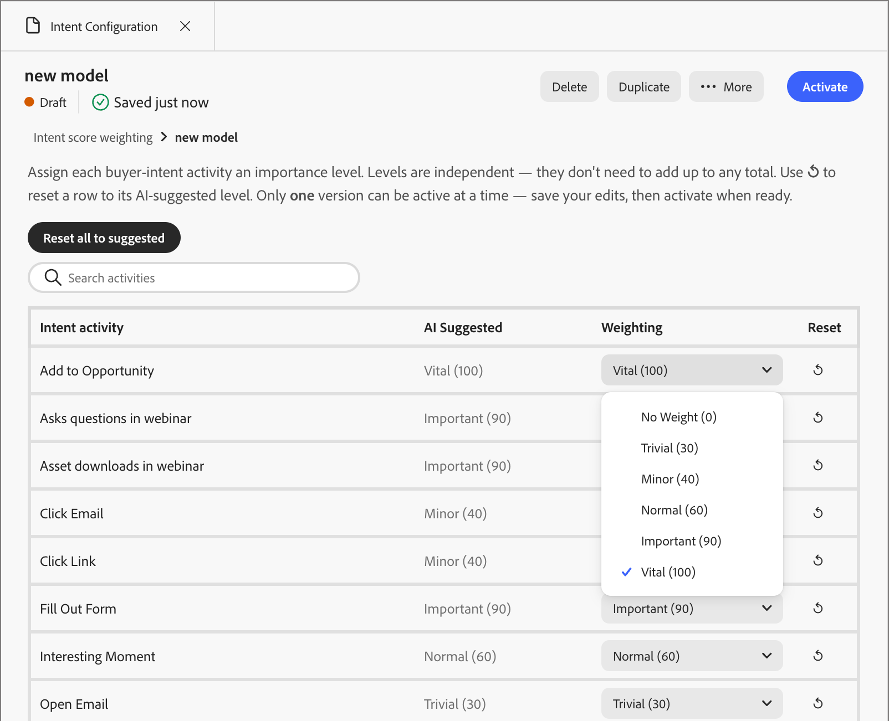

# Configuration de l’intention

Un seul ensemble normalisé de poids d’activité ne fonctionne pas entre les clients. Ce qui indique une intention réelle d&#39;achat varie selon l&#39;entreprise. Configurez et activez un modèle d’intention pour spécifier ce qui est important pour vous, par exemple si le remplissage d’un formulaire signale plus d’un clic sur un e-mail, au lieu d’hériter d’une valeur par défaut globale.

Les outils du panneau **[!UICONTROL Configuration de l’intention]** contrôlent le poids de chaque activité de prospect par rapport au score d’intention d’une personne. Il s’agit de la seule entrée configurable dans la notation d’intention. D’autres facteurs, tels que la pertinence du contenu, l’atténuation et les seuils, sont gérés par le système. Elle est disponible via la compétence [Configuration de l’intention](../agents/intent.md#configure-model).

Ouvrez le panneau à l’aide de l’une des deux méthodes suivantes à partir de l’interface de conversation [chat](../agents/chat-interface.md) de Coworker :

* Saisissez la commande `/intent-configuration`.
* Cliquez sur **[!UICONTROL +]**, sélectionnez **[!UICONTROL Utiliser une compétence d’agent]**, sélectionnez l’onglet **[!UICONTROL Intention]**, puis cliquez sur **[!UICONTROL Configuration de l’intention]**.

{width="700" zoomable="yes"}

## Vue Liste des modèles

La destination du panneau affiche **[!UICONTROL pondération du score d’intention]**, avec le nombre total de modèles sous le titre, un champ de recherche pour le filtrage par nom et un tableau triable :

| Colonne | Notes |
| --- | --- |
| [!UICONTROL Nom] | Triable, tri par défaut |
| [!UICONTROL Statut] | _[!UICONTROL Actif]_ (point vert), _[!UICONTROL Brouillon]_ (point orange), _[!UICONTROL Archivé]_ (point gris) |
| [!UICONTROL Date de création] | Date abrégée, complète au survol |
| [!UICONTROL Dernière mise à jour] | Date abrégée, complète au survol |
| [!UICONTROL Dernière mise à jour par] | Nom d’utilisateur tronqué, nom complet au survol |

Un seul modèle peut être _[!UICONTROL actif]_ à tout moment et c’est le modèle qui génère la notation. Un modèle sur deux est à l’état _[!UICONTROL Brouillon]_ (en cours de modification, pas encore actif) ou _[!UICONTROL Archivé]_ (un ancien modèle _[!UICONTROL Actif]_ automatiquement rétrogradé lorsqu’un nouveau modèle est activé).

Cliquez sur une ligne pour ouvrir la vue détaillée du modèle.

## Vue détaillée du modèle

La vue détaillée affiche le nom du modèle, le badge d’état, la date et l’heure du dernier enregistrement, ainsi qu’un chemin de navigation indiquant **[!UICONTROL pondération du score de l’intention]** et le nom du modèle sur lequel vous pouvez cliquer pour revenir à la liste.

La vue détaillée répertorie les activités liées à l’intention de l’acheteur et le niveau d’importance que chacune d’elles attribue au score d’intention de la personne. Le catalogue d’activités est fixe et seuls les niveaux peuvent changer. Ces niveaux sont indépendants : ils n&#39;ont pas besoin de faire le total. Une seule version du modèle de pondération peut être active à la fois. Pour apporter des modifications, dupliquez la version actuelle et modifiez la copie.

{width="550" zoomable="yes"}

Un champ de recherche filtre les lignes d’activité par nom. Le tableau lui-même :

| [!UICONTROL Activité d’intention] | [!UICONTROL AI Suggéré &#x200B;] | [!UICONTROL Pondération] | [!UICONTROL Réinitialiser] |
| --- | --- | --- | --- |
| Par exemple, Ajouter à l’opportunité, Remplir un formulaire, Cliquer sur l’e-mail, Cliquer sur le lien, Ouvrir l’e-mail, Se désabonner de l’e-mail, Visiter la page web, Poser des questions dans le webinaire, Téléchargements de ressources dans le webinaire, Moment intéressant, A répondu au sondage dans le webinaire, Mettre à jour l’opportunité | Lecture seule | Liste déroulante, modifiable sur les modèles Brouillons | Icône ↺**: réinitialise cette ligne sur la valeur Suggérée par l’IA** |

**Niveaux de pondération** (même échelle pour les colonnes Suggested de l’IA et Pondération) :

| Niveau | Valeur |
| ---| --- |
| [!UICONTROL Pas de poids] | 0 |
| [!UICONTROL Insignifiant] | 30 |
| [!UICONTROL Mineur] | 40 |
| [!UICONTROL Normal] | 60 |
| [!UICONTROL Important] | 90 |
| [!UICONTROL Essentiel] | 100 |

{width="550" zoomable="yes"}

Définir une activité sur **[!UICONTROL Aucun poids]** (0) l’exclut complètement de la notation. Le système exclut actuellement **[!UICONTROL e-mail de désabonnement]** par défaut à l’aide de cette méthode.

Cliquez sur **[!UICONTROL Réinitialiser tout à suggéré]** au-dessus du tableau pour restaurer chaque ligne à sa valeur Suggérée par l’IA.

### Créer et activer un modèle

Pour créer et activer un nouveau modèle de pondération, procédez comme suit.

1. Commencez à partir d’un modèle _[!UICONTROL Brouillon]_ existant.

   Vous pouvez également cliquer sur **[!UICONTROL Dupliquer]** pour que le modèle _[!UICONTROL Actif]_ actuel clone ses poids dans un nouveau brouillon.

1. Ajustez les poids ligne par ligne pour refléter ce qui est important pour votre entreprise.

   Par exemple, rétrogradez une activité à faible signal en **[!UICONTROL Trivial]** ou mettez à niveau une activité à signal élevé en **[!UICONTROL Important]** ou **[!UICONTROL Vital]**.

1. Cliquez sur **[!UICONTROL Enregistrer]**

   L’enregistrement vous invite à activer le modèle immédiatement.

1. Confirmez l’activation.

La confirmation en fait le nouveau modèle _[!UICONTROL actif]_ et rétrograde automatiquement le modèle précédemment actif à _[!UICONTROL archivé]_. Un seul modèle peut être actif à la fois.

### Colonne suggérée par l’IA

La colonne Suggested de l’IA est un point de départ, pas une recommandation entraînée.

* Un appel d’achèvement LLM gère toutes les activités à la fois pour un client et non un appel par activité.

* Pour chaque activité, le modèle lit uniquement son nom et sa description, puis sélectionne un niveau de poids en fonction des connaissances générales du comportement de l’acheteur B2B. Prenons l’exemple de ce que **[!UICONTROL Remplir le formulaire]** ou **[!UICONTROL Cliquer sur l’e-mail]** indique généralement à un acheteur B2B. Il n’a pas accès aux données client du client, aux enregistrements CRM ou aux modèles d’engagement historiques, et n’est pas spécifique au client ou à l’abonnement à l’heure actuelle.

* La sortie est renseignée `SUGGESTED_WEIGHT_VALUE` dans `IBG_INTENT_ACTIVITY_WEIGHT` au moment de la création du modèle et reste statique par la suite. Elle n’est pas mise à jour lorsque vous modifiez la colonne Pondération .

* Chaque ligne d&#39;activité a toujours une valeur suggérée renseignée. Aucun n’est laissé vide.

Examinez et ajustez chaque ligne pour refléter votre propre contexte commercial. Les valeurs suggérées sont une valeur par défaut raisonnable et non un modèle ajusté.

## Actions sur un modèle

Vous pouvez gérer un modèle en fonction de son statut.

| Action | Disponible pour | Ce qui se passe |
| --- | --- | --- |
| **[!UICONTROL Dupliquer]** | Actif, Brouillon | Ouvre une boîte de dialogue modale intitulée **[!UICONTROL Dupliquer]**, avec un champ Nom prérempli et des boutons **[!UICONTROL Annuler]** et **[!UICONTROL Dupliquer]**. Confirmer crée un modèle _[!UICONTROL Brouillon]_ avec les mêmes poids, qui s’ouvre directement dans la vue détaillée. |
| **[!UICONTROL Activer]** | Brouillon uniquement (également proposé comme invite juste après l’enregistrement) | Promeut le brouillon en _[!UICONTROL actif]_ et rétrograde automatiquement le modèle précédemment actif en _[!UICONTROL archivé]_. |
| **[!UICONTROL Supprimer]** | Brouillon uniquement | Invite une boîte de dialogue de confirmation avant la suppression définitive. Cette action est irréversible. Les modèles actifs ne peuvent pas être supprimés. |

Étant donné que seuls les modèles brouillons sont modifiables, le processus normal consiste à cliquer sur **[!UICONTROL Dupliquer]** pour le modèle _[!UICONTROL actif]_ actuel, à ajuster le poids du brouillon, puis à cliquer sur **[!UICONTROL Enregistrer]**. Vous pouvez l’activer immédiatement ou ultérieurement à l’aide du bouton **[!UICONTROL Activer]**.

## Calculs de pondération dans les scores d’intention

La colonne **[!UICONTROL Pondération]** affiche le nombre utilisé dans la notation quotidienne, lu à partir de la ligne pour le modèle _[!UICONTROL Actif]_ actuel. Trois éléments déterminent le score d’intention d’un prospect :

1. **Poids configuré ici** (`WEIGHT_VALUE`) pour chaque activité. Elle commence à partir de la suggestion de l’IA, mais peut être remplacée par client. Seule la ligne liée au modèle _[!UICONTROL actif]_ est utilisée, de sorte qu’une modification de poids n’a pas besoin d’une libération de code.

1. **pertinence du contenu** : non configurable ici. Le système extrait les mots-clés du contenu ou des ressources liés à l’activité et évalue si ce contenu correspond à un mot-clé, un produit ou une catégorie de 0 à 1.

1. **Fréquence** : nombre de fois qu’un prospect a interagi avec ce contenu, pris en compte dans la moyenne des engagements d’une personne.

Formellement, par engagement : `activity weight × content relevance`, moyennée en un **score quotidien** avec une décroissance exponentielle de **7 jours** appliquée de sorte que l’activité récente domine, puis min-max normalisé à 0 à 1 dans la population actuelle et regroupé :

| Score final | Niveau d’intention |
| --- | --- |
| > 0.6 | Élevé |
| > 0.2 | Support |
| Sinon | Faible |

### Pertinence du contenu

Pour les activités web, le système inspecte l’URL de la ressource et la société associée, puis déduit les mots-clés pertinents de la taxonomie de cette société. Par exemple, une URL liée à [!DNL Intuit] fait apparaître des mots-clés tels que _taxe_ ou _paie_. L’engagement réel d’un prospect dans ce contenu, par exemple l’affichage d’une page [!DNL TurboTax] ou d’une page [!DNL QuickBooks], est comparé à ces mots-clés afin de déterminer le produit spécifique auquel l’intérêt correspond. Pour les activités non web telles que _[!UICONTROL Moment intéressant]_ (y compris les événements hors ligne), le modèle évalue la description ou le contenu du moment, tel qu’un sujet de webinaire hors ligne, plutôt que le type d’activité. C’est le contenu, et non la catégorie d’événement, qui détermine la pertinence.

## Limites connues

Les restrictions suivantes s’appliquent aujourd’hui à la configuration d’intention.

* **Aucune activité personnalisée ou définie par le client aujourd’hui.** Le catalogue d’activités est fixe et [!DNL Marketo Engage] est la seule source de vérité. Une activité doit être connectée [!DNL Marketo Engage] pour être notée. Une future colonne pour les activités définies par le client est en cours de définition.
* **Aucune ingestion d’intention tierce aujourd’hui** par exemple, à partir de [!DNL Demandbase], [!DNL ZoomInfo] ou [!DNL 6sense]. Cette mise à jour est prévue pour les versions ultérieures. En attendant, la solution consiste à créer l’audience dans l’outil tiers et à la pousser directement dans [!DNL Marketo Engage] ou [!DNL Marketo Optimizer], en contournant la notation d’intention pour ce signal.
* **Aucune exportation native** à partir du panneau de pondération ou des rapports d’intention. Voir [Suivi des rapports](../agents/intent.md#report-follow-up) pour les invites qui transforment les résultats du rapport en liste de personnes.
