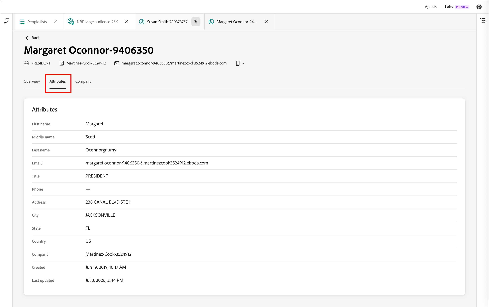

# Détails de la personne

En [!DNL Adobe Marketo Optimizer], lorsque vous cliquez sur le nom d’une personne dans l’onglet _[!UICONTROL Membres]_ d’une liste [personnes](./people-lists.md), la page des détails de la personne s’ouvre avec une vue consolidée de cette personne. Cette page fournit les informations suivantes :

* Résumé des rôles, de l’engagement et des intentions généré par l’IA
* Un historique complet des activités
* Attributs de profil et d’entreprise
* Interface de conversation d’un collègue étendue pour répondre aux questions sur la personne

## Ouvrir les détails de la personne {#open-person-details}

1. Dans le volet de navigation de gauche, développez **[!UICONTROL Gestion marketing]**.

1. À droite dans la liste de ressources **[!UICONTROL Marketing]**, sélectionnez **[!UICONTROL Listes des personnes]**.

1. Ouvrez une liste dynamique ou statique.

1. Cliquez sur le **[!UICONTROL nom]** d’une personne dans la liste.

   {width="600" zoomable="yes"}

La page de détails de la personne s’ouvre avec trois onglets : **[!UICONTROL Aperçu]**, **[!UICONTROL Attributs]** et **[!UICONTROL Société]**.

## En-tête de page {#page-header}

L’en-tête affiche le nom de la personne comme titre de la page, ainsi qu’une bande de contact en un coup d’œil :

* Titre du traitement
* Société
* Adresse e-mail
* Numéro de téléphone

Cliquez sur **[!UICONTROL Précédent]** pour revenir à la liste d’origine.

## Onglet Aperçu {#overview-tab}

L’onglet **[!UICONTROL Aperçu]** contient les cartes de résumé des prospects et la chronologie de l’activité.

{width="700" zoomable="yes"}

### Résumé du lead {#lead-summary}

Trois cartes donnent une évaluation de la personne générée par l’IA :

| Carte | Contenus |
|---|---|
| **[!UICONTROL Persona]** | Le [personnage dérivé](./personas.md) de la personne, ainsi qu’un court récit décrivant son rôle, sa société et son secteur d’activité. Cliquez sur l’icône d’informations pour plus de détails. |
| **[!UICONTROL Engagement]** | [score d’engagement de la personne](./engagement-scores.md), tendance (par exemple, _croissant_) et niveau (_faible_, _Medium_, _élevé_). |
| **[!UICONTROL Intention]** | Intention d’achat détectée ou _Aucune détectée_, avec des conseils contextuels et un lien pour vous aider à augmenter l’intention du produit. |

### Activités {#activities}

Sous le résumé du prospect, le panneau **[!UICONTROL Activités]** répertorie l’historique complet des interactions de la personne, regroupé par date. Chaque groupe de dates est extensible et réductible, et chaque ligne affiche une date et une heure, une balise de type d’activité (par exemple, _[!UICONTROL Modifier la valeur des données]_, _[!UICONTROL Ajouter à la liste]_, _[!UICONTROL Ajouter une personne au Parcours]_ ou _[!UICONTROL Transition de nœud de Parcours]_), ainsi qu’une description en langage clair de ce qui s’est passé. Le cas échéant, la description comprend un lien, tel que **[!UICONTROL Liste d’affichage]** ou **[!UICONTROL parcours d’affichage]**, pour accéder à l’objet associé.

Utilisez les commandes du panneau pour utiliser la chronologie :

* **Type d’activité** - Filtrez la chronologie selon un type d’activité spécifique, tel que les envois d’e-mails, les interactions de webinaire ou les modifications de liste et de parcours.
* **Période** - Limitez la chronologie à une période spécifique à l’aide de la commande Calendrier.
* **[!UICONTROL Exporter]** - Exportez les données d’activité visibles.
* **[!UICONTROL Tout réduire] / [!UICONTROL Tout développer]** - Activez/désactivez chaque regroupement de dates ouvert ou fermé en même temps.

## Onglet Attributs {#attributes-tab}

{width="700" zoomable="yes"}

L’onglet **[!UICONTROL Attributs]** affiche les champs de profil stockés de la personne sous la forme d’une liste de libellés/valeurs :

* Prénom
* Nom intermédiaire
* Nom
* E-mail
* Titre
* Téléphone
* Adresse
* Ville
* État
* Pays
* Société
* Créé
* Dernière mise à jour

## Onglet Société {#company-tab}

{width="700" zoomable="yes"}

L’onglet **[!UICONTROL Société]** affiche des données firmographiques associées à la société de la personne :

* Société
* Secteur
* Revenus annuels
* Rue de facturation
* Ville de facturation
* État de facturation
* Code postal de facturation
* Pays de facturation

Les champs sans données disponibles s’affichent sous la forme d’un tiret.

## Demander à un collègue de travail à propos d’une personne {#ask-coworker}

Ouvrez l’icône du panneau **[!UICONTROL Collègue]** en haut de la page pour obtenir de l’aide sur l’enregistrement de personne actuel. Le panneau s’ouvre à cette personne. Une puce située sous le fil du message (par exemple, _personne : [Nom de la personne]_) confirme l’enregistrement que vos invites ciblent.

{width="700" zoomable="yes"}

### Démarrer à partir d’une invite suggérée {#suggested-prompts}

Lorsque vous ouvrez le panneau à partir de la page des détails d’une personne, un collègue vous accueille avec un message de bienvenue contextuel et des invites suggérées par défaut, telles que :

* _Aide-moi à comprendre [Nom de la personne]_
* _Parlez-moi de [Nom de la personne]_
* _Résumer [l’activité d’engagement de la personne]_

Cliquez sur une invite suggérée ou tapez votre propre question dans la zone de saisie située au bas du panneau.

### Vérifier la réponse {#review-response}

La sélection d’une invite exécute une [compétence](../agents/skills.md) à plusieurs étapes, présentées sous la forme d’étapes de statut séquentielles (par exemple, _Rechercher une personne par ID_ et _Obtenir le récit de la personne_) pendant que l’autre personne compose la réponse. La réponse est un résumé structuré qui peut inclure les détails du profil, l’historique de l’engagement et les performances de la personne en matière d’e-mail.

Utilisez la commande pouces vers le haut/pouces vers le bas pour évaluer la réponse. Comme pour toute sortie de Coworker, passez en revue la réponse avant de l’utiliser. Pour plus d’informations, consultez les [instructions d’utilisation d’Adobe Generative AI](https://www.adobe.com/legal/licenses-terms/adobe-dx-gen-ai-user-guidelines.html){target="_blank"}.
