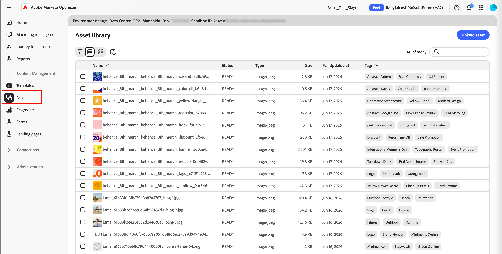
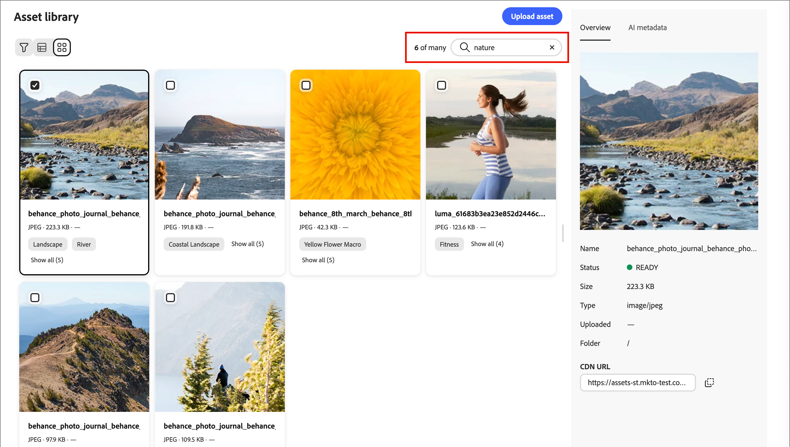

# Ressources

Dans [!DNL Adobe Marketo Optimizer], les ressources sont généralement les images utilisées lors de la conception de contenu pour prendre en charge les parcours. Vous pouvez utiliser ces images dans vos [e-mails](email-authoring.md), [modèles d’e-mail](templates.md) et [fragments visuels](email-authoring.md#visual-fragments) à partir du sélecteur de ressources ou une simple interface glisser-déposer dans l’espace de conception visuelle.

Formats de fichiers pris en charge : JPG, JPEG, GIF, PNG, EPS, SVG et RGB

<!--

>In this Beta release, you can choose images and assets from a one-time copy of your Marketo Engage asset library directly inside the email canvas. Modifying assets in Marketo Engage after the initial copy is **not** reflected in [!DNL Marketo Optimizer].

-->

>[!NOTE]
>
>Vous pouvez charger des ressources d’image à partir de la bibliothèque __ ou de l’espace de conception de contenu. Ces ressources chargées ne peuvent être utilisées que dans l’instance [!DNL Marketo Optimizer].
>
>L’importation de ressources à partir de systèmes externes et l’accès à une bibliothèque de ressources préremplie ne sont pas encore disponibles. Les prochaines versions devraient inclure l’importation de ressources à partir des systèmes existants, la prise en charge de dossiers et des fonctionnalités étendues de gestion des ressources.

<!-- You can [edit these assets using Adobe Express](./image-edit-adobe-express.md), and move them into folders to organize them for use across your emails, templates, and fragments. -->

La bibliothèque **** permet d’accéder au référentiel centralisé pour stocker et gérer les images et d’autres ressources de création. Il comprend des fonctionnalités optimisées par l’IA qui génèrent automatiquement des métadonnées et permettent la recherche en langage naturel.

Dans le volet de navigation de gauche, développez **[!UICONTROL Gestion de contenu]** et sélectionnez **[!UICONTROL Assets]**.

{width="800" zoomable="yes"}

>[!BEGINSHADEBOX]

La première fois que vous accédez à la bibliothèque __, consultez les [_[!UICONTROL conditions d’utilisation de Generative AI ]_](https://www.adobe.com/fr/legal/licenses-terms/adobe-gen-ai-user-guidelines.html) et confirmez votre accord.

{width="500"}

>[!ENDSHADEBOX]

La bibliothèque prend en charge deux options de disposition :

* **[!UICONTROL Liste]** — Cliquez sur l’icône _Vue Liste_ (  ) pour afficher les ressources dans un tableau triable avec des colonnes de métadonnées.
* **[!UICONTROL Galerie]** — Cliquez sur l’icône _Galerie_ (  ) pour afficher les ressources sous forme de grille miniature visuelle.

## Recherche de ressources {#find-assets}

Utilisez le champ _[!UICONTROL Rechercher]_ pour rechercher des ressources en décrivant ce dont vous avez besoin en langage naturel. Les résultats de la recherche sont basés sur les métadonnées générées par l’IA. Vous n’êtes donc pas limité à la recherche par nom de fichier.

**Exemples :**

* `team members`
* `nature`
* `exercise`

{width="700" zoomable="yes"}

## Affichage des détails de la ressource {#view-details}

Sélectionnez une ressource dans la vue Liste ou Galerie pour ouvrir sa vue détaillée à droite, qui affiche une description générée par l’IA, des balises, des mots-clés et des champs de métadonnées supplémentaires. Ces informations sont générées automatiquement lorsque la ressource est chargée. Sélectionnez l’onglet **[!UICONTROL Métadonnées d’IA]** pour consulter la description, les balises et les métadonnées générées.

{width="700" zoomable="yes"}

## Chargement d’un élément {#upload}

1. Cliquez sur **[!UICONTROL Charger]** en haut à droite.

1. Dans la boîte de dialogue, effectuez un glisser-déposer d’un fichier de votre système local.

   {width="450"}

   Vous pouvez également cliquer sur **[!UICONTROL Sélectionner un fichier sur votre ordinateur]** afin d’utiliser votre système de fichiers local pour localiser et sélectionner le fichier.

1. Cliquez sur **[!UICONTROL Télécharger le fichier]** pour confirmer et télécharger le fichier dans le référentiel.

Une fois le chargement terminé, le système génère automatiquement une description, attribue des balises et des mots-clés et extrait les attributs visuels tels que l’objet et le paramètre. Aucun balisage manuel n’est requis. La nouvelle image affiche un statut _[!UICONTROL TRAITEMENT]_ jusqu’à ce que ce processus soit terminé.

{width="700" zoomable="yes"}

## Utiliser des ressources pour la création de contenu {#assets-authoring}

Utilisez des ressources pour créer des e-mails, des modèles d’e-mail et des fragments visuels. L’éditeur de contenu visuel permet d’accéder aux images de la bibliothèque __. Vous pouvez également charger une ressource image, qui la place dans le référentiel de ressources interne.

Vous pouvez choisir la ressource d’image lorsque vous modifiez les paramètres d’un composant d’image ou directement sur la zone de travail :

* **_Composant vide_** - Lorsque vous ajoutez un composant d’image à la zone de travail, il est vide et permet d’accéder facilement à un fichier image pour le sélectionner ou l’importer.

  {width="500"}

* **_Barre d’outils de composant d’image_** - Lorsqu’un composant d’image est sélectionné dans la zone de travail, la barre d’outils permet d’accéder facilement à une source et de sélectionner le fichier image.

  {width="500"}

* **_Paramètres des composants d’image_** - Lorsqu’un composant d’image est sélectionné dans la zone de travail, vous pouvez afficher et modifier les paramètres dans le panneau de droite. Pour ajouter ou modifier le fichier image affiché dans le composant, choisissez le type de source et sélectionnez un fichier image.

  {width="350"}

Cliquez sur **[!UICONTROL Sélectionner une ressource]** pour ouvrir le sélecteur de ressources, où vous pouvez choisir une image dans le référentiel de ressources [!DNL Marketo Optimizer].

{width="700" zoomable="yes"}

Vous pouvez utiliser la recherche et les filtres pour localiser la ressource d’image souhaitée. Sélectionnez la ressource et cliquez sur **[!UICONTROL Sélectionner]** afin de l’utiliser pour le composant d’image.

Vous pouvez également choisir une ressource d’image dans les paramètres d’arrière-plan d’un composant de structure.
