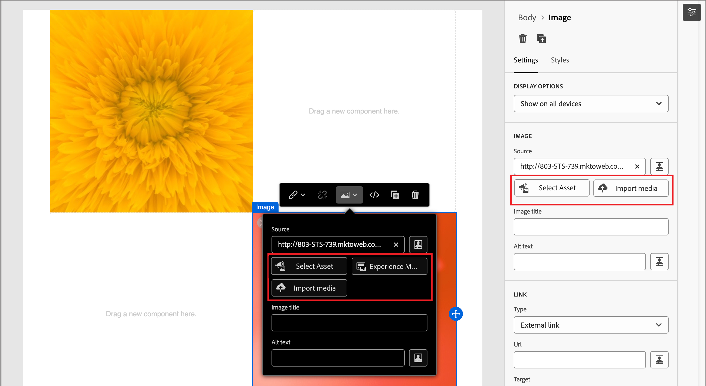

# Création de contenu d’e-mail

En [!DNL Adobe Marketo Optimizer], l’espace de conception d’e-mail fournit une zone de travail visuelle dans laquelle les spécialistes marketing créent des e-mails. Les outils de conception d’e-mail des panneaux de gauche et supérieur (structures, composants de contenu, modèles, fragments, etc.) prennent en charge la création à partir de zéro par glisser-déposer. Vous pouvez également choisir de commencer à partir d’un modèle, de coller des HTML brutes ou d’assembler des messages à partir de fragments visuels réutilisables.

>[!IMPORTANT]
>
>Pour la configuration par l’administrateur des sous-domaines, de l’authentification, des groupes d’adresses IP et des canaux e-mail, consultez [Délivrabilité des e-mails](../start/email-deliverability.md) et [Configuration du canal e-mail](../admin/email-channel-configuration.md).

En [!DNL Marketo Optimizer], chaque e-mail est associé à une action _[!UICONTROL Envoyer un e-mail]_ dans un parcours de personne. Le workflow complet, de la conception du parcours à la définition de l’e-mail, se produit dans une expérience continue. Lorsque vous [ajoutez un nœud _Envoyer un e-mail_ ](../marketing/action-nodes.md#add-an-action-node) à un parcours de personne, cliquez sur **[!UICONTROL Créer un e-mail]** pour lancer le processus. Vous commencez par définir les actions et les paramètres de contenu de l’e-mail. Cliquez sur **[!UICONTROL Modifier le corps de l’e-mail]** pour lancer l’espace de conception du contenu de l’e-mail, où vous pouvez choisir la manière de concevoir votre e-mail à l’aide des options suivantes :

* [Concevez entièrement votre e-mail](#design-from-scratch) à l’aide de l’interface de conception visuelle. Créez le composant Disposition d’e-mail par composant en effectuant un glisser-déposer sur une zone de travail vierge. Cette méthode est recommandée pour créer de nouveaux modèles ou des e-mails ponctuels.

* [Importez du contenu HTML existant](#import-html-content) dans l’éditeur de code ou travaillez côte à côte avec la zone de travail visuelle.

* [Sélectionnez un modèle existant](#templates) dans une liste de modèles d’e-mail intégrés ou personnalisés. Cette méthode est recommandée pour les cas d’utilisation d’e-mails répétables.

<!-- * Upload a design prototype (JPG, PNG, PDF, or Figma export) and have Coworker convert it into a responsive HTML email. (Image to HTML (Img2HTML) -->

{width="800" zoomable="yes"}

## Outils de conception d’e-mails {#email-design-tools}

* **Barre d’outils supérieure :** Enregistrer, Précédent, Basculer vers l’éditeur de code, prévisualiser les contrôles.
* **Panneau de gauche : structures** (dispositions de colonnes), contenu (texte, bouton, image, séparateur, réseau social, HTML), fragments, modèles, arborescence de navigation (hiérarchie de style DOM de l’e-mail).
* **Zone de travail centrale :** éditeur WYSIWYG avec aperçu pour ordinateur de bureau et appareil mobile.
* **Panneau de droite :** paramètres et styles du composant actuellement sélectionné, y compris les propriétés de contenu, l’arrière-plan, la bordure, la marge intérieure et la personnalisation.

>[!BEGINSHADEBOX]

## Bonnes pratiques en matière de conception d’e-mail {#design-best-practices}

Le respect des bonnes pratiques HTML et CSS permet d’assurer un rendu cohérent entre les clients de messagerie.

| Approche | Instructions |
| -------- | -------- |
| **Recommandé** | Mises en page statiques basées sur des tableaux · Tableaux HTML et tableaux imbriqués · Largeurs de modèle de 600 à 800 px · CSS intégré simple · Polices sécurisées pour le Web |
| **À utiliser avec précaution** | Images d’arrière-plan (prise en charge limitée des clients) · Polices web personnalisées (définissez toujours une police de secours) · Dispositions plus larges que 800 px · Cartes graphiques |
| **Éviter** | JavaScript, iFrames ou Flash · Contenu audio ou vidéo intégré · Formulaires HTML · Dispositions basées sur des div |

>[!NOTE]
>
>Le contenu des e-mails doit également répondre aux exigences applicables en matière d’accessibilité numérique. Structurez les en-têtes de manière logique, fournissez du texte secondaire pour toutes les images et vérifiez le contraste des couleurs dans les modes clair et sombre.

>[!ENDSHADEBOX]

## Concevoir votre e-mail à partir de zéro {#design-from-scratch}

Utilisez l’espace de conception visuelle du contenu pour définir la structure et le contenu de l’e-mail. En ajoutant et en déplaçant des composants structurels à l’aide de simples actions de glisser-déposer, vous pouvez concevoir la disposition et l’organisation du contenu de l’e-mail en quelques secondes.

1. Sur la page _[!UICONTROL Concevoir votre e-mail]_, sélectionnez l’option **[!UICONTROL Créer en partant de zéro]**.

<!-- 

1. In the _[!UICONTROL Create email]_ dialog, choose the type of email content that you want to author.

   * **[!UICONTROL Use Themes]** - Choose this option to create the email in _Theme mode_. In this mode, you can use a defined brand theme to streamline the content authoring process and make sure that the design aligns with defined standards.

   * **[!UICONTROL Manual Styling]** - Choose this option to create the email in _Manual mode_. In this mode, you manually set the styling for all structure and content components that you add to the blank canvas.

-->

1. [Ajoutez des composants de structure et de contenu](#structure-content) dans la zone de travail.

1. [Vérifier et mettre à jour les liens](#preview-and-edit-linked-urls).

1. [Tester l’e-mail](#check-and-test-the-email).

Lorsque le contenu vous convient, cliquez sur **[!UICONTROL Enregistrer]**.

## Importer du contenu HTML existant {#import-html-content}

<!-- originally  from   /help/_includes/content-design-import.md but copied and revised to omit the part about Marketo Engage assets and AEM assets -->

Le contenu importé peut être :

* Fichier HTML avec feuille de style incorporée
* Un fichier .zip qui comprend un fichier HTML, la feuille de style (.css) et les images

  >[!NOTE]
  >
  >Aucune contrainte ne s’applique à la structure du fichier .zip. Cependant, les références doivent être relatives et s’ajuster à l’arborescence du dossier .zip. Les images sont toujours chargées vers le [référentiel de ressources](./digital-asset-management.md).

_Pour importer un fichier contenant du contenu HTML :_

1. Sur la page d’accueil de la conception, sélectionnez l’option **[!UICONTROL Importer HTML]**.

1. Faites glisser et déposez le fichier HTML ou .zip contenant le contenu HTML, puis cliquez sur **[!UICONTROL Importer]**.

{width="500"}

>[!NOTE]
>
>L’utilisation d’une balise `<table>` comme première couche d’un fichier HTML peut entraîner une perte de style, y compris les paramètres d’arrière-plan et de largeur dans la balise de couche supérieure.

Vous pouvez personnaliser le contenu importé selon vos besoins à l’aide des outils de l’éditeur visuel d’e-mail.

## Sélectionner un modèle {#templates}

Lorsque vous ouvrez l’espace de conception d’e-mail, utilisez la section **[!UICONTROL Sélectionner un modèle de conception]** pour commencer à partir d’un modèle type intégré ou d’un modèle personnalisé enregistré. Voir [Utiliser un modèle dans un e-mail](./templates.md#use-in-journey) pour le workflow complet.

>[!NOTE]
>
>Les modèles enregistrés peuvent avoir des paramètres de gouvernance (verrouillage de contenu) appliqués à un ou plusieurs composants. L’espace de conception visuelle fournit des instructions sur les composants verrouillés lorsque vous [créez un e-mail à partir d’un modèle régi](./template-content-governance.md).

## Ajouter la structure et le contenu {#structure-content}

Utilisez l’éditeur visuel d’e-mail pour créer votre e-mail. Ajoutez un pré-titre, structurez la disposition avec des colonnes et des séparateurs, puis remplissez ces structures avec des composants de contenu tels que des images, des boutons et du texte. Vous pouvez également appliquer un CSS personnalisé pour le style avancé et prévisualiser le rendu de la conception en mode sombre.

### Définir le pré-titre {#preheader}

Le pré-titre est l’extrait de texte affiché après la ligne d’objet dans les aperçus de boîte de réception. En [!DNL Marketo Optimizer], le pré-titre est configuré sur la zone de travail visuelle dans l’espace de conception de l’e-mail, et non sur l’écran des propriétés de l’e-mail à côté de l’objet.

Une fois le **[!UICONTROL Corps]** sélectionné dans l’arborescence de navigation de gauche, ouvrez le panneau **[!UICONTROL Paramètres]** à droite.

Cliquez dans la région de texte **[!UICONTROL Pré-titre]** et saisissez la copie de pré-titre. Cliquez sur l’icône _Ajouter une personnalisation_ (  ) pour appliquer une mise en forme et des [jetons de personnalisation](#personalize-content) selon les besoins à l’aide des contrôles de texte enrichi.

>[!TIP]
>
>Conservez votre pré-titre entre 40 et 100 caractères. Elle doit compléter l’objet (et non le répéter) et donner au destinataire une raison supplémentaire d’ouvrir l’e-mail.

### Mode sombre {#dark-mode}

Le rendu en mode sombre est pris en charge par le biais de requêtes multimédias CSS `prefers-color-scheme`. Les outils de conception d’e-mail comprennent un aperçu en mode sombre et des options permettant de définir un style personnalisé pour la prise en charge des clients de messagerie. Vous pouvez ainsi vérifier que le texte reste lisible, que les logos sont visibles et que les couleurs de la marque s’affichent sur des arrière-plans sombres.

Pour obtenir des conseils détaillés sur la prévisualisation, la configuration des paramètres personnalisés du mode sombre, la prise en charge des clients de messagerie et les bonnes pratiques de test, voir [Mode sombre pour le contenu des e-mails](./email-dark-mode.md).

### Ajouter des composants de structure et de contenu {#components}

Créez votre disposition d’e-mail en ajoutant [composants de structure](./structure-components.md) et [composants de contenu](./content-components.md) à la zone de travail.

Faites glisser des éléments des sections **[!UICONTROL Structures]** et **[!UICONTROL Contenu]** dans le panneau de gauche, puis configurez chaque composant dans les onglets _[!UICONTROL Paramètres]_ et _[!UICONTROL Styles]_ sur la droite.

### Ajouter un CSS personnalisé {#custom-css}

Vous pouvez ajouter une page CSS personnalisée directement dans l’espace de conception d’e-mail pour un style avancé au-delà des paramètres standard des composants. Il est recommandé d’ajouter ce style de plus haut niveau avant d’inclure des composants de contenu, tels que des images, des boutons et du texte.

Voir [ Ajouter du code CSS personnalisé pour votre contenu](./design-custom-css.md) pour connaître les étapes, les règles de syntaxe et la résolution des problèmes.

>[!NOTE]
>
>Si votre e-mail est conçu à l’aide d’un [modèle avec du contenu verrouillé](./template-content-governance.md), vous ne pouvez pas ajouter de code CSS personnalisé à votre contenu. Le libellé du bouton se transforme en **[!UICONTROL Afficher le CSS personnalisé]** et tout CSS personnalisé déjà présent dans le contenu est en lecture seule.

### Ajouter des fragments {#visual-fragments}

Un fragment visuel est un composant de conception réutilisable pouvant être référencé par plusieurs ressources de contenu sur plusieurs [!DNL Marketo Optimizer]. Il s’agit généralement d’un bloc de contenu qui peut être précréé et rapidement inséré pour rendre la création plus rapide et plus cohérente.

L’exemple suivant décrit les étapes à suivre pour ajouter des fragments au fur et à mesure que vous créez votre contenu.

1. Pour ouvrir la liste des fragments, sélectionnez l’icône _Fragments_ (  ).

   Vous pouvez effectuer les actions suivantes :

   * Triez la liste.
   * Parcourez, recherchez ou filtrez la liste.
   * Basculez entre les vues Miniature et Liste.
   * Actualisez la liste pour refléter l’un des fragments récemment créés.

   {width="700" zoomable="yes"}

1. Faites glisser et déposez l’un des fragments dans le composant structurel.

   L’éditeur effectue le rendu du fragment dans la section/l’élément de la structure de l’e-mail.

   Le contenu du fragment est mis à jour dynamiquement dans la structure pour prévisualiser le rendu du fragment dans votre e-mail.

<!-- 
>[!BEGINSHADEBOX]

**Editable fields in customizable fragments**

A visual fragment can include editable fields that you can customize. Custom fields allow you to modify parameters when you incorporate the fragment into your content and create a tailored experience without affecting the original fragment. The fragment author can design the fragment for customization of text, image, and button components. If an included fragment contains components with editable fields, you can change the default values to customize it for your content.

1. Select the fragment component.

   The Settings displayed on the right include editable fields with the default values.

   {width="700" zoomable="yes"}   

1. Change any editable field as needed.

>[!ENDSHADEBOX]
-->

Une fois l’e-mail enregistré, il s’affiche dans la page des détails du fragment lorsque vous sélectionnez l’onglet _[!UICONTROL Utilisé par]_ dans le résumé.

### Ajout de ressources d’image {#insert-image}

Lorsque [!DNL Marketo Optimizer] est configuré, les ressources Marketo Design Studio existantes sont disponibles dans l’espace de conception d’e-mail. Vous pouvez parcourir et insérer ces images dans vos e-mails directement à partir du sélecteur de ressources.

>[!IMPORTANT]
>
>La disponibilité des ressources dans [!DNL Marketo Optimizer] repose sur une **copie ponctuelle** vos ressources à partir de Marketo Design Studio. La modification des ressources dans Marketo Engage après la copie initiale n’est **pas** reflétée dans [!DNL Marketo Optimizer]. Vous pouvez également charger des ressources d’image directement depuis l’espace de conception visuelle ou la bibliothèque .

Types de fichiers image pris en charge :

* **Entièrement pris en charge** (visible dans le sélecteur, incorporable en ligne) : JPG, PNG, GIF, WebP.
* **Accessible avec mise en garde** : SVG (avec un avertissement indiquant que certains clients de messagerie ne rendent pas SVG).
* **Non pris en charge dans cette version de Beta :** TIFF, PDF, DOCX, XLSX, PPTX, CSS, JS, HTML, TXT, fichiers binaires, PSD, AI, INDD.

Dans l’espace de conception visuelle du contenu, sélectionnez l’icône __ (  ) dans la barre de navigation de gauche. Dans le sélecteur de ressources, vous pouvez sélectionner directement les ressources stockées dans la bibliothèque Assets.

* Ajoutez une nouvelle ressource en faisant glisser la ressource image et en la déposant dans un composant de structure.

  {width="800" zoomable="yes"}

* Remplacez une ressource image existante en la sélectionnant sur la zone de travail et en cliquant sur **[!UICONTROL Sélectionner la ressource]** dans les outils source de l’image.

  {width="600" zoomable="yes"}

Pour plus d’informations sur l’utilisation des ressources, voir [_Utilisation des ressources pour la création de contenu_](./digital-asset-management.md#assets-authoring).

### Parcourir les calques, paramètres et styles {#navigation-layers}

Utilisez l’arborescence de navigation pour sélectionner des composants et des colonnes, puis ajustez leurs paramètres et styles dans le panneau de droite. Voir [ Arborescence de navigation ](./structure-components.md#navigation-tree).

### Personnaliser le contenu {#personalize-content}

[!DNL Marketo Optimizer] utilise la syntaxe Handlebars pour la personnalisation. Les jetons sont remplacés au moment de l’envoi par des valeurs provenant des données de profil de chaque destinataire. Il existe plusieurs endroits où vous pouvez utiliser la personnalisation dans un e-mail :

* **Objet** — Point de personnalisation le plus courant.
* **Pré-titre** : défini dans la zone de travail visuelle ; prend en charge les jetons d’attribut de profil.
* **Corps du texte de l’e-mail** — Prénoms et autres attributs de profil insérés en ligne.
* **URL des boutons** — ajoutez des paramètres par destinataire.

>[!NOTE]
>
>Seuls les attributs de profil sont disponibles dans l’éditeur Personalization dans cette version de Beta.

_Pour ajouter de la personnalisation :_

1. Dans l’espace de conception d’e-mail (ou sur la page des propriétés de l’e-mail pour la ligne d’objet), cliquez sur le champ dans lequel vous souhaitez insérer un jeton.
1. Cliquez sur l’icône _Personnaliser_ (  ) pour utiliser un jeton de personnalisation.
1. Dans la boîte de dialogue de personnalisation, parcourez l’arborescence du schéma sur la gauche. Les attributs de profil (prénom, nom, e-mail, fonction et autres champs de profil) sont répertoriés.
1. Sélectionnez un attribut. L’éditeur insère l’expression Handlebars correspondante, par exemple, `{{profile.firstName}}`.
1. Ajoutez une valeur de secours pour gérer les données manquantes : `{{profile.firstName | default: "there"}}`.
1. Cliquez sur **[!UICONTROL Confirmer]** ou **[!UICONTROL Insérer]**. L’expression apparaît en ligne dans le champ.

+++Modèles de personnalisation courants {#personalization-patterns}

Utilisez des expressions Handlebars telles que celles-ci (la personnalisation utilise la même syntaxe que celle décrite dans [Personnaliser le contenu](#personalize-content)) :

* `{{profile.lastName}}` — Insérer le nom du destinataire.
* `{{profile.jobTitle}}` — Référencez la fonction du destinataire dans la copie du corps.
* `{{profile.firstName}}, ready to take the next step?` — Combiner le jeton et le texte statique en ligne.

Pour un message d’accueil avec un prénom de secours en cas d’absence de valeur, utilisez l’assistant `default` comme indiqué dans les étapes de personnalisation précédentes (par exemple, prénom avec `"there"` par défaut).

+++

+++{#handlebars-helpers} des assistants Handlebars

En plus de `default`, l’éditeur de personnalisation comprend des assistants Handlebars intégrés pour la logique conditionnelle, la transformation du texte et la mise en forme de date. Utilisez le navigateur de fonctions de l’éditeur pour explorer les assistants disponibles et les insérer avec la syntaxe correcte.

>[!TIP]
>
>Dans l’espace de conception d’e-mail, saisissez `{{` directement dans un champ de texte pour déclencher une liste déroulante de saisie automatique intégrée répertoriant les attributs de profil disponibles. Il n’est pas nécessaire d’ouvrir la boîte de dialogue de personnalisation complète pour les insertions rapides.

+++

+++Expressions assistées par l’IA {#ai-personalization}

Dans l’éditeur de personnalisation, le collègue peut générer des expressions Handlebars à partir d’une description en langage clair, expliquer le rôle d’une expression existante et identifier les problèmes potentiels. Utilisez-la pour accélérer la création d’expressions, en particulier pour la logique conditionnelle ou les assistants de formatage de date.

+++

Pour plus d’informations sur les outils et la syntaxe de l’éditeur d’expression, voir [Expressions ](./personalization-expressions.md).

### Modifier le tracking des URL liées {#preview-and-edit-linked-urls}

{{$include /help/_includes/content-design-links.md}}

## Vérifier et tester l’e-mail {#check-and-test-the-email}

Utilisez les commandes d’aperçu de bureau et mobile dans la barre d’outils de l’espace de conception d’e-mail pour vérifier la disposition de votre e-mail avant d’enregistrer. Basculez vers l’aperçu en mode sombre pour valider la lisibilité et le contraste (voir [Mode sombre pour le contenu des e-mails](./email-dark-mode.md)).

Les workflows Profils de test, [!UICONTROL Simuler du contenu] et Envoyer des BAT ne sont pas disponibles dans cette version de Beta. Voir [Limites actuelles](../marketing/email-channel.md#limitations) dans la présentation du canal e-mail.

Consultez la section [Validation du contenu des e-mails](#validation) pour les alertes de contenu que vous devez résoudre avant l’activation du parcours.

## Valider le contenu d’un e-mail {#validation}

Pour que votre parcours puisse être activé, le contenu de l’e-mail doit être valide. [!DNL Marketo Optimizer] affiche des alertes au niveau du contenu sur l’e-mail et sur la zone de travail du parcours. Cette section couvre les alertes que vous pouvez voir et la manière de les résoudre.

### Alertes de contenu courantes {#content-alerts}

| Alerte | Signification | Comment résoudre |
| ----- | ------------- | -------------- |
| **L’objet est manquant** | Le champ Objet est vide. | Ouvrez l’e-mail et saisissez une ligne d’objet dans l’onglet **[!UICONTROL Contenu]**. Les jetons Personalization sont autorisés, mais le champ ne peut pas être vide. |
| **Le corps de l’e-mail est vide** | La zone de travail de l’espace de conception d’e-mail n’a aucun contenu. | Cliquez sur **[!UICONTROL Modifier le corps de l’e-mail]** pour ouvrir l’espace de conception d’e-mail. Faites glisser au moins un composant de structure et un composant de contenu sur la zone de travail, puis cliquez sur Enregistrer. |
| **Configuration de canal non sélectionnée** | Aucune configuration de canal e-mail n’a été choisie pour le nœud d’e-mail. | Dans l’onglet **[!UICONTROL Actions]**, sélectionnez une **[!UICONTROL ActiveConfiguration du canal Email]**. |
| **Configuration de canal supprimée** | La configuration de canal précédemment sélectionnée a été supprimée ou n’est plus active. | Dans l’onglet **[!UICONTROL Actions]**, sélectionnez un autre actif **[!UICONTROL configuration du canal e-mail]**. Si aucun n’est disponible, un administrateur doit en créer ou en réactiver un dans [Configuration du canal e-mail](../admin/email-channel-configuration.md). |
| **La taille de l’e-mail dépasse 100 Ko** | La taille totale de l’e-mail (HTML, CSS intégré, contenu codé) est supérieure à la limite des bonnes pratiques des FAI de 100 Ko. | Réduisez la taille de l’e-mail : remplacez les images intégrées volumineuses par des images hébergées en externe à partir de Marketo Design Studio, supprimez les CSS intégrés inutilisés et simplifiez les structures imbriquées. |
| **Jeton de personnalisation non résolu** | Un jeton Handlebars fait référence à un attribut de profil sans solution de secours et l’attribut peut être manquant pour certains destinataires. | Ajoutez une version de secours à l’aide de l’assistant `default` Handlebars, comme décrit dans [Personnaliser le contenu](#personalize-content). Vous pouvez également limiter l’audience par parcours aux profils où l’attribut est garanti. |
| **Image non chargée** | Un composant d’image fait référence à une ressource qui n’est plus disponible. | Cliquez sur l’image, ouvrez le sélecteur de ressources, puis sélectionnez à nouveau la ressource dans la bibliothèque Assets. |
