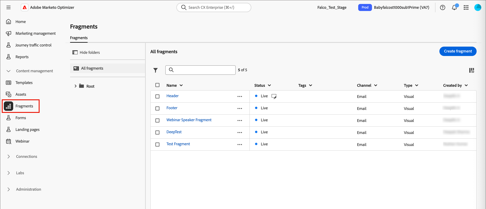
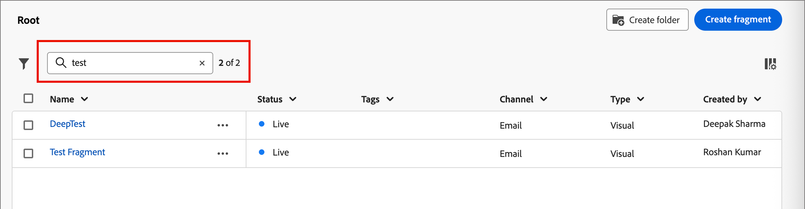

# Fragments

Un fragment est un composant réutilisable pouvant être référencé dans un ou plusieurs e-mails et modèles d’e-mail dans [!DNL Marketo Optimizer]. Il s’agit généralement d’un bloc de contenu (texte, image ou les deux) qui peut être précréé et rapidement inséré dans un e-mail ou un modèle d’e-mail. Grâce à cette fonctionnalité, vous pouvez précréer plusieurs blocs de contenu personnalisés à utiliser par les membres de votre équipe marketing pour assembler le contenu des e-mails afin d’améliorer le processus de conception. Les cas d’utilisation courants incluent les blocs de contenu d’en-tête/de pied de page pour les e-mails, les bannières d’invitation et les salutations saisonnières.

>[!BEGINSHADEBOX]

**Fragments visuels**

Les fragments visuels sont des blocs visuels prédéfinis créés à l’aide d’outils de conception visuelle que vous pouvez réutiliser dans plusieurs e-mails ou modèles d’e-mail. L’étendue actuelle de [!DNL Marketo Optimizer] et cette documentation incluent uniquement des fragments visuels.

>[!NOTE]
>
>Les fragments basés sur une expression ne sont pas encore pris en charge dans [!DNL Marketo Optimizer].

>[!ENDSHADEBOX]

Pour tirer le meilleur parti des fragments dans vos workflows :

* _Créer vos propres fragments_ - Créez des fragments visuels, soit en partant de zéro, soit en enregistrant le contenu en tant que fragment depuis l’espace de conception de contenu visuel.
* _Réutiliser les fragments_ - Utilisez-les autant de fois que nécessaire dans votre contenu d’e-mail ou de modèle d’e-mail.

## Accéder aux fragments et les gérer {#access-manage-fragments}

Pour accéder aux fragments visuels dans [!DNL Marketo Optimizer], accédez au volet de navigation de gauche et développez **[!UICONTROL Gestion de contenu]**. Sélectionnez ensuite **[!UICONTROL Fragments]**. Cette action ouvre une page de liste répertoriant tous les fragments créés dans l’instance, répertoriés dans un tableau.

{width="700" zoomable="yes"}

Le tableau est trié selon la colonne _[!UICONTROL Modifié]_, les fragments les plus récemment mis à jour étant en haut par défaut. Cliquez sur le titre de la colonne pour passer d’un ordre croissant à un ordre décroissant.

La structure de dossiers sur la gauche vous permet d’organiser les fragments. Par défaut, tous les fragments s’affichent. Lorsque vous sélectionnez un dossier, seuls les fragments et les sous-dossiers inclus dans le dossier sélectionné s’affichent.

### Statut du fragment {#fragment-status}

Le statut du fragment détermine sa disponibilité pour une utilisation dans un e-mail ou un modèle d’e-mail, ainsi que les modifications que vous pouvez y apporter.

| Statut | Description |
| ------ | ----------- |
| Brouillon | Lorsque vous créez un fragment, il est à l’état de brouillon. Il conserve ce statut lorsque vous définissez ou modifiez l’espace de conception visuelle jusqu’à ce que vous le publiiez pour l’utiliser dans un e-mail ou un modèle d’e-mail. Actions disponibles : <ul><li>Modifier tous les détails<li>Modification dans l’espace de conception visuelle<li>Publier<li>Dupliquer<li>Supprimer |
| Actif | Lorsque vous publiez un fragment, il peut être utilisé dans un e-mail ou un modèle d’e-mail. Le contenu du fragment publié ne peut pas être modifié dans l’espace de conception visuelle. Actions disponibles : <ul><li>Modifier la description<li>Ajouter à un e-mail ou un modèle<li>Créer une version brouillon<li>Dupliquer<li>Supprimer (si non utilisé) |
| Actif (avec brouillon) | Lorsque vous créez un brouillon à partir d’un fragment actif, la version active reste disponible pour être utilisée dans un e-mail ou un modèle d’e-mail, et le contenu du brouillon peut être modifié dans l’espace de conception visuelle. Si vous publiez le brouillon, il remplace la version active actuelle et le contenu est mis à jour dans les e-mails et les modèles d’e-mail où il est utilisé. Actions disponibles : <ul><li>Modifier la description<li>Ajouter à un e-mail ou un modèle<li>Modifier le brouillon dans l’espace de conception visuelle<li>Publier le brouillon<li>Dupliquer<li>Supprimer (si non utilisé) |
| Archivé | Le fragment est archivé et ne s’affiche pas dans la liste _Fragments_. |

### Filtrer la liste des fragments {#filter-list}

Pour rechercher un fragment par nom, saisissez une chaîne de texte dans la barre de recherche pour rechercher une correspondance. Lorsqu’un [dossier](#folders) est sélectionné, la recherche s’applique à tous les fragments ou dossiers du premier niveau de hiérarchie de ce dossier.

{width="500" zoomable="yes"}

Cliquez sur l’icône _Filtrer_ (  ) pour afficher les options de filtre disponibles et modifier les paramètres afin de filtrer les éléments affichés en fonction de vos critères spécifiés.

### Personnalisation de l’affichage des colonnes {#column-display}

Personnalisez les colonnes à afficher dans le tableau en cliquant sur l’icône _Personnaliser le tableau_ (  ) en haut à droite.

Dans la boîte de dialogue, sélectionnez les colonnes à afficher et cliquez sur **[!UICONTROL Appliquer]**.

{width="300"}

### Actions en masse {#bulk-actions}

Vous pouvez sélectionner plusieurs fragments à l’aide des cases à cocher et leur appliquer des opérations en bloc. Les actions disponibles s’affichent dans une barre d’actions en bloc au bas de la page de liste. Les opérations suivantes sont disponibles :

* **[!UICONTROL Déplacer vers le dossier]** - Déplacez les fragments sélectionnés dans un dossier.
* **[!UICONTROL Archiver]** - Archivez les fragments sélectionnés.

Vous pouvez également trier la liste de fragments en cliquant sur l’en-tête d’une colonne et redimensionner les colonnes en faisant glisser la bordure de la colonne pour l’adapter aux données dont vous avez besoin.

## Créer des fragments {#create-fragments}

Vous pouvez créer des fragments visuels dans [!DNL Marketo Optimizer] en cliquant sur **[!UICONTROL Créer un fragment]** en haut à droite.

1. Sur la page _[!UICONTROL Créer un fragment]_, saisissez un **[!UICONTROL Nom]** utile (obligatoire) et un **[!UICONTROL Description]** (facultatif).

   * Nom : 100 caractères maximum, doit être unique et ne pas respecter la casse.

   * Description - 300 caractères maximum

   * Les caractères Alpha, numériques et spéciaux sont autorisés

   * Les caractères réservés ne sont **_pas autorisés_** : `\ / : * ? " < > |`

   {width="700" zoomable="yes"}

1. Cliquez sur **[!UICONTROL Créer]**.

   L’espace de conception visuelle s’ouvre avec une zone de travail vide.

1. Utilisez les outils de conception de contenu pour créer le contenu du fragment visuel :

   * [Ajouter une structure et du contenu](./fragment-authoring.md#design-fragment)
   * [Ajout de ressources](./fragment-authoring.md#add-assets)
   * [Parcourir les calques, paramètres et styles](./fragment-authoring.md#navigate-layers-settings-styles)
   * [Personnaliser le contenu](./fragment-authoring.md#personalize-content)
   * [Modifier le tracking des URL liées](./fragment-authoring.md#edit-linked-url-tracking)

1. Cliquez sur **[!UICONTROL Enregistrer]** à tout moment pour enregistrer le brouillon de fragment.

1. Lorsque vous êtes prêt à rendre le fragment disponible pour une utilisation dans un e-mail ou un modèle d’e-mail, cliquez sur **[!UICONTROL Publier]**.

## Affichage des détails du fragment {#view-details}

Cliquez sur le nom d’un fragment de la page de liste pour ouvrir la page des détails du fragment. Vous pouvez choisir de modifier le fragment, de le renommer ou de mettre à jour sa description. Effectuez des mises à jour et cliquez en dehors du champ de nom ou de description pour enregistrer automatiquement les modifications.

>[!NOTE]
>
>Si un fragment publié est utilisé par un e-mail ou un modèle d’e-mail, vous ne pouvez pas modifier le nom ni le contenu. Vous pouvez créer un brouillon si vous souhaitez apporter des modifications au fragment.

{width="700" zoomable="yes"}

Cliquez sur **[!UICONTROL Modifier le fragment]** pour ouvrir le fragment dans l’éditeur de contenu visuel.

Quittez la vue à tout moment en cliquant sur la flèche _Précédent_ en haut à gauche, qui vous renvoie à la page de liste _Fragments_.

## Afficher les références de fragment {#references}

Pour un fragment _en ligne_, vous pouvez afficher la liste des ressources qui référencent (utilisent) actuellement le fragment.

1. Dans la page des détails du fragment, cliquez sur Plus (**...**) en haut à droite.

1. Sélectionnez **[!UICONTROL Explorer les références]**.

   La page _[!UICONTROL Utilisation du fragment]_ affiche une liste des ressources dans lesquelles le fragment est actuellement utilisé dans les [!DNL Marketo Optimizer], dans les e-mails et les modèles d’e-mail.

   >[!IMPORTANT]
   >
   >Un fragment actuellement utilisé par un e-mail ou un modèle d’e-mail ne peut pas être supprimé.

   Les références sont affichées selon la catégorie : _E-mail_ ou _Modèle d’e-mail_. Chaque e-mail dans [!DNL Marketo Optimizer] est défini dans un nœud d’action _Envoyer un e-mail_ d’un parcours de personne. Le parcours parent de l’e-mail qui utilise le fragment est donc affiché dans les références.

1. Cliquez sur le lien pour ouvrir l’e-mail ou le modèle d’e-mail correspondant où le fragment est utilisé.

## Utiliser des dossiers pour gérer les fragments {#folders}

Pour naviguer facilement dans vos fragments, vous pouvez utiliser des dossiers pour mieux les organiser dans une hiérarchie structurée. Vous pouvez ainsi classer et gérer les éléments en fonction des besoins de votre organisation.

Sélectionnez le dossier _[!UICONTROL Racine]_ pour afficher tous les fragments, y compris ceux situés dans tous les sous-dossiers. Sélectionnez un dossier de la structure pour afficher son contenu. Une fois le dossier sélectionné, cliquez sur Créer un fragment pour créer un fragment dans ce dossier.

### Créer des dossiers {#folders-create}

1. Une fois le dossier parent sélectionné (dossier racine ou autre), cliquez sur **[!UICONTROL Créer un dossier]** en haut à droite.

1. Saisissez un **[!UICONTROL Nom]** pour le nouveau dossier, puis cliquez sur **[!UICONTROL Enregistrer]**.

   Le nouveau dossier apparaît en haut de la liste, à l’intérieur du dossier parent sélectionné.

   Vous pouvez cliquer sur l’icône du menu Plus ( **...** ) pour renommer, déplacer ou supprimer le dossier.

### Déplacer des dossiers {#folders-move}

1. Cliquez sur le menu _Plus_ (**...**) en regard du nom du fragment que vous souhaitez déplacer.

1. Choisissez **[!UICONTROL Déplacer vers le dossier]**.

1. Dans la boîte de dialogue, naviguez dans la structure de dossiers et sélectionnez le dossier dans lequel vous souhaitez déplacer le fragment.

1. Cliquez sur **[!UICONTROL Déplacer]**.

### Supprimer des dossiers {#folders-delete}

1. Dans la structure de dossiers, sélectionnez le parent du dossier à supprimer.

1. Cliquez sur le menu _Plus_ (**...**) en regard du nom du sous-dossier affiché que vous souhaitez supprimer.

1. Choisissez **[!UICONTROL Supprimer le dossier]**.

## Modifier des fragments {#edit-fragments}

Les modifications apportées à un fragment dépendent de son statut actuel :

* Lorsqu’un fragment a le statut _Brouillon_, vous pouvez modifier n’importe lequel de ses détails et le contenu visuel.
* Lorsqu’un fragment a le statut _Actif_, vous pouvez modifier sa description, mais pas son nom. Vous ne pouvez pas modifier le contenu visuel à moins de créer un brouillon.
* Lorsqu’un fragment est à l’état _En ligne_ avec un brouillon existant, la modification des détails se limite à la description. Vous pouvez également modifier le contenu visuel de la version brouillon.

>[!BEGINTABS]

>[!TAB Brouillon]

1. Dans la page de liste _[!UICONTROL Fragments]_, cliquez sur le nom du fragment pour l’ouvrir.

   Un aperçu du contenu visuel s’affiche.

1. Modifiez la description, si nécessaire.

   {width="600" zoomable="yes"}

1. Pour apporter des modifications au contenu dans l’espace de conception visuelle, cliquez sur **[!UICONTROL Modifier]** en haut à droite.

   Utilisez les outils de conception visuelle selon vos besoins :

   * [Ajouter une structure et du contenu](./fragment-authoring.md#design-fragment)
   * [Ajout de ressources](./fragment-authoring.md#add-assets)
   * [Parcourir les calques, paramètres et styles](./fragment-authoring.md#navigate-layers-settings-styles)
   * [Personnaliser le contenu](./fragment-authoring.md#personalize-content)
   * [Modifier le tracking des URL liées](./fragment-authoring.md#edit-linked-url-tracking)

   Cliquez sur **[!UICONTROL Enregistrer]** ou **[!UICONTROL Enregistrer et fermer]** pour revenir aux détails du fragment.

1. Lorsque le fragment répond à vos critères et que vous souhaitez le rendre disponible pour une utilisation dans un e-mail ou un modèle d’e-mail, cliquez sur **[!UICONTROL Publier]**.

>[!TAB Actif]

1. Dans la page de liste _[!UICONTROL Fragments]_, cliquez sur le nom du fragment pour l’ouvrir.

   Un aperçu du contenu visuel s’affiche avec les détails du fragment sur la droite.

1. Modifiez la description, si nécessaire.

1. Si vous souhaitez mettre à jour le contenu, cliquez sur **[!UICONTROL Modifier]** en haut à droite.

1. Dans la boîte de dialogue, cliquez sur **[!UICONTROL Confirmer]** pour créer un brouillon du fragment.

   {width="300"}

1. Cliquez sur **[!UICONTROL Modifier]** en haut à droite.

1. Utilisez les outils de conception visuelle nécessaires pour mettre à jour le contenu du brouillon :

* [Ajouter la structure et le contenu](./fragment-authoring.md#design-fragment)
* [Ajout de ressources](./fragment-authoring.md#add-assets)
* [Parcourir les calques, paramètres et styles](./fragment-authoring.md#navigate-layers-settings-styles)
* [Personnaliser le contenu](./fragment-authoring.md#personalize-content)
* [Modifier le tracking des URL liées](./fragment-authoring.md#edit-linked-url-tracking)

Cliquez sur **[!UICONTROL Enregistrer]** ou **[!UICONTROL Enregistrer et fermer]** pour revenir aux détails du fragment.

1. Lorsque le brouillon répond à vos critères et que vous souhaitez rendre les modifications disponibles pour une utilisation dans un modèle d’e-mail ou de courrier électronique, cliquez sur **[!UICONTROL Publier]**.

   Lorsque vous publiez le brouillon, il remplace la version active actuelle et le contenu est mis à jour dans les e-mails et les modèles d’e-mail où il est déjà utilisé.

>[!TAB En direct (avec brouillon)]

Vous pouvez ouvrir le brouillon pour le modifier de deux manières différentes à partir de la page de liste _[!UICONTROL Fragments]_ :

* Cliquez sur l’icône _Brouillon_ ( ) en regard du nom du fragment.

* Cliquez sur le nom du fragment pour l’ouvrir. Cliquez ensuite sur l’icône _Plus de menu_ (***...***) en haut à droite et choisissez **[!UICONTROL Ouvrir le brouillon]**.

Un aperçu du contenu visuel de la version brouillon s’affiche.

_Pour mettre à jour le brouillon de contenu :_

1. Cliquez sur **[!UICONTROL Modifier]** en haut à droite.

1. Utilisez les outils de conception visuelle selon vos besoins :

   * [Ajouter une structure et du contenu](./fragment-authoring.md#design-fragment)
   * [Ajout de ressources](./fragment-authoring.md#add-assets)
   * [Parcourir les calques, paramètres et styles](./fragment-authoring.md#navigate-layers-settings-styles)
   * [Personnaliser le contenu](./fragment-authoring.md#personalize-content)
   * [Modifier le tracking des URL liées](./fragment-authoring.md#edit-linked-url-tracking)

   Cliquez sur **[!UICONTROL Enregistrer]** ou **[!UICONTROL Enregistrer et fermer]** pour revenir aux détails du fragment.

1. Lorsque le brouillon répond à vos critères et que vous souhaitez rendre les modifications disponibles pour une utilisation dans un modèle d’e-mail ou de courrier électronique, cliquez sur **[!UICONTROL Publier]**.

   Lorsque vous publiez le brouillon, il remplace la version publiée actuelle et le contenu est mis à jour dans les e-mails et les modèles d’e-mail où il est déjà utilisé.

>[!ENDTABS]

## Fragments dupliqués {#duplicate-fragments}

Vous pouvez dupliquer un fragment à l’aide de l’une des méthodes suivantes :

* Sur la page de liste _[!UICONTROL Fragments]_, cliquez sur l’icône _Plus_ (**...**) en regard du nom du fragment et choisissez **[!UICONTROL Dupliquer]**.
* En haut à droite de la page des détails du fragment, cliquez sur _Plus_ (**...**) et choisissez **[!UICONTROL Dupliquer]**.

Dans la boîte de dialogue, saisissez un nom utile (unique) et une description. Cliquez sur **[!UICONTROL Dupliquer]** pour terminer l’action.

Le fragment (nouveau) dupliqué apparaît alors dans la liste _Fragments_, située dans le même dossier.

<!-- 

## Save a new fragment from email or template content {#save-as-fragment}

When you are creating/editing an email or email template in the visual content editor, you can choose to save all or parts of the content as a fragment so that it is available for reuse.

1. When you have some content to be saved as a fragment, click **[!UICONTROL More]** and choose **[!UICONTROL Save as Fragment]**.

1. Select the different elements to be included in the fragment.

   Select multiple structures by holding the Shift or Control button.

   You can only select structures that are adjacent to each other and the interface does not allow you to select non-adjacent elements.

1. With the content selected, click **[!UICONTROL Create]** at the top right.

1. In the dialog, enter a useful name and description for the fragment. Then click **[!UICONTROL Create]**.

   The new fragment is then displayed in the _Fragments_ listing page and is also available for use within emails and email templates.

-->

## Ajouter des fragments visuels au contenu de votre e-mail ou modèle {#add-to-content}

Les fragments sont conçus pour être réutilisés et peuvent être insérés pour la création de modèles d’e-mail et d’e-mail. Vous pouvez ajouter jusqu’à 30 fragments dans un e-mail ou un modèle. Les fragments peuvent être imbriqués jusqu’à un seul niveau.

>[!BEGINTABS]

>[!TAB Ajouter des fragments à un email]

1. Accédez à un parcours de personne et ouvrez un nœud d’action _[!UICONTROL Envoyer un e-mail]_ existant ou [ajoutez-en un](../marketing/action-nodes.md#add-an-action-node).

1. Cliquez sur **[!UICONTROL Modifier le corps de l’e-mail]** pour ouvrir ou continuer [créer le contenu de l’e-mail](./email-authoring.md).

1. Faites glisser et déposez un élément du menu **[!UICONTROL Structures]** pour fournir une _structure_ pour le fragment.

1. Pour ouvrir la liste des fragments publiés, cliquez sur l’icône _Fragments_.

   Vous pouvez effectuer les actions suivantes :
   * Triez la liste.
   * Parcourez, recherchez et filtrez la liste.
   * Basculez entre les vues Carte (miniature) et Liste.
   * Actualisez la liste pour refléter l’un des fragments récemment créés.

   {width="600"}

1. Faites glisser et déposez l’un des fragments dans l’espace réservé du composant de structure.

   L’éditeur effectue le rendu du fragment dans la section/l’élément de la structure de l’e-mail.

Le contenu du fragment est mis à jour dynamiquement dans la structure pour rendre un visuel de la manière dont le contenu apparaît dans l’e-mail.

>[!TIP]
>
>Si vous souhaitez que le fragment occupe toute la disposition horizontale dans l’e-mail, ajoutez une structure de colonne [!UICONTROL 1:1] puis faites-y glisser le fragment et déposez-le.

Une fois l’e-mail enregistré, il apparaît dans la page des détails du fragment lorsque l’onglet _[!UICONTROL Utilisé par]_ est sélectionné. Les fragments ajoutés à un e-mail ne sont pas modifiables dans l’e-mail ou le modèle : le fragment source publié définit le contenu.

>[!TAB Ajouter des fragments à un modèle d’e-mail]

1. Dans le volet de navigation de gauche, développez **[!UICONTROL Gestion de contenu]** et sélectionnez **[!UICONTROL Modèles]**.

1. [Créez un modèle](./templates-create.md) ou ouvrez un modèle d’e-mail existant.

1. Dans le panneau des propriétés du modèle à droite, cliquez sur **[!UICONTROL Modifier le corps de l’e-mail]**.

1. Effectuez un glisser-déposer d’un élément du menu **[!UICONTROL Structures]** pour fournir une _structure_ contenant le fragment.

1. Pour ouvrir la liste des fragments, cliquez sur l’icône _Fragments_ à gauche.

   Vous pouvez effectuer les actions suivantes :
   * Triez la liste.
   * Parcourez, recherchez et filtrez la liste.
   * Basculez entre les vues Carte (miniature) et Liste.
   * Actualisez la liste pour refléter l’un des fragments récemment créés.

   {width="600"}

1. Faites glisser et déposez un fragment dans le composant de structure.

   L’éditeur effectue le rendu du fragment dans la section/l’élément de la structure du modèle d’e-mail.

>[!TIP]
>
>Si vous souhaitez que le fragment occupe toute la disposition horizontale dans le modèle d’e-mail, ajoutez une structure de colonne _[!UICONTROL 1:1]_ puis faites-y glisser le fragment et déposez-le.

Une fois le modèle d’e-mail enregistré, il apparaît dans la page des détails du fragment lorsque l’onglet _[!UICONTROL Utilisé par]_ est sélectionné. Les fragments ajoutés à un modèle d’e-mail ne sont pas modifiables dans le modèle : le fragment source publié définit le contenu.

>[!ENDTABS]

## Actions sur les fragments lors de la création d’e-mails et de modèles {#fragment-actions}

Lorsqu’un fragment est ajouté à un e-mail ou à un modèle d’e-mail, le contenu du fragment ne peut pas être modifié dans l’e-mail ou le modèle. Vous pouvez toutefois appliquer les actions suivantes :

* **[!UICONTROL Supprimer]** - Cette action supprime le fragment du contenu de l’e-mail ou du modèle d’e-mail actuel (la source du fragment n’est pas affectée).
* **[!UICONTROL Actualiser]** - Cette action actualise le contenu du fragment dans l’e-mail ou le modèle d’e-mail actuel. L’actualisation est utile lorsque vous souhaitez refléter des modifications récentes apportées au fragment après l’ajout à l’e-mail ou au modèle d’e-mail.
* **[!UICONTROL Dupliquer]** - Cette action duplique le fragment dans le même e-mail ou modèle d’e-mail dans l’éditeur, avec les mêmes dimensions et ajouté juste en dessous.
* **[!UICONTROL Ouvrir le fragment]** - Cette action ouvre un nouvel onglet du navigateur avec la page de l’éditeur de fragments et les détails.
* **[!UICONTROL Explorer les références]** - Cette action ouvre la page Utilisation du fragment, où vous pouvez afficher l’utilisation du fragment par type.
* **[!UICONTROL Rompre l’héritage]** - Cette action rompt l’héritage du fragment (et de ses modifications) de la source. Utilisez cette action pour rendre le contenu du fragment disponible en tant que contenu indépendant et modifiable dans l’e-mail ou le modèle d’e-mail. Cette action supprime également l’e-mail ou le modèle d’e-mail de la référence _Utilisé par_ pour le fragment d’origine.

Lorsque vous sélectionnez le fragment sur la page de l’éditeur, ces actions sont disponibles dans la barre d’outils contextuelle et le panneau des propriétés à droite.

{width="600" zoomable="yes"}
