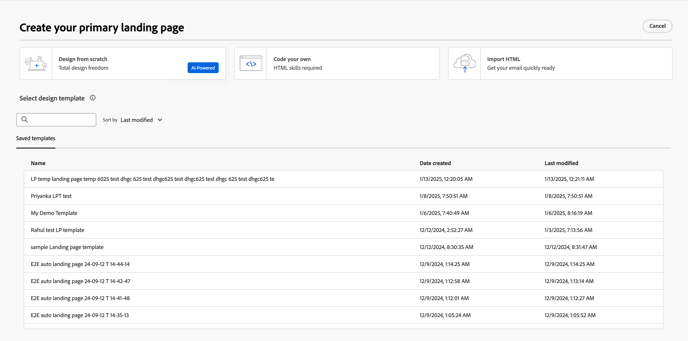

# Créer et publier des pages de destination

En tant que marketeur, vous pouvez définir et publier les pages que vous souhaitez incorporer dans vos parcours. Lorsque vous ajoutez une nouvelle page de destination, vous configurez la page principale et les sous-pages, vous concevez le contenu, vous le testez et vous le publiez.

>[!BEGINSHADEBOX]

## Conditions préalables relatives aux pages de destination {#landing-page-prerequisites}

Pour que les marketeurs puissent créer des pages de destination pour prendre en charge leurs parcours, les configurations et ressources suivantes doivent être en place :

* [Sous-domaine de page de destination](../admin/configuration-presets-landing-pages.md#lp-subdomains) - Configurez un sous-domaine dédié à l’hébergement de vos pages de destination.
* [Préréglage de la page de destination](../admin/configuration-presets-landing-pages.md#lp-presets) - Un préréglage définit le sous-domaine et les autres paramètres appliqués à vos pages de destination.
* [Formulaire](./forms.md) (pour les cas d’utilisation de capture de données) - Obligatoire lorsque vous souhaitez incorporer un formulaire sur une page de destination et envoyer des données à Experience Platform.

>[!ENDSHADEBOX]

## Créer une page de destination {#create-landing-page}

>[!CONTEXTUALHELP]
>id="ajo-b2b-prime_lp_create"
>title="Définissez et configurez votre page de destination."
>abstract="Pour créer une page de destination, vous devez sélectionner un préréglage, puis configurer la page principale et les sous-pages, et enfin tester la page avant de la publier."

Pour diriger les membres d’une audience de parcours vers une page web définie lorsqu’ils cliquent sur un lien spécifique, créez une page de destination dans [!DNL Marketo Optimizer].

>[!IMPORTANT]
>
>Avant de créer votre première page de destination, effectuez sa configuration. Cela inclut la configuration d’un sous-domaine pour héberger vos pages de destination et la définition d’au moins un préréglage qui spécifie le sous-domaine et d’autres paramètres de canal. Vous sélectionnez un préréglage lors de la création de la page de destination. Pour la configuration de l’administrateur, voir [Configuration de la page de destination](../admin/configuration-presets-landing-pages.md).
>
>Pour les cas d’utilisation de capture de données, créez un [formulaire](./forms.md) avant de l’incorporer dans une page de destination.

_Pour créer une landing page :_

1. Accédez au volet de navigation de gauche et sélectionnez **[!UICONTROL Gestion de contenu]** > **[!UICONTROL Pages de destination]**.

1. Dans la liste des pages de destination, cliquez sur **[!UICONTROL Créer une page de destination]**.

1. Saisissez un **[!UICONTROL Titre]** (obligatoire) et un **[!UICONTROL Description]** (facultatif).

   Critères de titre et de description :

   * **Titre** — 100 caractères maximum. Doit être unique (non-respect de la casse).
   * **Description** — 300 caractères maximum.
   * Les caractères Alpha, numériques et spéciaux sont autorisés.
   * Les caractères réservés ne sont **_pas autorisés_** : `\ / : * ? " < > |`

   {width="600"}

1. Sélectionnez un **[!UICONTROL paramètre prédéfini]**.

   Un administrateur [crée des préréglages de page de destination](../admin/configuration-presets-landing-pages.md#lp-presets) pour définir le sous-domaine et les autres paramètres utilisés pour les pages de destination. Sélectionnez un paramètre prédéfini, puis cliquez sur **[!UICONTROL Afficher le paramètre prédéfini]** pour consulter ses paramètres et confirmer qu’ils correspondent aux exigences de votre page de destination.

1. Cliquez sur **[!UICONTROL Créer]**.

   La page principale et ses propriétés s’affichent. Découvrez comment [&#x200B; configurer les paramètres de la page principale &#x200B;](#configure-primary-page).

   {width="700" zoomable="yes"}

1. Pour ajouter une sous-page (par exemple, une page de remerciement ou d’erreur), cliquez sur l’icône **+**.

   Vous pouvez ajouter jusqu’à deux sous-pages par page de destination.

Après avoir configuré et conçu la page principale et les sous-pages, [testez votre page de destination](#test-landing-page) avant de la publier.

>[!CAUTION]
>
>Vous ne pouvez pas accéder à votre page de destination en copiant-collant l’URL définie dans un navigateur web, même si la page est publiée. Testez la page à l’aide de la fonction d’aperçu, comme décrit dans [Tester la page de destination](#test-landing-page).

## Configurer la page principale {#configure-primary-page}

>[!CONTEXTUALHELP]
>id="ajo-b2b-prime_lp_primary_page"
>title="Définissez les paramètres de votre page principale."
>abstract="Définissez la page principale, qui s’affiche immédiatement lorsqu’un ou une destinataire clique sur le lien de la page de destination, par exemple à partir d’un e-mail ou d’un site web."

>[!CONTEXTUALHELP]
>id="ajo-b2b-prime_lp_access_settings"
>title="Définissez lʼURL de votre page de destination."
>abstract="Dans cette section, définissez une URL de page de destination unique. La première partie de l’URL nécessite la configuration préalable d’un sous-domaine de page de destination dans le cadre du préréglage que vous avez sélectionné."

La page principale est la page qui s’affiche immédiatement lorsqu’un destinataire clique sur le lien de la page de destination, par exemple à partir d’un e-mail ou d’un site web.

_Pour définir les paramètres de la page principale :_

1. Modifiez le **[!UICONTROL Nom de la page]** en fonction de vos besoins, qui est par défaut la page de Principal __.

1. Définissez la partie de fin de l’URL de la page.

   Le préréglage que vous avez sélectionné détermine la première partie de l’URL. Un administrateur configure le [sous-domaine de page de destination](../admin/configuration-presets-landing-pages.md#lp-subdomains) dans le cadre du préréglage.

   >[!CAUTION]
   >
   >LʼURL de la page de destination doit être unique.
   >
   >Vous ne pouvez pas accéder à votre page de destination en copiant-collant cette URL dans un navigateur web, même si la page est publiée. Testez-la à l’aide de la fonction d’aperçu, comme décrit dans [Tester la page de destination](#test-landing-page).

1. Si vous souhaitez une page de destination anonyme, désactivez l’option **[!UICONTROL Exiger des utilisateurs identifiés]**.

1. Cliquez sur l’icône _Calendrier_ (  ) pour définir l’**[!UICONTROL expiration de la page]**.

   Après avoir sélectionné une date d’expiration, choisissez l’action lors de l’expiration de la page :

   * **[!UICONTROL URL de redirection]** - Saisissez l’URL de la page à utiliser comme redirection.

     {width="400"}

   * **[!UICONTROL Erreur de navigateur]** - Saisissez le texte de l’erreur à afficher à la place de la page.

     {width="400"}

## Choisir le type de conception du contenu {#choose-design-type}

Pour ajouter le _[!UICONTROL Contenu]_ de la page, cliquez sur **[!UICONTROL Ouvrir Designer]**. Le processus de conception commence par le choix de la manière dont vous souhaitez commencer :

* [Créer en partant de zéro](#design-from-scratch)
* [Importer du contenu HTML](#import-html)

{width="800" zoomable="yes"}

Après avoir sélectionné la méthode souhaitée pour démarrer la conception de la page de destination, utilisez les outils de conception visuelle pour [terminer le contenu de la page](./landing-page-design.md).

### Créer en partant de zéro {#design-from-scratch}

Utilisez l’espace de conception visuelle du contenu pour définir la structure et le contenu de la page de destination. En ajoutant et en déplaçant des composants structurels à l’aide de simples actions de glisser-déposer, vous pouvez concevoir la disposition et l’organisation du contenu de la page en quelques secondes.

1. Sur la page d’accueil de la conception, sélectionnez l’option **[!UICONTROL Créer en partant de zéro]**.

1. [Ajoutez la structure et le contenu](./landing-page-design.md#structure-content-landing-page) à la page.

1. [Vérifier et modifier le tracking des URL liées](./landing-page-design.md#linked-url-tracking).

1. [Tester la page de destination](#test-landing-page).

Lorsque le contenu vous convient, cliquez sur **[!UICONTROL Enregistrer]**.

### Importer du contenu HTML {#import-html}

<!-- originally  from   /help/_includes/content-design-import.md but copied and revised to omit the part about Marketo Engage assets and AEM assets -->

Le contenu importé peut être :

* Fichier HTML avec feuille de style incorporée
* Un fichier .zip qui comprend un fichier HTML, la feuille de style (.css) et les images

  >[!NOTE]
  >
  >Aucune contrainte ne s’applique à la structure du fichier .zip. Cependant, les références doivent être relatives et s’ajuster à l’arborescence du dossier .zip. Les images sont toujours chargées vers le [référentiel de ressources](./digital-asset-management.md).

_Pour importer un fichier contenant du contenu HTML :_

1. Sur la page d’accueil de la conception, sélectionnez l’option **[!UICONTROL Importer HTML]**.

1. Faites glisser et déposez le fichier HTML ou .zip contenant le contenu HTML, puis cliquez sur **[!UICONTROL Importer]**.

{width="500"}

>[!NOTE]
>
>L’utilisation d’une balise `<table>` comme première couche d’un fichier HTML peut entraîner une perte de style, y compris les paramètres d’arrière-plan et de largeur dans la balise de couche supérieure.

Vous pouvez personnaliser le contenu importé selon vos besoins à l’aide des outils de conception visuelle.

## Vérifier les alertes {#check-alerts}

Lorsque vous concevez le contenu de votre page de destination, des alertes s’affichent en haut à droite lorsque des paramètres clés sont manquants.

{width="250"}

Si ce bouton ne s’affiche pas, aucun problème n’est détecté.

Il existe deux types d’alertes :

* **_avertissements_** qui se rapportent aux recommandations et aux bonnes pratiques telles que :

  * `Placeholder links are present in the landing page body` : n’oubliez pas de remplacer les espaces réservés par des liens valides.

  * `Text version of HTML is empty` : n’oubliez pas de définir une version texte du corps de votre page, qui est utilisée lorsque le contenu HTML ne peut pas être affiché.

  * `Empty link is present in page body` : vérifiez que tous les liens de votre page sont corrects.

* **_Erreurs_** qui vous empêchent de tester ou d’activer le parcours tant qu’elles ne sont pas corrigées, telles que :

  * `The landing page content is empty` : le contenu de la page est obligatoire.

## Tester la page de destination {#test-landing-page}

>[!CONTEXTUALHELP]
>id="ajo-b2b-prime_preview_lp_profiles"
>title="Prévisualiser et tester votre page de destination"
>abstract="Après avoir défini les paramètres et le contenu de votre page de destination, utilisez des profils de test pour prévisualiser la page."

Lorsque les paramètres et le contenu de la page de destination sont définis, vous pouvez utiliser des profils de test pour prévisualiser la page. Si vous avez inséré du [contenu personnalisé](./landing-page-design.md#personalize-content), vous pouvez vérifier l’affichage de celui-ci dans la page de destination à l’aide des données de profil de test.

>[!PREREQUISITES]
>
>Pour prévisualiser et tester des pages de destination, vous devez disposer de l’autorisation **[!UICONTROL Publier des messages]** et d’un jeu de données défini contenant des profils de test.

1. Cliquez sur **[!UICONTROL Aperçu et test]** pour ouvrir la sélection du profil de test.

   >[!NOTE]
   >
   >Vous pouvez également utiliser la fonction **[!UICONTROL Simuler du contenu]** lorsque vous vous trouvez dans l’espace de conception visuelle.

1. Dans l’écran _[!UICONTROL Simuler]_, sélectionnez un profil de test.

   {width="700" zoomable="yes"}

   Si les profils dont vous avez besoin ne sont pas répertoriés, cliquez sur **[!UICONTROL Gérer les profils de test]** pour utiliser une adresse e-mail de profil de test connu et l’ajouter à la liste.

   +++Ajout de profils de test

   Pour **[!UICONTROL Espace de noms d’identité]**, cliquez sur l’icône _Sélectionner_ (  ) et choisissez l’espace de noms d’`Email` à utiliser pour tester les profils.

   {width="700" zoomable="yes"}

   Dans le champ **[!UICONTROL Valeur d’identité]**, saisissez l’adresse e-mail pour identifier le profil de test et cliquez sur **[!UICONTROL Ajouter un profil]**. Vous pouvez répéter cette opération pour ajouter plusieurs profils.

   {width="700" zoomable="yes"}

   Cliquez sur la flèche vers l’arrière en haut à gauche pour revenir à la page _[!UICONTROL Simuler]_.

   +++

1. Sélectionnez **[!UICONTROL Ouvrir l’aperçu]** pour tester votre page de destination.

   L’aperçu de la page de destination s’ouvre dans un nouvel onglet. Les données du profil de test sélectionné remplacent les éléments personnalisés.

   {width="600"}

1. Sélectionnez dʼautres profils de test pour prévisualiser le rendu de chaque variante de votre page de destination.

## Publier la page {#publish-landing-page}

>[!PREREQUISITES]
>
>Pour publier des pages de destination, vous devez disposer de l’autorisation **[!UICONTROL Publier des messages]**. Avant de publier, [vérifiez et résolvez toutes les alertes](#check-alerts).

Lorsque le brouillon de page répond à vos critères et que vous souhaitez le rendre disponible pour qu’il soit lié dans vos messages de parcours, cliquez sur **[!UICONTROL Publier]** en haut à droite. Dans la boîte de dialogue de confirmation, cliquez de nouveau sur **[!UICONTROL Publier]** pour confirmer.

{width="250"}

Lorsque la landing page est publiée, elle s&#39;affiche dans la liste des landing pages avec le statut **_[!UICONTROL Publiée]_**. Cela signifie qu’il est actif et prêt à être utilisé dans un e-mail ou un SMS envoyé par le biais d’un parcours.

Vous ne pouvez pas accéder à la page de destination publiée en copiant-collant l’URL dans un navigateur web. Vous pouvez le tester à tout moment à l’aide de la fonction [preview](#test-landing-page).
