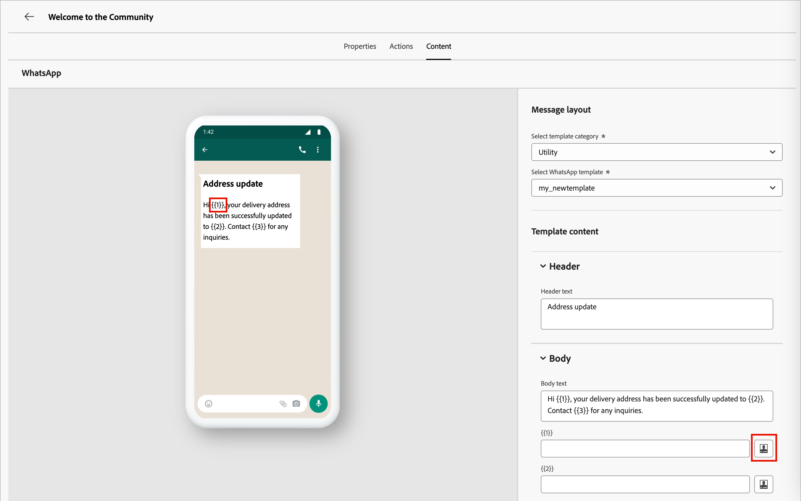

# Création WhatsApp

Utilisez [!DNL Adobe Marketo Optimizer] pour envoyer des messages WhatsApp aux personnes sur leurs appareils mobiles. Vous pouvez créer, personnaliser et prévisualiser des messages en utilisant des modèles de messages Meta approuvés à partir de l&#39;éditeur WhatsApp.

Avant de créer des messages WhatsApp pour les parcours de personne, assurez-vous qu&#39;un canal [WhatsApp](../admin/configuration-channels-whatsapp.md) est configuré dans les paramètres _[!UICONTROL Administrateur]_.

>[!NOTE]
>
>Seuls les éléments de message _sortant_ WhatsApp sont pris en charge dans [!DNL Marketo Optimizer].

+++ Éléments de message pris en charge et options call-to-action

Utilisez les tableaux de cette section comme référence pour le contenu WhatsApp sortant que vous pouvez inclure dans les modèles Meta approuvés et pour les boutons interactifs que vous pouvez ajouter aux messages.

Le tableau suivant résume les éléments de message pris en charge et leurs exigences.

| Élément de message | Description |
| - | - |
| En-têtes | Texte facultatif qui apparaît au-dessus du corps de votre message. |
| Texte | Prend en charge le contenu dynamique par le biais de paramètres. |
| Images (JPEG, PNG) | Doivent être au format RGB ou RGBA 8 bits et d’une taille inférieure à 5 Mo. |
| Vidéos | Doit être 3GPP ou MP4, de moins de 16 Mo, et hébergé par URL. |
| Audio | Disponible uniquement pour les messages de réponse. Le fichier doit être au format AAC, AMR, MP3, MP4 audio ou OGG, être hébergé sur une URL et avoir une taille inférieure à 16 Mo. |
| Documents | Doit être inférieur à 100 Mo, hébergé sur une URL et dans l’un des formats suivants : `.txt`, `.xls`/`.xlsx`, `.doc`/`.docx`, `.ppt`/`.pptx` ou `.pdf`. |
| Corps de texte | Prend en charge le contenu dynamique par le biais de paramètres. |
| Texte du pied de page | Prend en charge le contenu dynamique par le biais de paramètres. |

Le tableau suivant répertorie les types de boutons call-to-action et la manière dont chacun se comporte dans le message.

| Call to action | Description |
| - | - |
| Visiter le site web | Un seul bouton est autorisé, avec les paramètres de variable inclus. |
| Appeler sur WhatsApp | Fournit un bouton qui ouvre une conversation WhatsApp avec le numéro de téléphone spécifié directement à partir du message. |
| Appeler le numéro de téléphone | Fournit un bouton qui déclenche un appel téléphonique vers le numéro spécifié lorsque l’utilisateur ou l’utilisatrice appuie dessus. |

+++

## Ajouter une action WhatsApp dans un parcours de personne {#add-whatsapp-journey-action}

>[!IMPORTANT]
>
>**Gestion du consentement de WhatsApp** : conformément aux politiques de Meta et aux réglementations applicables, tous les messages marketing de WhatsApp doivent être envoyés uniquement aux destinataires ayant accepté de recevoir des communications. Les destinataires de WhatsApp peuvent se désinscrire à tout moment en répondant avec un mot-clé de désinscription. Les réponses d’opt-out sont automatiquement honorées et les profils correspondants sont supprimés des audiences de messages marketing futures.

Vous pouvez configurer des diffusions de messages WhatsApp dans un parcours de personne lorsque vous [ajoutez un nœud _[!UICONTROL Prendre une action]_](../marketing/action-nodes.md) et choisissez **[!UICONTROL Envoyer WhatsApp]** dans la liste des actions.

## Créer le message WhatsApp {#create-whatsapp-message}

1. Au bas du panneau _[!UICONTROL Agir]_, cliquez sur **[!UICONTROL Créer WhatsApp]**.

1. Dans la boîte de dialogue, entrez un **[!UICONTROL Nom]** (obligatoire) et un **[!UICONTROL Description]** (facultatif) uniques pour le message WhatsApp.

   {width="400"}

1. Cliquez sur **[!UICONTROL Créer]**.

   L&#39;espace de conception _WhatsApp_ s&#39;ouvre où vous pouvez définir les actions WhatsApp et créer le contenu pour envoyer le message.

### Sélection de la configuration des actions {#select-actions-configuration}

1. Dans l&#39;espace de conception _WhatsApp_, sélectionnez l&#39;onglet **[!UICONTROL Actions]**.

1. Pour **[!UICONTROL Configuration de WhatsApp]**, sélectionnez la configuration qui prend en charge les actions marketing et les paramètres de diffusion des messages selon vos besoins.

   {width="700" zoomable="yes"}

1. Cliquez sur **[!UICONTROL Modifier le contenu]** pour passer aux paramètres et au texte du message.

### Sélectionner un modèle de message {#select-message-template}

Les messages WhatsApp sont envoyés à l&#39;aide de modèles de messages préapprouvés depuis votre compte professionnel Meta WhatsApp. **Les modèles doivent être examinés et approuvés par Meta** avant de pouvoir les utiliser dans [!DNL Marketo Optimizer]. Pour gérer et envoyer des modèles à approuver, contactez l’administrateur de votre compte [!DNL Meta Business Manager].

1. Pour **[!UICONTROL Sélectionner une catégorie de modèles]**, choisissez l’une des options suivantes :

   * Marketing
   * Utilitaire
   * Authentification

1. Pour **[!UICONTROL Sélectionner le modèle WhatsApp]**, choisissez un modèle approuvé pour le compte professionnel configuré.

   Le contenu du modèle se charge dans l’éditeur de messages, affichant la structure du modèle et les champs de variable disponibles pour la personnalisation.

   {width="700" zoomable="yes"}

   Le système organise les modèles par catégorie (_Marketing_, _Utilitaire_ et _Authentification_) et statut. Seuls les modèles **_Approuvés_** peuvent être sélectionnés. Pour plus d&#39;informations sur la création de modèles WhatsApp, voir [_Création de modèles de messages pour votre compte d&#39;entreprise WhatsApp_](https://www.facebook.com/business/help/2055875911147364?id=2129163877102343) dans la documentation de Meta.

### URL des images {#image-urls}

Si votre modèle comprend des images, utilisez le champ **[!UICONTROL URL de l’image]** pour ajouter des URL de média afin de remplacer tous les espaces réservés dans votre modèle. Les médias des modèles Meta sont uniquement des espaces réservés. Pour afficher correctement les images, l’audio ou la vidéo, vous devez utiliser des URL externes provenant d’Adobe Experience Manager ou d’autres sources.

### Personnaliser le contenu du message {#personalize-message-content}

Les modèles WhatsApp approuvés peuvent inclure des espaces réservés de variable que vous définissez à l’aide de données de profil ou de valeurs dynamiques.

Pour chaque champ de variable affiché dans le modèle, cliquez sur l’icône _Personnaliser_ (  ) en regard du champ.

{width="700" zoomable="yes"}

La boîte de dialogue permet d’accéder aux jetons de personne et aux jetons système. Des jetons standard et personnalisés sont inclus. Vous pouvez utiliser la barre _Rechercher_ pour localiser le jeton dont vous avez besoin ou parcourir l’arborescence de dossiers pour rechercher et sélectionner l’un des jetons.

Lorsque vos jetons de personnalisation sont définis, cliquez sur **[!UICONTROL Enregistrer]** pour enregistrer les modifications et revenir à l&#39;espace de travail principal des messages WhatsApp.
