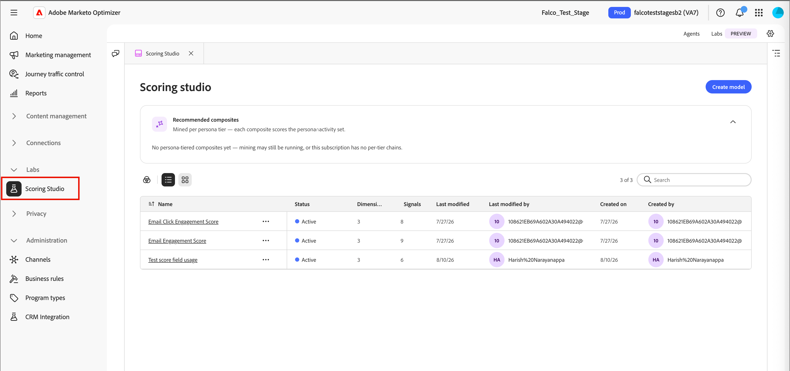

# Studio de notation

Scoring Studio comprend une liste de modèles, une zone de travail modifiable pour chaque modèle et l’[interface de conversation des collègues](../agents/chat-interface.md). Utilisez la zone de travail pour vérifier ou ajuster les dimensions et les signaux directement, tandis que Coworker continue à proposer des changements en langage naturel à vos côtés. Pour plus d’informations sur la création d’un modèle à partir d’une invite, voir [_Création de modèles de notation personnalisés_](../agents/lead-scoring-model.md).

## Liste de modèles {#model-list}

La liste des modèles est la vue de destination de Scoring Studio. Il affiche chaque modèle de score de votre instance de [!DNL Marketo Optimizer] sous forme de lignes dans un tableau ou de cartes si vous passez en vue grille.

| Colonne | Description |
| --- | --- |
| Nom | Sélectionnez un nom de modèle pour l’ouvrir sur la zone de travail. |
| Statut | _[!UICONTROL Actif]_, _[!UICONTROL Brouillon]_ ou _[!UICONTROL Archivé]_. |
| Dimensions | Nombre de dimensions dans le modèle. |
| Signaux | Nombre de signaux dans le modèle. |
| Dernière modification | Date de la dernière modification du modèle. |
| Dernière modification par | Personne qui a modifié le modèle pour la dernière fois. |
| Date de création | Date de création du modèle. |
| Création par | Personne qui a créé le modèle. |

{width="800" zoomable="yes"}

Utilisez le champ de recherche pour rechercher un modèle par nom ou filtrer la liste par statut. Sélectionnez le menu **[!UICONTROL Plus]** d’une ligne pour **[!UICONTROL Modifier]**, **[!UICONTROL Dupliquer]**, **[!UICONTROL Archiver]** ou **[!UICONTROL Supprimer]** un modèle.

Un modèle actif est en lecture seule. Pour le modifier, dupliquez-le et modifiez le doublon. Archivez ensuite l’original et publiez la copie modifiée.

## Zone de travail du modèle {#model-canvas}

La sélection d’un nom de modèle l’ouvre sur la zone de travail. Chaque modèle ouvert apparaît comme son propre onglet, ce qui vous permet de travailler sur plusieurs modèles. La zone de travail est organisée en onglets, y compris **[!UICONTROL Règles]** et **[!UICONTROL Lead]**.

Dans l’onglet **[!UICONTROL Règles]**, chaque dimension du modèle correspond à une colonne de la zone de travail. Chaque en-tête de colonne affiche le nom de la dimension et son total de points par rapport à sa limite, par exemple `20 / 30 pts`, avec une barre de progression qui se remplit à mesure que ses signaux génèrent des points.

{width="700" zoomable="yes"}

À l’intérieur de chaque dimension, chaque signal apparaît sous la forme d’une carte indiquant son nom, sa valeur de point et sa fréquence de correspondance (par exemple, `1 time / day`) ou `Static` pour les signaux basés sur des attributs qui ne dépendent pas de l’activité.

Lorsque Coworker détecte un motif sur plusieurs activités, il peut les combiner en une seule carte de signal composite qui résume chaque condition.

## Configurer un signal {#configure-signal}

Pour vérifier ou modifier un signal, procédez comme suit.

1. Sélectionnez **[!UICONTROL Modifier le brouillon]**.

1. Sélectionnez une carte de signalisation sur la zone de travail.

   Le panneau Propriétés s’ouvre dans la partie droite de la zone de travail.

   {width="700" zoomable="yes"}

1. Sélectionnez l’icône **[!UICONTROL Modifier]** (  ), puis mettez à jour les propriétés du signal :

   * Sous **[!UICONTROL Signal]**, confirmez le type de signal (une activité ou un attribut) et l’activité ou l’attribut spécifique qu’il note.

   * Sous **[!UICONTROL Déclencher ceci]**, définissez les conditions qui doivent correspondre.

     Ajoutez les éléments à utiliser, tels que des pages spécifiques, et indiquez si les conditions **[!UICONTROL Any of]** ou **[!UICONTROL All of]** doivent être vraies.

   * Sous **[!UICONTROL Points]**, définissez le nombre de points auxquels le signal contribue.

     Vous pouvez éventuellement définir une **[!UICONTROL Limite]** pour limiter le nombre de points qu’elle peut contribuer par personne. Coworker affiche une plage de points suggérée en fonction des autres signaux du modèle.

   * Pour les signaux basés sur l&#39;activité, définissez la **[!UICONTROL Fréquence]** requise avant que le signal n&#39;attribue des points.

     Facultativement, définissez un pourcentage **[!UICONTROL Dégradation]** qui réduit les points du signal après un nombre défini de jours.

   * Activez l’option **[!UICONTROL Éviter de noter les mêmes actions deux fois]** pour n’attribuer des points qu’une seule fois par personne, quel que soit le nombre de fois où l’activité se produit.

     Désactivez l’option permettant d’attribuer des points à chaque fois que l’activité se produit à la place. Ce paramètre est activé par défaut.

1. Sélectionnez **[!UICONTROL Enregistrer]** pour appliquer vos modifications et revenir à la zone de travail.

## Segment de lead {#lead-segment}

Chaque modèle de notation note un segment de prospect, faisant référence à une liste de personnes existante plutôt qu’à des règles que vous définissez dans Scoring Studio. Lorsque Coworker crée un modèle, il sélectionne une liste correspondante ou en crée une nouvelle.

Pour modifier la liste, sélectionnez l’onglet **[!UICONTROL Lead]**, puis sélectionnez **[!UICONTROL Modifier]** en regard du segment de lead.

{width="700" zoomable="yes"}.

Un segment de prospect utilise l’un des deux types de liste suivants :

* **Liste statique** : ensemble fixe de personnes capturées lors de la création de la liste.
* **Liste dynamique** : liste qui réévalue ses règles d’appartenance à chaque exécution du modèle, de sorte que le segment reflète toujours les critères de liste.

L’aperçu du modèle affiche le nom du segment, son nombre de membres et un lien **[!UICONTROL Afficher la liste des personnes]** qui ouvre directement la liste. Pour plus d’informations sur la gestion des listes, voir [_Listes de personnes_](../audiences/people-lists.md).

Si la liste référencée est vide ou supprimée ultérieurement, le modèle cesse de noter au lieu de retomber sur l’ensemble de votre audience. Aucun prospect n’est noté tant que vous n’avez pas attribué une liste valide et non vide.

Sous le segment de prospect, la carte **[!UICONTROL Nom du champ de score]** affiche l’attribut de prospect dans lequel le modèle écrit son score. Par défaut, le nom du champ correspond au nom du modèle. Sélectionnez **[!UICONTROL Modifier]** pour le renommer.

## Publier et planifier {#publish-schedule}

Lorsque votre modèle est prêt, sélectionnez **[!UICONTROL Publier]**. Choisissez la fréquence à laquelle le modèle évalue votre audience : quotidienne, hebdomadaire ou mensuelle.

Pour le processus de publication complet, y compris la manière dont [!DNL Marketo Optimizer] met en service automatiquement un champ de notation, consultez [_Publication d’un modèle de notation_](../agents/lead-scoring-model.md#publish-model).
