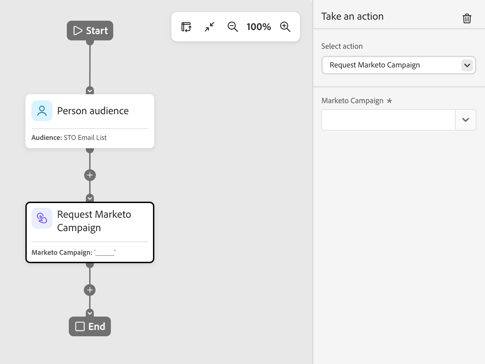
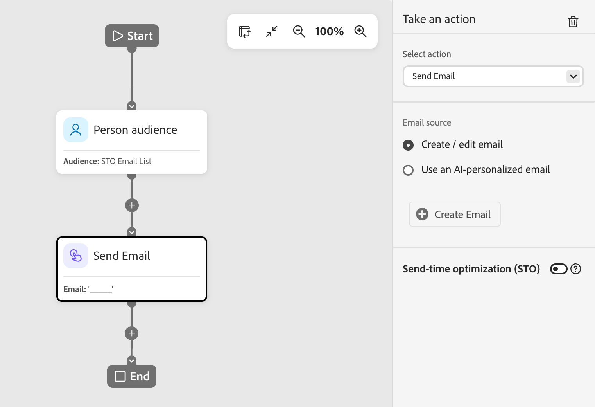

# Nœud Prendre une action

Dans un parcours de personne, utilisez une action sur les personnes lorsque vous souhaitez appliquer une modification à toutes les personnes sur le chemin de nœud.

## Actions et contraintes {#actions}

| Action | Contraintes |
| ------ | ----------- |
| **[!UICONTROL Activer vers la destination]** | <li>Sélectionner ou créer une liste statique <li>Si la liste n’a pas de destination activée, activez la liste vers une ou plusieurs destinations |
| **[!UICONTROL Ajouter une personne au parcours]** | <li>Sélectionner un parcours planifié ou dynamique <li>Les critères d’audience du parcours cible ne sont pas appliqués |
| **[!UICONTROL Ajouter à la liste]** | <li>Créer une liste statique ou en sélectionner une existante |
| **[!UICONTROL Ajouter à la liste Marketo Engage]** | <li>Sélectionner une liste statique dans Marketo Engage |
| **[!UICONTROL Modifier la valeur des données]** | <li>Sélectionner l’attribut de personne <li>Définir une nouvelle valeur |
| **[!UICONTROL Modifier le statut dans le programme]** | <li>Sélectionner un programme<li>Sélectionner un nouveau statut |
| **[!UICONTROL Modifier le statut de membre du webinaire]** | <li>Sélectionner un programme<li>Sélectionner un nouveau statut |
| **[!UICONTROL Supprimer de la liste]** | <li>Sélectionner une liste statique <li>Ignore la personne si elle n’est pas actuellement membre |
| **[!UICONTROL Supprimer de la liste Marketo Engage]** | <li>Sélectionner une liste statique dans Marketo Engage <li>Ignore la personne si elle n’est pas actuellement membre |
| **[!UICONTROL Supprimer une personne du parcours]** | <li>Sélectionner un parcours dynamique <li>Ignore la personne si elle n’est pas actuellement membre du parcours cible |
| **[!UICONTROL Demander une campagne Marketo Engage]** | <li>Sélectionner une campagne Marketo Engage |
| **[!UICONTROL Envoyer un e-mail]** | <li>Créer, modifier ou utiliser un e-mail personnalisé par l’IA <li>Optimisation de l’heure d’envoi (facultatif) |
| **[!UICONTROL Envoyer WhatsApp]** | <li>Sélectionner un message WhatsApp |

<!-- 
removed? | **[!UICONTROL Change Program Data]** | <li>Select program attribute <li>Set new value | 
-->

## Ajouter un nœud d’action {#add-an-action-node}

1. Accédez à la zone de travail de parcours.

1. Cliquez sur l’icône plus ( **+** ) d’un chemin d’accès et choisissez **[!UICONTROL Effectuer une action]**.

   {width="200"}

1. Dans les propriétés de nœud sur la droite, sélectionnez une action dans la liste et définissez ses valeurs.

+++Activer vers la destination

Utilisez cette action pour ajouter des personnes à une liste statique et activer cette liste vers une destination directement depuis votre parcours. Vous pouvez utiliser une liste statique existante ou en créer une spécifiquement pour le parcours.

>[!PREREQUISITES]
>
>Vous devez avoir une ou plusieurs [destinations configurées](../audiences/destinations.md) pour votre sandbox [!DNL Marketo Optimizer] avant de configurer un nœud de parcours _Activer vers la destination_.

{width="450"}

Sous **[!UICONTROL Ajouter à la liste]**, choisissez l’une des options suivantes :

* **[!UICONTROL Créer]** — Créez une liste statique et ajoutez-y des personnes. La liste est immédiatement disponible sous **[!UICONTROL Listes des personnes]**.

  Sélectionnez un programme parent pour la liste et saisissez un **[!UICONTROL Nom]** (obligatoire) et un **[!UICONTROL Description]** (facultatif). Cliquez sur **[!UICONTROL Créer]** pour ajouter la nouvelle liste pour le nœud.

  {width="375"}

* **[!UICONTROL Sélectionner]** — Sélectionnez une liste statique existante dans laquelle vous souhaitez ajouter les personnes qui atteignent le nœud.

  Cochez la case de la liste statique existante, puis cliquez sur **[!UICONTROL Enregistrer]**.

  {width="700" zoomable="yes"}

Quiconque atteint le nœud est ajouté à la liste statique sélectionnée, mais l’action n’est pas terminée tant que la liste n’est pas activée vers une destination :

* Si la liste sélectionnée est déjà activée, ses destinations apparaissent sous **[!UICONTROL Destinations]** et l’action est prête.
* Dans le cas contraire, un message _Au moins une destination est requise_ s’affiche. Cliquez sur **[!UICONTROL Activer la liste vers la destination]**, sélectionnez la destination, puis cliquez sur **[!UICONTROL Enregistrer]**. Cliquez sur **[!UICONTROL Activer]** dans la boîte de dialogue de confirmation.

{width="600" zoomable="yes"}

Une fois l’activation terminée, la destination s’affiche sous **[!UICONTROL Destinations]** et l’action est prête. Si nécessaire, vous pouvez activer la liste vers des destinations supplémentaires.

Toute personne atteignant le nœud est ajoutée à la liste statique sélectionnée, qui est activée à la destination choisie. Elle est donc ajoutée à cette audience de destination et, par conséquent, à toute campagne que l’audience alimente.

+++

+++[!UICONTROL Ajouter une personne au parcours &#x200B;]

Utilisez cette action pour ajouter des personnes à d&#39;autres parcours planifiés ou en direct. Les personnes ajoutées par le biais de cette action sont immédiatement ajoutées à l’audience du parcours cible. Les critères d’audience du parcours cible ne sont pas appliqués.

{width="450"}

+++

+++[!UICONTROL Ajouter à la liste]

Utilisez cette action pour ajouter des personnes à une liste statique dans Marketo Optimizer.

{width="450"}

Choisissez l’une des options suivantes :

* **[!UICONTROL Créer]** — Créez une ressource de liste statique et ajoutez-y des personnes. Cette liste peut être utilisée immédiatement par d’autres ressources dans Marketo Optimizer.
* **[!UICONTROL Sélectionner]** — Sélectionnez une ressource de liste statique existante à laquelle vous souhaitez ajouter les personnes qui atteignent le nœud.

+++

+++[!UICONTROL Ajouter à la liste Marketo Engage]

Utilisez cette action pour ajouter des personnes à une liste statique dans Marketo Engage.

{width="450"}

+++

+++[!UICONTROL Modifier la valeur des données]

Utilisez cette action pour mettre à jour la valeur d’un attribut sur un enregistrement de personne. Sélectionnez l’attribut et définissez la nouvelle valeur.

>[!TIP]
>
>Pour effacer la valeur d’un attribut, définissez la valeur sur `NULL`.

{width="450"}

+++

+++[!UICONTROL Modifier le statut dans le programme]

Utilisez cette action pour modifier le statut d’une personne dans un programme Marketo Engage. Sélectionnez le programme, puis sélectionnez le nouveau statut.

{width="450"}

+++

+++[!UICONTROL Modifier le statut de membre du webinaire]

Utilisez cette action pour modifier le statut d’une personne par rapport à un webinaire interactif. Sélectionnez le webinaire , puis sélectionnez le nouveau statut.

{width="450"}

+++

+++[!UICONTROL Supprimer de la liste]

Utilisez cette action pour supprimer des personnes d’une liste statique dans Marketo Optimizer. Si une personne n’est pas actuellement membre de la liste, l’action est ignorée pour cette personne.

{width="450"}

+++

+++[!UICONTROL Supprimer de la liste Marketo Engage]

Utilisez cette action pour supprimer des personnes d’une liste statique dans Marketo Engage. Si une personne n’est pas actuellement membre de la liste, l’action est ignorée pour cette personne.

{width="450"}

+++

+++[!UICONTROL Supprimer une personne du parcours &#x200B;]

Utilisez cette action pour supprimer des personnes d’autres parcours de personnes actives. La personne est immédiatement retirée du parcours cible et aucune autre action n’est entreprise à son encontre. Si une personne n’est pas actuellement membre du parcours cible, l’action est ignorée pour cette personne.

{width="450"}

+++

+++[!UICONTROL Demander une campagne Marketo Engage]

Utilisez cette action pour ajouter des personnes à une campagne de demande dans une instance Marketo Engage connectée. Sélectionnez la campagne Marketo Engage à demander.

{width="450"}

+++

+++[!UICONTROL Envoyer un e-mail]

Utilisez cette action pour envoyer un e-mail aux personnes inscrites. Les personnes dont le statut est désabonné, placées sur une liste bloquée, dont le statut d’e-mail est suspendu ou dont le marketing est suspendu ignorent cette action.

{width="450"}

Vous pouvez créer un e-mail, modifier un e-mail existant ou utiliser un e-mail personnalisé par l’IA. Pour plus d&#39;informations sur la création et la modification des emails, voir [Canal email](./email-channel.md). Pour générer des variantes basées sur un persona pour un email existant, voir [&#x200B; Personnaliser le contenu d’un email par persona &#x200B;](../agents/personalize-content.md).

Vous pouvez utiliser l’[optimisation de l’heure d’envoi](./email-send-time-optimization.md) pour personnaliser le délai de diffusion des e-mails en prédisant le moment où chaque profil est le plus susceptible d’interagir.

+++

+++[!UICONTROL Envoyer WhatsApp]

Utilisez cette action pour envoyer un message WhatsApp. Vous pouvez créer, personnaliser et prévisualiser des messages WhatsApp dans l&#39;espace de conception visuelle (voir [Création WhatsApp](../content/whatsapp-authoring.md)).

{width="450"}

+++
