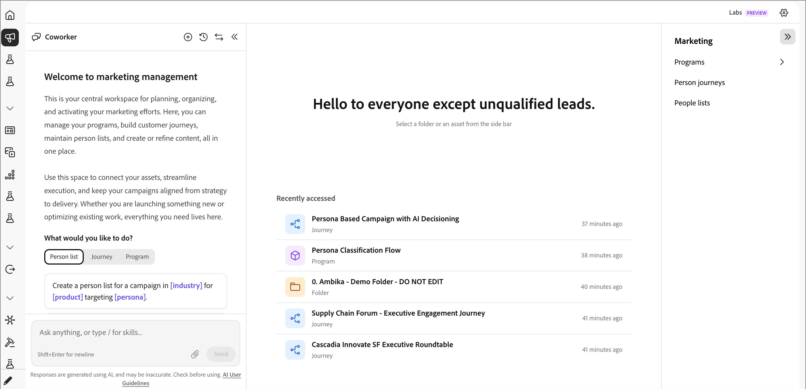

# Gestion marketing

Sélectionnez l’icône _Gestion marketing_ (mégaphone) dans le volet de navigation de gauche pour ouvrir votre espace de travail central à des fins de planification, d’organisation et d’activation du marketing. À partir de là, vous pouvez gérer [programmes](./programs.md), créer [parcours &#x200B;](./person-journeys.md), gérer [listes de personnes](../audiences/people-lists.md) et créer [contenu](../content/digital-asset-management.md), le tout à un seul endroit.

Marketing Management utilise une disposition à trois zones : un panneau de conversation à gauche, un espace de travail au centre et une arborescence de programmes à droite.

{width="800" zoomable="yes"}

## Panneau de conversation {#chat-panel}

Le panneau de conversation accompagne votre travail afin que vous puissiez demander au [collègue](../agents/chat-interface.md) de faire les choses en contexte. L’en-tête du panneau comprend les commandes suivantes :

| Commande | Description |
|---------|-------------|
| **Nouvelle conversation** | Démarrez une nouvelle conversation. |
| **Historique des conversations** | Parcourez et rouvrez les conversations antérieures. |
| **Permuter les panneaux** | Basculez le panneau de conversation de l’autre côté. |
| **Réduire** | Masquez le panneau pour agrandir l’espace de travail. |

L’entrée indique _Poser toutes les questions, ou saisir / pour les compétences..._ Lorsqu’une ressource est sélectionnée dans l’espace de travail, l’entrée prend en compte le contexte (par exemple, _Posez des questions sur « [nom de la ressource] »..._) afin que vos questions s’appliquent directement à ce que vous consultez.

## Espace de travail {#workspace}

L’espace de travail central permet l’affichage et la modification des ressources.

Lorsque rien n’est sélectionné, l’espace de travail affiche un état de bienvenue — **Bienvenue à nouveau. Les revenus ne se généreront pas d&#39;eux-mêmes.** : avec une invite de sélection d’un dossier ou d’une ressource dans l’arborescence du programme.

- **Accès récent** — Liste des [parcours &#x200B;](./person-journeys.md), [programmes](./programs.md) et dossiers que vous avez touchés le plus récemment, chacun avec un horodatage relatif. Cliquez sur une ligne pour la rouvrir.
- **Vue des ressources** — Une fois que vous avez sélectionné un élément dans l’arborescence du programme, ses détails s’ouvrent dans l’espace de travail.
- **Pages d’inventaire** — La sélection d’un dossier ou d’un programme affiche une table d’inventaire de son contenu ([programmes](./programs.md), [parcours &#x200B;](./person-journeys.md), [listes de personnes](../audiences/people-lists.md), e-mails, etc.). Les tableaux d’inventaire prennent en charge le redimensionnement des colonnes, l’affichage/masquage des colonnes, le tri et la recherche. La sélection d’une liste de personnes, par exemple, ouvre l’inventaire de ses membres.

## Arborescence du programme {#program-tree}

Le panneau de droite affiche l’arborescence de navigation pour vos ressources liées au marketing. Il fournit des outils fonctionnels que vous pouvez utiliser :

- Un bouton **Créer un programme** en haut (voir [Programmes](./programs.md)).
- Une zone **Rechercher** pour rechercher des ressources par nom.
- Arborescence de dossiers hiérarchique reposant sur _Activités marketing/par défaut_, contenant des dossiers, des [programmes](./programs.md) et des [parcours &#x200B;](./person-journeys.md). Développez les dossiers à explorer. Le menu **...** de chaque ligne expose les actions par ressource.

Sélectionnez un élément dans l’arborescence du programme pour ouvrir les détails dans l’espace de travail central.
