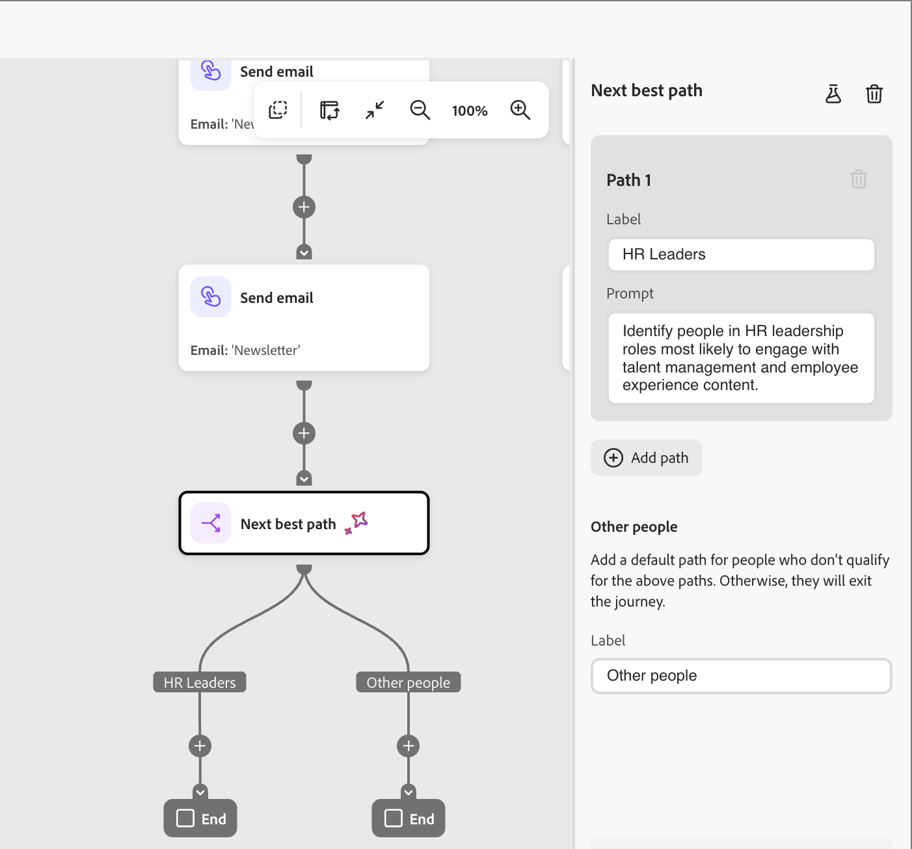
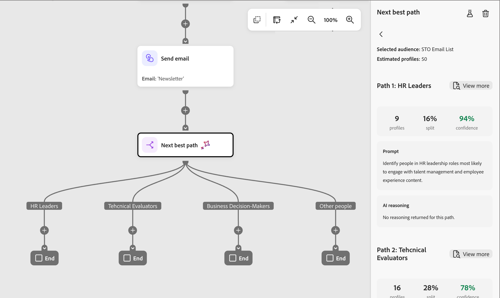

# Nœud du meilleur chemin suivant

En [!DNL Marketo Optimizer], le nœud *Meilleur chemin suivant* apporte la prise de décision de chemin partagé pilotée par l’IA directement dans la zone de travail du parcours. Au lieu de configurer des conditions de filtrage sur un nœud [chemins partagés](./split-merge-paths-nodes.md), vous décrivez votre intention en langage naturel et laissez le système déterminer le chemin le plus pertinent pour chaque personne.

Dans l’achat B2B, un profil peut sembler être un type d’acheteur, mais son comportement, ses données micrographiques et son contexte d’engagement révèlent une histoire plus nuancée. Le nœud de meilleur chemin suivant évalue ce contexte pour prendre une décision de routage intelligente, tout en vous permettant de réviser, de modifier ou de remplacer toute recommandation d’IA avant d’activer le parcours.

## Prise de décision de chemin {#path-decisioning}

Il existe trois étapes pour passer de l’intention à l’activation.

* **Étape 1 : définir des chemins d’accès** — Ajoutez un nœud de meilleur chemin suivant dans votre parcours, nommez chaque chemin d’accès et écrivez une invite en langage naturel décrivant qui doit progresser sur le chemin. Vous pouvez ajouter ou supprimer des chemins d’accès à tout moment.

* **Étape 2 : Simuler** — Choisissez un exemple d&#39;audience et exécutez une simulation. Le nombre de profils par chemin, les scores de confiance et le raisonnement de l’IA s’affichent afin que vous puissiez valider la logique avant l’activation.

  >[!NOTE]
  >
  >La simulation s’exécute uniquement sur des exemples de données et n’affecte jamais l’exécution des parcours en direct.

* **Étape 3 : activer** — Publiez le parcours sur votre audience réelle. L’IA évalue chaque personne au moment de l’exécution, attribue le chemin le mieux adapté en temps réel et un système de secours par défaut garantit que personne n’est exclu d’un chemin.

### Entrées de prise de décision par l’IA {#ai-decisioning-inputs}

Lorsqu’une personne atteint le nœud, le système récupère le contexte du profil, applique des contraintes et utilise un LLM pour sélectionner le chemin le mieux adapté. L’IA évalue chaque personne à l’aide d’une combinaison des entrées suivantes :

* **Historique d’engagement** - Ouvertures d’e-mails, clics sur les liens, visites de pages web et autres signaux comportementaux provenant des parcours actuels et précédents
* **Signaux en temps réel** - Événements à forte intention tels que le remplissage de formulaires et la tarification des visites de pages
* **Attributs de profil** - Données démographiques, intitulé de la fonction, persona et firmographic
* **Attributs du compte** - Données micrographiques et technographiques associées au compte de la personne

### Création de contexte d’IA {#ai-context-building}

En prenant en charge la décision de routage, l’IA construit une couche déduite pour chaque profil. Il combine des données démographiques et démographiques, des détails de compte et des signaux comportementaux (tels que les détails de la personne, l’intention du problème et l’intention du produit) dans un résumé contextuel pour cette personne. À l’aide de ce contexte enrichi, l’IA peut acheminer chaque personne vers le chemin optimal et fournir un score de confiance ainsi qu’un raisonnement en langage naturel derrière chaque décision.

Chaque décision est consignée avec un score de confiance et un raisonnement en langage naturel pour la transparence et l’observabilité.

Si aucun chemin d’accès n’est une correspondance forte ou si l’invite référence des données non disponibles pour un profil, la personne est acheminée vers le chemin d’accès de secours par défaut.

## Ajouter un nœud de meilleur chemin suivant {#add-node}

1. Ouvrez le parcours de la personne et accédez à la zone de travail du parcours.

1. Cliquez sur l’icône plus ( **+** ) d’un chemin et choisissez **[!UICONTROL Meilleur chemin suivant]**.

   {width="200"}

   Le nœud est ajouté à la zone de travail et le panneau de configuration de la division de l’IA s’ouvre à droite. Elle commence par un chemin et un chemin par défaut *Autres personnes* pour acheminer les personnes qui ne remplissent les critères d’aucun des chemins définis.

## Configuration des chemins d’accès {#configure-paths}

Pour chaque chemin, définissez un nom et une invite en langage naturel qui décrit qui doit y être acheminé. L’invite remplace entièrement l’interface utilisateur des conditions de filtre ; il n’existe aucune condition d’attribut à configurer.

1. Pour le premier chemin, saisissez les propriétés dans la carte de chemin d’accès dans le panneau de droite :

   * Saisissez un **[!UICONTROL Libellé]** qui reflète l’audience ou l’intention de ce segment.

   * Saisissez une **[!UICONTROL Invite]** en langage naturel décrivant qui appartient à ce chemin. Concentrez-vous sur l’intention et le résultat, et non sur des valeurs d’attribut spécifiques.

   {width="500"}

1. Cliquez sur **[!UICONTROL Ajouter un chemin]** pour chaque chemin supplémentaire à inclure.

   Pour supprimer un chemin d’accès, cliquez sur l’icône *Supprimer* (  ) sur la carte de chemin d’accès.

   Ajoutez le libellé et une invite pour chaque chemin d’accès.

   **Exemple d’invite de division en trois chemins :**

   * *Chemin 1 - Chefs des ressources humaines :* identifier les personnes occupant des rôles de leadership dans les ressources humaines les plus susceptibles de participer à la gestion des talents et au contenu de l’expérience des employés.
   * *Chemin 2 - Évaluateurs techniques :* identifiez les parties prenantes techniques les plus susceptibles d’interagir avec l’architecture du produit, les intégrations et le contenu d’implémentation.
   * *Chemin 3 - Décideurs d’entreprise :* identifiez les parties prenantes les plus susceptibles d’impliquer le retour sur investissement, les résultats commerciaux et le contenu d’études de cas.

   {width="600"}

1. Si nécessaire, réorganisez les chemins pour définir l’ordre de priorité de la correspondance.

   Le filtrage des chemins d’accès est évalué dans l’ordre décroissant. Chaque personne suit le premier chemin correspondant. Cliquez sur les flèches vers le haut et vers le bas en haut à droite de chaque carte de chemin d’accès pour la déplacer vers le haut ou le bas de la liste.

1. Vérifiez le chemin par défaut **[!UICONTROL Autres personnes]** (dernier dans la liste des chemins) et modifiez le libellé si nécessaire.

   Le chemin par défaut est utilisé lorsque l’IA ne peut pas affecter en toute confiance une personne à un chemin défini ou lorsque les données pertinentes ne sont pas disponibles. Lorsqu’une invite fait référence à des données qui n’existent pas dans le jeu de données pour un profil donné, le système achemine ce profil vers le chemin d’accès par défaut et signale l’écart de données.

>[!BEGINSHADEBOX]

**Commandes dans la boucle**

Les recommandations de l’IA ne sont pas contraignantes. Avant d’activer le parcours, vous pouvez :

* Pour affiner la logique de routage, modifiez toute invite de chemin.
* Ajouter, supprimer ou réorganiser des chemins d’accès.
* Remplacez les suggestions de l’IA par des conditions personnalisées si nécessaire.

Les affectations de chemins pilotés par l’IA ne prennent effet que lorsque vous publiez le parcours.

>[!ENDSHADEBOX]

## Exemples d’invites par cas d’utilisation {#prompt-examples}

Les exemples suivants montrent comment écrire des invites de chemin efficaces dans les cas d’utilisation marketing B2B courants. Utilisez-les comme points de départ et adaptez la langue en fonction du contexte du parcours et des données d’audience.

* « Identifiez les personnes qui ont consulté les sites des RH (shrm.org, hbr.org/topic/human-resource-management) et [!DNL Journey Optimizer] au cours des 30 derniers jours, qui assisteront probablement à un webinaire sur l’IA dans les opérations des RH et qui sont intéressées par les produits d’IA. »

* « Identifiez les personnes qui ont un engagement sur les sites de finance (wsj.com/finance,investopedia.com), qui s’intéressent à la [!DNL Marketo Engage] au cours des 30 derniers jours, et qui sont susceptibles d’assister à un webinaire sur l’IA dans la planification financière. Ils auraient également dû manifester un certain intérêt pour les produits d’IA. »

* « Identifiez les personnes impliquées dans les sites de recherche/risque (mckinsey.com/capabilities/risk-and-resilience, forrester.com/research) et [!DNL GenStudio] au cours des 30 derniers jours, susceptibles d&#39;assister à un webinaire sur l&#39;IA dans la gestion des risques et intéressées par les produits d&#39;IA. »

## Simuler la prise de décision avant la publication {#simulate}

Utilisez la simulation pour tester la manière dont l’IA évalue vos invites par rapport à une audience réelle avant que le parcours ne soit activé. La simulation est disponible uniquement lorsque le parcours est à l’état *Brouillon* et n’a aucun effet sur les parcours publiés.

### Exécuter une simulation {#run-simulation}

1. Sélectionnez le nœud de meilleur chemin suivant et cliquez sur l’icône *Simuler* (  ) en haut du panneau de droite.

1. Dans la boîte de dialogue, choisissez une liste dynamique à utiliser pour l’audience de simulation.

<!-- 
   * **[!UICONTROL Original person lists]** – Use the audience from the audience node. Specify a sample size when the full audience exceeds the simulation threshold.
   * **[!UICONTROL Dynamic and static lists]** – Use a [!DNL Marketo Engage] static or dynamic list.
   * **[!UICONTROL Test records]** – Use AI-suggested test profiles.
-->

{width="250"}.

>[!NOTE]
>
>* Si l’audience sélectionnée dépasse le seuil de simulation, le système exécute la simulation sur un échantillon de 100 profils. Un indicateur dans l’interface utilisateur indique que les résultats sont basés sur des échantillons.
>* Si l&#39;audience sélectionnée n&#39;est pas encore matérialisée, la simulation est bloquée. Un avertissement intégré vous demande de matérialiser d’abord l’audience.

1. Cliquez sur **[!UICONTROL Simuler]**.

### Consulter les résultats de la simulation {#review-results}

Une fois la simulation exécutée, le panneau de droite affiche la répartition des profils sur chaque chemin et le raisonnement de l’IA derrière ces affectations :

| Résultat | Description |
|---|---|
| **Profils** | Nombre de profils acheminés vers le chemin d’accès. |
| **Fractionner** | Pourcentage de profils acheminés vers le chemin d’accès. |
| **Confiance** | Niveau de confiance de l’IA pour l’affectation de chemin. Le degré de confiance reflète la fraîcheur des données, l’intensité et la cohérence du signal, ainsi que le succès historique de modèles de routage similaires. |
| **Invite** | Invite évaluée pour le chemin d’accès. |
| **Raisonnement IA** | Explication en langage naturel de l’affectation collective des profils à ce chemin d’accès. |

{width="600"}

>[!NOTE]
>
>Lorsque les données disponibles ou la portée limitent une décision, les résultats incluent des informations sur la limitation. Par exemple, lorsqu’un attribut obligatoire n’est pas présent dans le jeu de données, les résultats incluent un indicateur explicite expliquant comment les données manquantes ont affecté les résultats.

Utilisez les résultats pour affiner les invites et confirmer que le routage reflète le résultat prévu. Vous pouvez modifier les invites de chemin et réexécuter la simulation autant de fois que nécessaire avant de la publier.

## Publication et surveillance du parcours {#publish-monitor}

Après validation des résultats de la simulation :

1. Connectez l’audience de personnes au nœud d’entrée de parcours.

1. [Publiez le parcours](./person-journeys.md#publish).

Une fois le parcours actif, le nœud de meilleur chemin suivant s’exécute au moment de l’exécution. Lorsque chaque personne atteint le nœud, l’IA les évalue en temps réel à l’aide des derniers signaux et les achemine vers le chemin le plus pertinent.

Pour un parcours publié, ouvrez la zone de travail du parcours et sélectionnez le nœud de meilleur chemin suivant pour afficher la section **_[!UICONTROL Résultats finaux]_** dans le panneau de droite. Les résultats finaux indiquent :

* Répartition en pourcentage des profils sur chaque chemin d’accès
* Score de confiance pour chaque affectation de chemin
* Raisonnement au niveau du chemin et du profil, avec des détails extensibles pour les profils individuels

{width="600"}

Les résultats en direct sont également disponibles par le biais de la compétence Observabilité de Parcours dans l’[interface de conversation des collègues](../agents/chat-interface.md).
