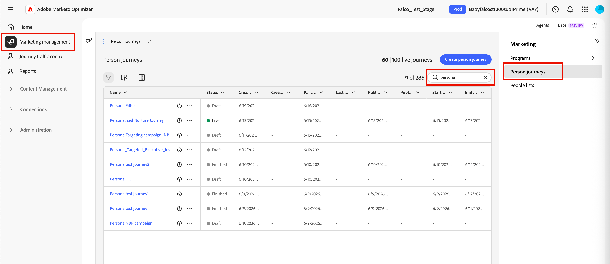

# Parcours de la personne

Dans [!DNL Adobe Marketo Optimizer], les parcours de personne sont des plans marketing automatisés, basés sur des prospects et à plusieurs étapes, qui orchestrent des expériences personnalisées sur plusieurs canaux. Ces parcours utilisent les données Marketo Engage pour exécuter ces plans marketing en réponse à l’engagement, aux événements métier ou aux campagnes planifiées.

>[!NOTE]
>
>Chaque parcours réside dans un [programme](./programs.md) défini. Vous devez avoir au moins un programme à utiliser comme parent avant de créer un parcours.

_Pour créer un nouveau parcours de personne :_

1. Créez le parcours de personne.
1. Ajoutez les nœuds et définissez le flux du parcours dans la zone de travail du parcours.
1. [Publiez le parcours](#publish-a-journey).

## Accès et navigation dans les parcours de personne {#access-and-browse-person-journeys}

1. Dans le volet de navigation de gauche, développez **[!UICONTROL Gestion marketing]**.

1. À droite dans la liste de ressources **[!UICONTROL Marketing]**, sélectionnez **[!UICONTROL parcours de personne]**.

   La liste parcours de personne _s’affiche sous la forme d’une page à onglets dans l’espace de travail principal._

   Vous pouvez saisir du texte dans l’outil _Rechercher_ en haut de la liste pour filtrer la liste affichée par nom.

   {width="800" zoomable="yes"}

1. Utilisez les outils de liste pour personnaliser la liste affichée :

   * Cliquez sur l’icône _Filtrer_ (  ) pour filtrer la liste par statut.
   * Cliquez sur l’icône _Personnaliser le tableau_ (  ) pour contrôler les colonnes affichées.
   * Cliquez sur l’icône _Réinitialiser les colonnes_ (  ) pour réinitialiser les largeurs de colonne.

### Colonnes de liste de parcours {#journey-list-columns}

La page de liste parcours comprend les colonnes suivantes :

* [!UICONTROL Nom] (cliquez sur le nom pour ouvrir la zone de travail du parcours en vue de la modifier)
* [!UICONTROL Statut]
* [!UICONTROL Date de création]
* [!UICONTROL Créé par]
* [!UICONTROL Dernière mise à jour]
* [!UICONTROL Dernière mise à jour par]
* [!UICONTROL Publié sur]
* [!UICONTROL Publié par]
* [!UICONTROL &#x200B; Date de début &#x200B;]
* [!UICONTROL &#x200B; Date de fin &#x200B;]

Vous pouvez trier la liste par _[!UICONTROL Statut]_, _[!UICONTROL Date de création]_ ou _[!UICONTROL Dernière mise à jour]_ en cliquant sur l’en-tête de colonne. Vous pouvez saisir et faire glisser les bordures d’en-tête pour modifier les largeurs de colonne affichées. Dans la boîte de dialogue _Personnaliser le tableau_, cochez ou décochez les cases, puis cliquez sur **[!UICONTROL Appliquer]**.

### Statut du parcours {#journey-status}

Le statut d’un parcours peut changer en fonction des actions que vous appliquez. En fonction du statut d’un parcours, certaines actions sont disponibles dans la partie droite de l’en-tête.

| Statut | Description | Actions disponibles |
| ------ | ----------- | ----------------- |
| _&#x200B;**Brouillon**&#x200B;_ | Parcours dépublié modifiable. | [Publier](#publish-a-journey), [Dupliquer](#duplicate-a-journey), [Supprimer](#delete-a-journey) |
| _&#x200B;**Actif**&#x200B;_ | Le statut du parcours passe de _Brouillon_ à _Actif_ lorsque vous publiez un parcours. Dans ce statut, il n’est plus modifiable. | [Dupliquer](#duplicate-a-journey), [Fermer aux nouvelles entrées](#close-to-new-entries), [Abandonner](#abort-a-journey) |
| _&#x200B;**Fermé aux nouvelles entrées**&#x200B;_ | Le statut du parcours passe de _En ligne_ à _Fermé aux nouvelles entrées_ lorsque vous cliquez sur **[!UICONTROL Fermer aux nouvelles entrées]** dans l’en-tête du parcours. | [Dupliquer](#duplicate-a-journey), [Abandonner](#abort-a-journey) |
| _&#x200B;**Abandonné**&#x200B;_ | Le statut du parcours passe de _Actif_ ou _Fermé aux nouvelles entrées_ lorsque vous abandonnez un parcours. Vous ne pouvez pas redémarrer un parcours abandonné. | [Dupliquer](#duplicate-a-journey), [Supprimer](#delete-a-journey) |
| _&#x200B;**Terminé**&#x200B;_ | Lorsque tous les membres de l’audience d’une personne dans un parcours terminent le parcours, le statut passe de _Actif_ ou _Fermé aux nouvelles entrées_ à _Terminé_. | [Dupliquer](#duplicate-a-journey), [Supprimer](#delete-a-journey) |

## Créer un parcours de personne {#create-a-person-journey}

1. Cliquez sur **[!UICONTROL Créer un Parcours]** en haut à droite de la liste des parcours.

1. Dans la boîte de dialogue, sélectionnez le programme **[!UICONTROL Parent]** pour le parcours de personne.

1. Saisissez un **[!UICONTROL Nom]** unique (obligatoire) et un **[!UICONTROL Description]** (facultatif).

   {width="400"}

1. Cliquez sur **[!UICONTROL Créer]**.

   Le canevas de parcours s’ouvre avec le nœud d’audience Personne de départ.

   {width="600" zoomable="yes"}

### En-tête de parcours {#journey-header}

L’en-tête de chaque zone de travail de parcours comprend le nom, le statut et le planning du parcours.

{width="600" zoomable="yes"}

* Cliquez sur l’icône _Modifier_ (  ) pour modifier le nom du parcours ou les informations de description.
* Cliquez sur **[!UICONTROL Paramètres du Parcours]** pour modifier le début et la périodicité du parcours.
* Cliquez sur **[!UICONTROL ... Plus]** pour appliquer une action de parcours ou pour activer/désactiver le contrôle du trafic de parcours [&#128279;](./journey-traffic-control.md) et la rentrée.
* Si toutes les erreurs sont résolues et que vous souhaitez activer le parcours, cliquez sur **[!UICONTROL Publier]**.

### Conception de parcours {#journey-design}

La zone de travail de parcours __ est la zone centrale de l’espace de travail de parcours. C’est là que vous pouvez ajouter des nœuds de parcours et les configurer. Cliquez sur un nœud pour ouvrir ses propriétés dans le panneau situé à droite de la disposition et les définir en fonction de votre conception. Un parcours de personne commence toujours par un nœud [_[!UICONTROL Audience de personne &#x200B;]_](./person-audience-node.md), où vous pouvez définir l’entrée du parcours.

Après avoir créé un parcours de personne et défini l’audience de personne, créez le parcours à l’aide de nœuds . La zone de travail de parcours fournit un espace de conception visuel dans lequel vous pouvez créer vos cas d’utilisation marketing B2B à plusieurs étapes à l’aide des types de nœuds suivants pour créer le parcours :

* [Entreprendre une action](./action-nodes.md)
* [Écouter un événement](./listen-for-event-nodes.md)
* [Attendre](./wait-nodes.md)
* [Chemins partagés](./split-merge-paths-nodes.md)
* [Deuxième meilleur chemin](./next-best-path.md)
* [Fusionner les chemins](./split-merge-paths-nodes.md)

## Gestion des parcours {#journey-management}

Ouvrez la liste parcours pour consulter le statut des parcours, apporter des modifications et prendre des mesures.

### Actions de parcours {#journey-actions}

La page de liste parcours comprend tous les parcours de personne de votre instance Marketo Optimizer. La page de liste vous permet d’appliquer plusieurs actions à un parcours.

#### Publier un parcours {#publish}

Vous pouvez publier un parcours en l’absence d’erreur de blocage. Une fois le parcours publié, son statut passe à _Actif_. Si le parcours comporte des erreurs, le bouton **[!UICONTROL Publier]** est grisé avec le message `Resolve errors before publishing`.

1. Ouvrez le brouillon de parcours à partir de la liste _[!UICONTROL parcours de personne]_.

1. Dans la partie supérieure droite de la zone de travail de parcours, cliquez sur **[!UICONTROL Publier]**.

1. Dans la boîte de dialogue _[!UICONTROL Vérifier les paramètres du parcours]_, définissez les options de début du parcours.

   Si vous avez déjà défini une planification dans les paramètres de **[!UICONTROL Parcours]**, vérifiez les paramètres.

   Si vous devez définir l’activation du parcours, choisissez un type de planification :

   * Pour activer le parcours au moment de la publication, choisissez **[!UICONTROL Immédiatement]**.
   * Pour activer le parcours à une date ultérieure, choisissez **[!UICONTROL À une date spécifique]** et cliquez sur l’icône _Calendrier_ pour sélectionner la date.

1. Si nécessaire, spécifiez la **[!UICONTROL date de fin]** pour le parcours.

   {width="400" zoomable="no"}

   Il peut s&#39;agir d&#39;un maximum de trois ans à compter de la date de début. Ce champ est obligatoire pour la publication.

1. Cliquez sur **[!UICONTROL Suivant]**.

1. Dans la boîte de dialogue de confirmation, cliquez sur **[!UICONTROL Publier]**.

#### Abandon d’un parcours {#abort-a-journey}

Si vous abandonnez (arrêtez) un parcours actif ou un parcours planifié à une date de début ultérieure, les personnes du parcours arrêtent immédiatement leur progression et aucune nouvelle entrée au parcours ne peut se produire. Vous ne pouvez pas redémarrer un parcours abandonné.

1. Ouvrez le parcours à partir de la liste _[!UICONTROL parcours de personne]_.

1. Cliquez sur **[!UICONTROL ... Plus]** en haut à droite et choisissez **[!UICONTROL Abandonner]**.

   {width="600" zoomable="yes"}

1. Dans la boîte de dialogue de confirmation, cliquez sur **[!UICONTROL Abandonner]**.

#### Fermer aux nouvelles entrées {#close-to-new-entries}

Si vous fermez un parcours actif à de nouvelles entrées, les personnes actuellement dans le parcours continuent leur chemin dans ce parcours et aucune autre entrée de parcours ne peut se produire. Vous ne pouvez pas redémarrer un parcours fermé. Vous pouvez dupliquer un parcours clôturé.

1. Ouvrez le parcours à partir de la liste _[!UICONTROL parcours de personne]_.

1. Cliquez sur **[!UICONTROL ... Plus]** en haut à droite et choisissez **[!UICONTROL Fermer aux nouvelles entrées]**.

1. Dans la boîte de dialogue de confirmation, cliquez sur **[!UICONTROL Fermer aux nouvelles entrées]**.

#### Dupliquer un parcours {#duplicate-a-journey}

Une action de duplication est similaire à une fonction de clonage, mais le parcours dupliqué n’inclut aucune ressource de contenu de parcours créée. Vous pouvez dupliquer les détails du parcours ou simplement un squelette de la structure du flux et du chemin.

1. Dans la liste parcours de personne _, cliquez sur l’icône_ Plus _(**...**) à côté du nom du parcours et choisissez **[!UICONTROL Dupliquer]**._

   {width="400"}

   Selon le statut du parcours, vous pouvez également accéder à l’action en double à partir des détails du parcours ou de la zone de travail du parcours :

   * Pour un brouillon de parcours, cliquez sur **[!UICONTROL ... Plus]** en haut à droite et choisissez **[!UICONTROL Dupliquer]**.
   * Pour tous les autres statuts de parcours, cliquez sur **[!UICONTROL Dupliquer]** en haut à droite.

1. Dans la boîte de dialogue, sélectionnez le programme **[!UICONTROL Parent]** pour le parcours dupliqué.

1. Saisissez un **[!UICONTROL Nom]** unique (obligatoire) et un **[!UICONTROL Description]** (facultatif).

   Par défaut, la boîte de dialogue utilise le nom du parcours d’origine suivi de `_copy`. Saisissez un nom unique différent pour le parcours, si nécessaire.

   {width="370"}

1. Choisissez le **[!UICONTROL type]** de duplication :

   * **[!UICONTROL Duplication partielle du contenu]** : utilisez ce type pour copier tout le contenu du parcours, à l’exclusion des e-mails ou des SMS créés. Les nœuds qui font référence à un e-mail ou un SMS Marketo Engage restent pleinement intacts.

   * **[!UICONTROL Dupliquer sans détails]** - Utilisez ce type pour copier uniquement la structure de nœud et les chemins d’accès. Les paramètres de nœud et conditions de chemin ne sont pas définis (par défaut). Vous pouvez donc réutiliser le flux de base avec différents paramètres d’audience, d’actions et de segmentation de chemin. Tous les nœuds d’attente utilisent la valeur par défaut de cinq jours.

1. Cliquez sur **[!UICONTROL Dupliquer]**.

   Le parcours dupliqué s’ouvre dans la zone de travail du parcours, où vous pouvez définir les détails et créer du contenu de parcours selon vos besoins.

#### Supprimer un parcours {#delete-a-journey}

Utilisez une action de suppression pour supprimer définitivement un parcours. Vous ne pouvez pas supprimer un parcours actif ou un parcours planifié à une date de début ultérieure.

>[!WARNING]
>
>La suppression d’un parcours est définitive et irréversible.

1. Dans la liste parcours de personne _, cliquez sur l’icône_ Plus _(**...**) à côté du nom du parcours et choisissez **[!UICONTROL Supprimer]**._

   Selon le statut du parcours, vous pouvez également accéder à l’action de suppression à partir de l’en-tête du parcours :

   * Pour un brouillon de parcours, cliquez sur **[!UICONTROL ... Plus]** en haut à droite et choisissez **[!UICONTROL Supprimer]**.
   * Pour d’autres statuts de parcours, tels que _Terminé_ ou _Abandonné_, cliquez sur **[!UICONTROL Supprimer]** en haut à droite.

1. Dans la boîte de dialogue de confirmation, cliquez sur **[!UICONTROL Supprimer]**.
