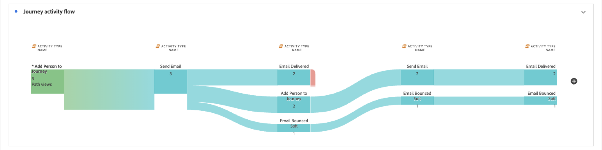

# Parcours de personne Rapport individuel

<!-- SPHR-39120: UX plans to move the Journey activity flow tile to the top of the report. Update the tile order in this page when that ships. -->

Cliquez sur **[!UICONTROL Afficher le rapport]** pour un parcours de personne actif ou terminé afin d’afficher ses performances, y compris le statut, l’engagement, les mesures d’e-mail et le flux d’activité.

_Pour afficher le rapport :_

1. Ouvrez un parcours de personne **[!UICONTROL En ligne]** ou **[!UICONTROL Terminé]** à partir de la liste _[!UICONTROL parcours de personne]_.
1. Dans l’en-tête du parcours, sélectionnez **[!UICONTROL Afficher le rapport]**.

   {width="600" zoomable="yes"}

Vous pouvez [modifier la période](./reports-overview.md#change-the-date-range) pour le rapport.

Sélectionnez **[!UICONTROL Partager]** en haut du rapport pour télécharger ou planifier une exportation des données. Voir [_Exporter un rapport_](./reports-overview.md#export-a-report) dans la présentation des rapports.

Parcours de personne Rapport individuel présentant le statut du parcours, la tendance d’achèvement et les mosaïques d’engagement.{width="700" zoomable="yes"}

## Filtres {#filters}

Les filtres de rapport sont définis sur le parcours actif.

* **[!UICONTROL Nom du Parcours (événement)]** - Prédéfini sur le parcours à partir duquel vous avez ouvert le rapport.
* **[!UICONTROL Persona (événement)]** - (_pas encore pris en charge_) Filtrez le rapport pour les personnes qui correspondent à un [persona dérivé](../audiences/personas.md#filter-by-derived-persona) spécifique. La valeur par défaut est [!UICONTROL &#x200B; Aucun filtre &#x200B;].

Sélectionnez **[!UICONTROL Réinitialiser tout]** pour effacer le filtre _[!UICONTROL Persona (Événement)]_ et revenir à la vue par défaut.

## Statut et engagement de la personne {#person-status-and-engagement}

Cette section présente quatre mosaïques :

* **[!UICONTROL Statut des personnes dans le parcours]** - Répartit les personnes dans le parcours en catégories _[!UICONTROL Terminé]_ et _[!UICONTROL En cours]_, avec les pourcentages correspondants.
* **[!UICONTROL Personnes ayant terminé le parcours au fil du temps]** - Graphique en courbes qui suit le nombre de personnes ayant terminé le test au cours de la période sélectionnée.
* **[!UICONTROL Personnes engagées ou non engagées]** - Répartit les personnes du parcours en _[!UICONTROL Engagées]_ et _[!UICONTROL Non engagées]_, avec les pourcentages correspondants.
* **[!UICONTROL Personnes engagées]** - Nombre total de personnes qui remplissent les critères pour être engagées dans le parcours.

## Performances des e-mails {#email-performance}

Le tableau [!UICONTROL &#x200B; Performances des e-mails &#x200B;] affiche les mesures de diffusion et d’engagement pour chaque e-mail envoyé dans le parcours. Pour obtenir les mêmes mesures d’e-mail sur tous les parcours, consultez le [rapport sur l’engagement des e-mails](./email-engagement-report.md).

{width="700" zoomable="yes"}

[!UICONTROL Performances des emails] colonnes du tableau :

* [!UICONTROL Nom de l’adresse électronique] - Nom de l’adresse électronique.
* [!UICONTROL Envoyés] - Nombre d’e-mails envoyés.
* [!UICONTROL Diffusés] - Nombre d&#39;e-mails diffusés.
* [!UICONTROL &#x200B; % diffusés &#x200B;] - Nombre d’e-mails diffusés divisé par le nombre envoyé.
* [!UICONTROL Ouverts] - Nombre de fois où les destinataires ont ouvert l’e-mail.
* [!UICONTROL &#x200B; % d’ouvertures &#x200B;] - Nombre de messages ouverts divisé par le nombre de messages diffusés.
* [!UICONTROL Clics] - Nombre de fois où les destinataires ont cliqué sur un lien dans l’e-mail.
* [!UICONTROL &#x200B; % d’e-mails cliqués &#x200B;] - Nombre d’e-mails cliqués divisé par le nombre diffusé.

## Flux d’activité de parcours {#journey-activity-flow}

La visualisation du flux d’activité de Parcours  montre le chemin parcouru par les personnes dans le parcours, à partir de l’activité _[!UICONTROL Ajouter une personne au Parcours]_. Chaque nœud affiche le nombre de chemins d’accès vus pour cette activité.

{width="700" zoomable="yes"}
