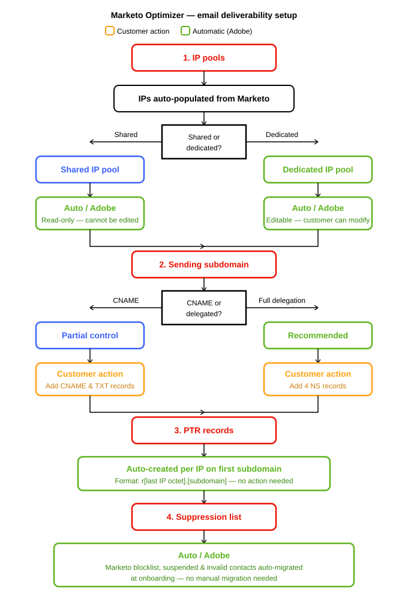

# Délivrabilité des e-mails

Les informations suivantes sont destinées aux administrateurs qui configurent l’infrastructure d’envoi pour prendre en charge les spécialistes marketing et les créateurs de contenu d’e-mail. Il décrit les fonctionnalités de délivrabilité et comment configurer des sous-domaines, l’authentification et les pools d’adresses IP.

Dans [!DNL Adobe Marketo Optimizer], la délivrabilité des emails désigne l’ensemble des configurations d’infrastructure et d’authentification qui permettent aux emails d’atteindre la boîte de réception du destinataire, et non le dossier des spams, et qui ne sont pas bloqués par les FAI (fournisseurs d’accès Internet).

Il utilise les blocs de création suivants, configurés par un administrateur, généralement dans l’ordre suivant :

1. [&#x200B; Déléguer un ou plusieurs sous-domaines &#x200B;](#subdomain-delegation) à Adobe.
1. [Configurez les enregistrements DMARC, SPF et DKIM](#dmarc-spf-dkim) sur chaque sous-domaine.
1. [Confirmez le groupe d’adresses IP](#ip-pools) utilisé pour envoyer un e-mail pour votre sous-domaine.
1. [Créez une ou plusieurs configurations de canal e-mail](../admin/email-channel-configuration.md#create-email-channel-configuration) qui lient un sous-domaine, un groupe d’adresses IP et une identité d’expéditeur.

{width="600"}

>[!TIP]
>
>Traitez la délivrabilité et la configuration des canaux comme une activité d’administration unique. Une fois configurés, les professionnels du marketing et les auteurs d’e-mails n’ont pas besoin de les revoir.
>
> Consultez les rubriques suivantes pour plus d’informations sur les canaux e-mail :
>
>* Configuration des canaux e-mail - [Configuration du canal e-mail](../admin/email-channel-configuration.md)
>* Création d&#39;emails - [Ajouter des emails aux parcours &#x200B;](../marketing/email-channel.md)
>* Conception de contenu d&#39;e-mail - [Création de contenu d&#39;e-mail](../content/email-authoring.md)

## Limites actuelles {#limitations}

* La **méthode de délégation personnalisée** pour la délégation de sous-domaine n’est pas encore disponible. Utilisez Fully Delegated ou CNAME. La délégation personnalisée est ciblée pour la version mise à disposition générale.
* Les **Groupes d’adresses IP dédiés** ne sont pas disponibles dans Beta. Le pool d’adresses IP partagées est la seule option. Les adresses IP dédiées sont livrées à GA, y compris la planification du préchauffage des adresses IP et la gestion des enregistrements PTR.

## Principaux concepts {#key-concepts}

Avant de configurer les e-mails, passez en revue les concepts qui s’appliquent aux fonctionnalités de délivrabilité des canaux e-mail :

| Concept | Ce que cela signifie en [!DNL Marketo Optimizer] |
| ------- | ---------------------- |
| **_Sous-domaine_** | Partie déléguée de votre domaine d&#39;envoi (par exemple, `mail.contoso.com`) utilisée pour envoyer des e-mails par [!DNL Marketo Optimizer]. Les sous-domaines isolent votre réputation marketing B2B des e-mails d’entreprise ou transactionnels. |
| **_Groupe d’adresses IP_** | Groupe d’adresses IP associées à un ou plusieurs sous-domaines. [!DNL Marketo Optimizer] prend en charge un groupe d’adresses IP partagé géré par Adobe dans cette version. Les groupes d’adresses IP dédiés figurent sur la feuille de route de la disponibilité générale. |
| **_Configuration des canaux_** | Ensemble réutilisable de paramètres d’envoi d’e-mail (identité de l’expéditeur, adresse de réponse, sous-domaine, groupe d’adresses IP, type d’e-mail et suivi) que vous joignez aux actions d’e-mail dans parcours. Vous pouvez avoir plusieurs configurations de canal nommé pour différentes marques, unités opérationnelles ou types d’envoi. |

<!--

## Roles and permissions {#roles-permissions}

[!DNL Marketo Optimizer] uses role-based access control (RBAC) for email features. Permissions are managed in the Adobe Admin Console (IMS) and synced at login. Product administrators assign granular permissions to product profiles, and then attach those product profiles to users.

Access to email functionality in [!DNL Marketo Optimizer] is gated by two layers:

1. **Feature flag (LD).** A LaunchDarkly flag controls whether the entire feature is turned on for your organization. Email authoring and deliverability are gated by `dx_ajo_btob_channel_foundation`. Without this flag, the feature is hidden regardless of permissions.
2. **Functional permission.** A user-level permission that controls whether a specific user can read or write within a feature.

Most email features follow a `view-*` (read) and `manage-*` (write) pattern. A user needs the read permission to see a feature in the navigation, and the write permission to create, edit, or delete within it.

### Email authoring permissions {#email-authoring-permissions}

| Capability | Permission | What it allows |
| ---------- | ---------- | -------------- |
| **View emails** | `view-b2b-emails` | View the email list, open emails, view content (read-only). |
| **Create / edit / delete emails** | `manage-b2b-emails` | All read access plus create, edit, duplicate, and delete emails. Required to author email content within a journey. |
| **View templates** | `view-b2b-templates` | Browse and preview templates in the Templates gallery (read-only). |
| **Create / edit / delete templates** | `manage-b2b-templates` | All read access plus create, edit, and delete saved templates. |
| **View fragments** | `view-b2b-fragments` | Browse and preview visual fragments (read-only). |
| **Create / edit fragments** | `manage-b2b-fragments` | All read access plus create and edit visual fragments. |
| **Publish fragments** | `publish-b2b-fragments` | Publish a fragment so it becomes available to email authors across the organization. |
| **Manage shared assets and library items** | `manage-b2b-library-items` | Manage the underlying shared library used by templates, fragments, and emails. Often granted alongside the template/fragment manage permissions. |
| **Manage usage labels** | `manage-b2b-delete-usage-labels` | Manage data usage labels (DULE) attached to library items for governance. |
| **Manage packages** | `manage-b2b-packages` | Bundle and move templates, fragments, and emails between sandboxes. |
| **View assets (Marketo Design Studio assets in [!DNL Marketo Optimizer])** | `view-b2b-assets` | Browse the asset picker and preview images. Read-only. |
| **Manage assets** | `manage-b2b-assets` | All read access plus future asset-management actions (Beta scope). |
| **Export message data** | `manage-b2b-message-export` | Export email-level message data and reports. |

Within a person journey, the **Send email** action requires `manage-b2b-person-journeys` (to add the action and activate the journey). A user with only email permissions can author content but cannot add an email to a journey.

### Email deliverability permissions {#email-deliverability-permissions}

Deliverability features (subdomains, DMARC, IP pools, suppression lists, allowed lists, IP warmup plans, and seed lists) are administrator-level configuration. They are governed by two permissions covering the entire **[!UICONTROL Channels]** > **[!UICONTROL Email settings]** area:

| Capability | Permission | What it allows |
| ---------- | ---------- | -------------- |
| **View email settings** | `view-b2b-email-settings` | View subdomains, PTR records, IP pools, suppression list, allowed list, IP warmup plans, and seed lists (read-only). |
| **Manage email settings** | `manage-b2b-email-settings` | All read access plus delegate subdomains, configure DMARC, manage suppression and allowed lists, manage IP warmup plans and seed lists. |

Some sub-features within Email settings are gated by additional LaunchDarkly flags — Suppression list (`enable-suppression`), Allowed list (`enable-allow-list`), Seed lists (`enable-seedlist-ui`). If a sub-feature is not visible in your organization, check with your Adobe representative on flag enablement.

### Channel configuration permissions {#channel-configuration-permissions}

Channel configurations sit under **[!UICONTROL Channels]** → **[!UICONTROL General settings]**. They tie deliverability primitives (subdomain, IP pool, sender identity) to a reusable object that journey authors reference. They are governed by a single permission:

| Capability | Permission | What it allows |
| ---------- | ---------- | -------------- |
| **Manage channel configurations** | `manage-b2b-channels-configurations` | View, create, edit, and delete email channel configurations. |

-->

## Délégation de sous-domaines {#subdomain-delegation}

La délégation de sous-domaine indique à Internet qu’Adobe est autorisé à envoyer des e-mails au nom d’un sous-domaine spécifique (par exemple, `mail.contoso.com`) de votre domaine. La délégation d’un sous-domaine dédié, plutôt que votre domaine racine, protège votre messagerie d’entreprise et offre les avantages suivants :

* **Isolement de la réputation.** Les envois marketing sont séparés du courrier d’entreprise. Si la réputation marketing se détériore, vos e-mails transactionnels et d’entreprise ne sont pas affectés.
* **Préchauffage d’adresses IP plus rapide.** Des sous-domaines dédiés permettent d&#39;établir plus rapidement une réputation positive de l&#39;expéditeur avec les FAI.
* **Authentification moderne.** SPF, DKIM et DMARC peuvent être configurés de manière propre par sous-domaine sans affecter les autres flux d’e-mails.
* **Conformité.** Permet de répondre aux exigences en matière d’expéditeurs en masse de Gmail, Yahoo et d’autres principaux FAI.

>[!NOTE]
>
>Chaque sous-domaine de [!DNL Marketo Optimizer] ne peut être utilisé que par un seul produit Adobe. Vous ne pouvez pas partager le même sous-domaine d’envoi entre [!DNL Marketo Optimizer] et un autre produit tel que Adobe Marketo Engage ou Adobe Campaign. Vous devez utiliser des sous-domaines distincts.

### Méthodes prises en charge {#supported-methods}

[!DNL Marketo Optimizer] prend en charge deux des trois méthodes de délégation de sous-domaine de cette version de Beta. La troisième méthode (délégation personnalisée) figure sur la feuille de route.

| Méthode | Quand l’utiliser | Ce que cela implique |
| ------ | ----------- | ---------------- |
| **Entièrement délégué** | Recommandé | Déléguez l’autorité DNS complète du sous-domaine à Adobe. Adobe crée et gère les enregistrements MX, SPF, DKIM, DMARC, A et CNAME. Frais généraux d’exploitation les plus faibles. Adobe gère les modifications DNS pour vous. |
| **CNAME** | Pour les politiques restreintes | Conservez l’autorité DNS de votre côté et créez des enregistrements CNAME pointant vers des enregistrements gérés par Adobe. Utilisez cette option lorsque la politique DNS de votre organisation n’autorise pas la délégation complète. Vous êtes responsable de la gestion des enregistrements DNS. |
| **Délégation personnalisée** | Feuille de route (GA) | Conservez la pleine propriété des certificats DNS et SSL. Offre un contrôle maximal, notamment la possibilité d’utiliser vos propres certificats. Il est destiné à la version mise à jour en disponibilité générale. |

### Délégation d’un sous-domaine (méthode entièrement déléguée) {#delegate-fully-delegated}

>[!PREREQUISITES]
>
>* Choisissez une convention de nommage des sous-domaines (par exemple, `mail.contoso.com` pour le marketing, `alerts.contoso.com` pour le transactionnel).
>* Vérifiez auprès de votre équipe informatique/DNS qu’elle peut déléguer le sous-domaine (enregistrements DNS) à Adobe.
>* Créez le nouveau sous-domaine dans votre fournisseur DNS, puis attendez 24 à 48 heures pour la propagation DNS avant de déléguer à Adobe.
>* Vérifiez que vous disposez du rôle Administrateur dans [!DNL Marketo Optimizer].

1. Dans le volet de navigation de gauche [!DNL Marketo Optimizer], développez **[!UICONTROL Administration]** et sélectionnez **[!UICONTROL Canaux]**.
1. Dans le panneau, développez **[!UICONTROL Paramètres d’e-mail]** et sélectionnez **[!UICONTROL Sous-domaines]**.
1. Cliquez sur **[!UICONTROL Configurer le sous-domaine]**.
1. Saisissez le nom complet du sous-domaine (par exemple, `mail.contoso.com`).
1. Choisissez **[!UICONTROL Délégation complète]** comme méthode de délégation.
1. Configurez DMARC pour le sous-domaine (voir [DMARC, SPF et DKIM](#dmarc-spf-dkim)).

   Au minimum, configurez un enregistrement DMARC avec une politique de démarrage de `none` afin de pouvoir surveiller les rapports sans affecter la diffusion.

1. Consultez la liste des enregistrements DNS à gérer par Adobe.

   Ils comprennent généralement des enregistrements MX, SPF, DKIM, DMARC, A et CNAME (pour le suivi et les URL de page miroir).

1. Téléchargez les enregistrements DNS au format CSV à l’aide du bouton **[!UICONTROL Télécharger les enregistrements]**. Partagez ce fichier avec votre équipe DNS.

1. Votre équipe DNS ajoute les enregistrements DNS de votre solution d’hébergement de domaine qui délèguent le sous-domaine à Adobe.

1. Une fois que votre équipe DNS a confirmé que les enregistrements sont en place, revenez à [!DNL Marketo Optimizer] et cochez la case confirmant que vous avez créé les enregistrements requis sur le site d’hébergement.

1. Cliquez sur **[!UICONTROL Envoyer]** pour lancer une série de contrôles de validation (pré-validation, MX, SPF, DKIM, DMARC, enregistrement FBL).

1. Attendez que le statut du sous-domaine passe à **[!UICONTROL Succès]**.

   Cette opération prend généralement quelques minutes une fois la propagation DNS terminée.

>[!NOTE]
>
>Si la validation échoue, le statut passe à **[!UICONTROL Échec]** et [!DNL Marketo Optimizer] affiche la raison (par exemple, enregistrement NS introuvable, enregistrement MX manquant ou DMARC mal configuré). Corrigez le problème DNS sous-jacent, puis réessayez l’envoi.

### Délégation d’un sous-domaine (méthode CNAME) {#delegate-cname}

Utilisez cette méthode uniquement si la politique DNS de votre organisation interdit la délégation complète. Avec CNAME, vous conservez les enregistrements DNS de votre côté.

1. Dans le volet de navigation de gauche [!DNL Marketo Optimizer], développez **[!UICONTROL Administration]** et sélectionnez **[!UICONTROL Canaux]**.
1. Dans le panneau, développez **[!UICONTROL Paramètres d’e-mail]** et sélectionnez **[!UICONTROL Sous-domaines]**.
1. Cliquez sur **[!UICONTROL Configurer le sous-domaine]**.
1. Saisissez le nom de sous-domaine complet.
1. Choisissez **[!UICONTROL CNAME]** comme méthode de délégation.
1. Configurez DMARC pour le sous-domaine ([DMARC, SPF et DKIM](#dmarc-spf-dkim)).
1. Consultez la liste des enregistrements CNAME à générer. Ils pointent les composants de votre sous-domaine vers des enregistrements gérés par Adobe.
1. Téléchargez les enregistrements au format CSV et partagez-les avec votre équipe DNS.
1. Votre équipe DNS ajoute chaque enregistrement CNAME à votre solution d’hébergement DNS.
1. Lorsque des enregistrements sont en place et propagés, revenez à [!DNL Marketo Optimizer] et confirmez.
1. Cliquez sur **[!UICONTROL Envoyer]**.
1. Attendez que le statut atteigne **[!UICONTROL Succès]**.

>[!IMPORTANT]
>
>Avec CNAME, Adobe ne peut pas vous aider à modifier, gérer ou résoudre les problèmes de DNS pour le sous-domaine. Toute modification ultérieure, telle que l’ajout d’un nouveau CNAME pour une mise à jour de fonctionnalité, doit être effectuée par votre équipe DNS.

Pour obtenir des instructions détaillées sur les fournisseurs DNS courants, consultez les sections suivantes :

### Ajouter des enregistrements CNAME par fournisseur DNS {#add-cname-records-dns-provider}

[!DNL Marketo Optimizer] génère les enregistrements CNAME et TXT exacts pour votre sous-domaine et vous permet de les télécharger sous forme de fichier CSV. Suivez les étapes spécifiques au fournisseur suivantes pour aider votre équipe DNS à localiser l’écran de paramètres approprié et à ajouter chaque enregistrement.

>[!NOTE]
>
>Les valeurs de l’hôte, du type et de la cible dans le fichier CSV téléchargé sont spécifiques à votre sous-domaine et à votre organisation. Copiez-les exactement plutôt que de réutiliser des valeurs d’un autre sous-domaine.

#### AWS Route 53 {#aws-route-53}

1. Connectez-vous à la console de gestion AWS et ouvrez **[!UICONTROL Route 53]**.
1. Sélectionnez **[!UICONTROL Zones hébergées]**, puis choisissez la zone hébergée pour votre domaine.
1. Cliquez sur **[!UICONTROL Créer un enregistrement]** et conservez le jeu de politiques de routage sur **[!UICONTROL Routage simple]**.
1. Pour chaque ligne du fichier CSV :

   * **Nom d&#39;enregistrement** — Saisissez uniquement la partie qui précède le nom de votre zone. Par exemple, pour `data.mail.contoso.com` dans la zone de `contoso.com`, saisissez `data.mail`.
   * **Type d’enregistrement** — Choisissez `CNAME` ou `TXT` pour correspondre au fichier CSV.
   * **Value** — Collez la cible à partir du fichier CSV. Pour les enregistrements TXT, placez la valeur entre guillemets.
   * **TTL** — 300 secondes suffisent.

1. Cliquez sur **[!UICONTROL Ajouter un autre enregistrement]** pour ajouter des entrées par lots, puis sur **[!UICONTROL Créer des enregistrements]** une fois toutes les lignes saisies.

>[!NOTE]
>
>Les valeurs TXT doivent être entre guillemets doubles ou la validation de l’enregistrement échoue. Un enregistrement CNAME ne peut pas se trouver au sommet de la zone, mais cela n’affecte pas un sous-domaine délégué.

#### Cloudflare {#cloudflare}

1. Connectez-vous au tableau de bord Cloudflare et sélectionnez votre domaine.
1. Accédez à **[!UICONTROL Enregistrements DNS]** et cliquez sur **[!UICONTROL Ajouter un enregistrement]**.
1. Pour chaque ligne du fichier CSV :

   * **Type** — Choisissez `CNAME` ou `TXT`.
   * **Nom** — Entrez la partie hôte, par exemple `data.mail`. Cloudflare ajoute automatiquement votre domaine.
   * **Target** (pour CNAME) ou **Content** (pour TXT) : collez la valeur du fichier CSV.
   * **Statut du proxy** — Défini sur **[!UICONTROL DNS uniquement]** (icône grise dans le cloud).
   * **TTL** — Conserver le statut **[!UICONTROL Auto]**.

1. Cliquez sur **[!UICONTROL Enregistrer]** pour chaque ligne.

>[!IMPORTANT]
>
>Chaque enregistrement que vous ajoutez pour [!DNL Marketo Optimizer] doit afficher un nuage gris (DNS uniquement), et non un nuage orange (proxy). Un enregistrement proxy achemine le trafic via les serveurs de Cloudflare au lieu d’Adobe, ce qui interrompt la signature DKIM, le suivi des clics et la gestion des bounces. Si un enregistrement est orange, cliquez sur l’icône cloud pour l’afficher en gris.

#### AZURE DNS {#azure-dns}

1. Connectez-vous au portail Azure et ouvrez **[!UICONTROL zones DNS]**.
1. Sélectionnez la zone DNS de votre domaine.
1. Cliquez sur **[!UICONTROL + Jeu d’enregistrements]**.
1. Pour chaque ligne du fichier CSV :

   * **Nom** — Entrez la partie hôte, par exemple `data.mail`. Azure ajoute le nom de la zone.
   * **Type** — Choisissez `CNAME` ou `TXT`.
   * Pour un enregistrement CNAME, saisissez la cible à partir du fichier CSV dans le champ **[!UICONTROL Alias]**.
   * Pour un enregistrement TXT, collez la valeur dans le champ **[!UICONTROL Valeur]**. Azure gère les devis.
   * **TTL** — Entrez un nombre et une unité, par exemple 300 secondes.

1. Cliquez sur **[!UICONTROL OK]** pour enregistrer le jeu d&#39;enregistrements pour chaque ligne.

>[!NOTE]
>
>Utilisez un jeu d’enregistrements CNAME standard, et non l’option Jeu d’enregistrements d’alias , qui pointe uniquement vers les ressources Azure plutôt que vers les noms d’hôtes externes. Chaque jeu d’enregistrements CNAME contient exactement une cible, correspondant à la manière dont [!DNL Marketo Optimizer] émet des enregistrements : un CNAME par hôte.

#### Google Cloud DNS {#google-cloud-dns}

1. Ouvrez la console Google Cloud et accédez à **[!UICONTROL Services réseau]** > **[!UICONTROL DNS Cloud]**.
1. Sélectionnez la zone de votre domaine.
1. Cliquez sur **[!UICONTROL Ajouter une norme]** pour ajouter un jeu d&#39;enregistrements.
1. Pour chaque ligne du fichier CSV :

   * **Nom DNS** — Entrez la partie hôte, par exemple `data.mail`. Cloud DNS affiche le suffixe de zone et vous ajoutez l’hôte .
   * **Type d&#39;enregistrement de ressource** — Choisissez `CNAME` ou `TXT`.
   * **TTL** — 300 secondes suffisent.
   * Pour un enregistrement CNAME, saisissez la cible dans **[!UICONTROL Nom canonique]** et terminez-la par un point.
   * Pour un enregistrement TXT, collez la valeur dans le champ de données.

1. Cliquez sur **[!UICONTROL Créer]** pour chaque ligne.

>[!NOTE]
>
>Le nom canonique doit être entièrement qualifié et se terminer par un point de fin, ou la résolution échoue. Votre équipe DNS peut également ajouter chaque enregistrement avec la commande `gcloud dns record-sets create`.

### Mécanismes de sécurisation de sous-domaine {#subdomain-guardrails}

* **Limite par défaut :** 10 sous-domaines par organisation. Contactez votre représentant Adobe si vous en avez besoin (jusqu’à 100 selon le contrat).
* **Propagation DNS :** patientez entre 24 et 48 heures pour que les modifications se propagent globalement. La validation peut échouer simplement parce que le DNS ne s’est pas encore propagé.
* **Réutilisation de sous-domaine :** un sous-domaine déjà utilisé par un autre produit Adobe (Marketo Engage, Adobe Campaign) ne peut pas être réutilisé dans [!DNL Marketo Optimizer].

## DMARC, SPF et DKIM {#dmarc-spf-dkim}

DMARC, SPF et DKIM sont des normes d’authentification de messagerie. Ensemble, ils prouvent aux serveurs de messagerie de réception que votre message est réellement envoyé au nom de votre domaine et n&#39;a pas été falsifié. Les FAI modernes — Gmail, Yahoo, Microsoft — ont besoin de ces normes pour les expéditeurs en masse.

| Enregistrement | Signifie | But |
| ------ | ---------- | ------- |
| **SPF** | Cadre de la politique de l&#39;expéditeur | Répertorie les adresses IP de serveur de messagerie autorisées à envoyer des e-mails à partir de votre domaine. Les serveurs de réception rejettent les e-mails provenant d’adresses IP qui ne figurent pas sur cette liste. Adobe crée et conserve automatiquement l’enregistrement SPF lorsque vous déléguez un sous-domaine (Délégation complète). |
| **&#x200B;**&#x200B;| Message identifié DomainKeys | Une signature cryptographique ajoutée à chaque e-mail sortant. Le serveur de réception vérifie la signature par rapport à une clé publique publiée dans le DNS. Adobe génère automatiquement des clés DKIM et des enregistrements DNS lors de la délégation de sous-domaine. |
| **&#x200B;**&#x200B;| Authentification, reporting et conformité des messages basés sur des domaines | Indique aux serveurs de réception ce qu’ils doivent faire en cas d’échec de SPF ou de DKIM et fournit des rapports sur les résultats de l’authentification. DMARC comporte trois modes de stratégie : aucun, mise en quarantaine et rejet. |

### Modes de stratégie DMARC {#dmarc-policy-modes}

| Stratégie | Action | Quand l’utiliser |
| ------ | ------ | ----------- |
| `none` | Surveiller | Le serveur de réception ne fait rien en cas d’échec de DMARC, mais envoie tout de même un rapport. Utilisez cette option lors de la première délégation d’un sous-domaine pour confirmer que l’authentification fonctionne sans risque de perte de message. |
| `quarantine` | Quarantaine | Le serveur de réception place les messages en échec dans le dossier des courriers indésirables. |
| `reject` | Rejeter | Le serveur de réception rejette (bounces) les messages dont l&#39;authentification a échoué. Mode le plus strict. Recommandé lorsque vous êtes sûr de votre configuration d’authentification. |

### Configuration de DMARC {#configure-dmarc}

DMARC est configuré au moment de la délégation de sous-domaine, mais vous pouvez également ajouter ou mettre à jour DMARC pour un sous-domaine déjà délégué.

1. Dans le volet de navigation de gauche [!DNL Marketo Optimizer], développez **[!UICONTROL Administration]** et sélectionnez **[!UICONTROL Canaux]**.

1. Dans le panneau, développez **[!UICONTROL Paramètres d’e-mail]** et sélectionnez **[!UICONTROL Sous-domaines]**.

1. Dans la liste Sous-domaines , recherchez votre sous-domaine et vérifiez la colonne Enregistrement DMARC .

   Si un enregistrement est manquant, une alerte s’affiche.

1. Ouvrez le sous-domaine et accédez à la section Enregistrement DMARC .

   * Si un enregistrement DMARC existe déjà sur le domaine parent, [!DNL Marketo Optimizer] récupère automatiquement les valeurs. Vous pouvez les conserver ou les remplacer.
   * S’il n’existe aucun enregistrement, choisissez **[!UICONTROL Gérer avec Adobe]** afin qu’Adobe crée et héberge l’enregistrement DMARC.

1. Définissez la politique : `none`, `quarantine` ou `reject`. Commencez par `none`, sauf si vous disposez déjà d’une posture DMARC mature sur votre domaine parent.

1. (Facultatif) Configurez des balises DMARC supplémentaires (`sp` pour la politique de sous-domaine, `pct` pour le pourcentage, `rua` et `ruf` pour les adresses de rapport).

1. Si vous utilisez Délégation complète, cliquez sur **[!UICONTROL Enregistrer]**.

   Adobe applique automatiquement l’enregistrement. Si vous utilisez CNAME, copiez l’enregistrement DNS et demandez à votre équipe DNS de l’ajouter, puis confirmez-le dans [!DNL Marketo Optimizer].

1. Patientez jusqu’à 48 heures pour la propagation DNS, puis vérifiez que l’indicateur de statut DMARC sur la page du sous-domaine est vert/sain.

>[!TIP]
>
>Commencez par `policy=none` pour surveiller les rapports d’authentification, puis passez à `quarantine` et enfin à `reject` une fois que vos rapports affichent un alignement SPF et DKIM sain. Le passage direct à `reject` sans surveillance peut entraîner le rejet d’e-mails légitimes.

## Groupes d’adresses IP {#ip-pools}

Un groupe d’adresses IP est un groupe nommé d’adresses IP utilisées pour envoyer votre e-mail. Les pools d&#39;adresses IP sont essentiels pour la réputation de l&#39;expéditeur : chaque pool a sa propre réputation auprès des FAI, de sorte qu&#39;un problème lié à un pool (par exemple, une rafale marketing qui déclenche des plaintes contre le spam) n&#39;en contamine pas un autre (par exemple, des confirmations transactionnelles).

### Types de pool {#pool-types}

| Type de pool | Disponibilité | Description |
| --------- | ------------ | ----------- |
| **Groupe d’adresses IP partagées** | Disponible sur Beta | Groupe d’adresses IP gérées par Adobe et partagées par de nombreux clients. La réputation est préservée par Adobe dans le pool. Idéal pour les e-mails de faible à moyen volume et les clients qui ne souhaitent pas gérer le préchauffage d’adresses IP. |
| **Groupe d’adresses IP dédié** | Feuille de route (GA) | Une ou plusieurs adresses IP attribuées exclusivement à votre organisation. La réputation t&#39;appartient. Recommandé pour les expéditeurs et expéditrices à volume élevé. Inclut la planification du réchauffement des adresses IP et la gestion des enregistrements PTR. |

### Vérification et affectation d’un groupe d’adresses IP {#review-ip-pool}

Dans cette version, les groupes d’adresses IP sont préconfigurés pour votre organisation. Vous attribuez un groupe d’adresses IP lors de la création d’une configuration de canal e-mail.

1. Dans le volet de navigation de gauche [!DNL Marketo Optimizer], développez **[!UICONTROL Administration]** et sélectionnez **[!UICONTROL Canaux]**.
1. Dans le panneau, développez **[!UICONTROL Paramètres d’e-mail]** et sélectionnez **[!UICONTROL Groupes d’adresses IP]**.
1. Vérifiez qu’un groupe d’adresses IP avec le statut **[!UICONTROL Actif]** est disponible pour votre organisation.
1. Passez la souris sur le pool pour afficher les adresses IP et leurs enregistrements PTR (DNS inversé).
1. Si votre organisation compte plusieurs unités commerciales ou marques, planifiez l’utilisation des pools d’adresses IP (par exemple, pool marketing ou pool de webinaires) avant de créer des configurations de canal.

>[!IMPORTANT]
>
>Ne mélangez pas le trafic marketing et transactionnel sur le même groupe d’adresses IP, même si le groupe partagé est disponible. Le paramètre Type d’e-mail sur la configuration du canal (Marketing ou Transactionnel) régit le comportement de suppression, mais vos configurations de canal doivent toujours utiliser des pools distincts dans la mesure du possible.

<!--

### Frequently asked questions {#faq}

| Question | Answer |
| -------- | ------ |
| **Can I reuse the subdomain I already use in Marketo Engage?** | No. A subdomain can only be associated with one Adobe product at a time. Create a new subdomain (for example, mail2.contoso.com) for [!DNL Marketo Optimizer]. |
| **Why does my channel configuration show Failed?** | The most common reasons are: MX record validation failed (your subdomain DNS isn't fully configured); DMARC misalignment; or an IP pool that is in Processing and has never been associated with the selected subdomain. Open the configuration to see the specific reason. |
| **What happens if a personalization token has no value at send time?** | If you defined a fallback with the Handlebars `default` helper, the fallback is used. If not, the token resolves to an empty string. [!DNL Marketo Optimizer] warns you when a token has no fallback and the underlying attribute is not guaranteed by the audience definition. |
| **Can I personalize using account-level attributes?** | Not in this release. Personalization in [!DNL Marketo Optimizer] today supports profile attributes only. |
| **What's the maximum email size?** | 100 KB is the recommended best-practice cap for inbox rendering. [!DNL Marketo Optimizer] warns you in the editor if you exceed it. |
| **Can I migrate existing Marketo email templates into [!DNL Marketo Optimizer]?** | A guided self-serve migration tool — including Velocity-to-Handlebars conversion — is delivered at GA. In this release, you can manually rebuild templates or paste raw HTML. |
| **Will my updates to Marketo assets show up in [!DNL Marketo Optimizer]?** | No. Asset availability in [!DNL Marketo Optimizer] is based on a one-time copy from Marketo Design Studio. Re-uploaded or modified Marketo assets are not reflected in [!DNL Marketo Optimizer] today. Native asset upload and management within [!DNL Marketo Optimizer] is on the Beta roadmap. |

## Glossary {#glossary}

| Term | Definition |
| ---- | ---------- |
| **DKIM** | DomainKeys Identified Mail — cryptographic email signature. |
| **DMARC** | Domain-based Message Authentication, Reporting & Conformance. |
| **FBL** | Feedback Loop — a service ISPs offer to receive spam-complaint reports back to senders. |
| **Handlebars** | JavaScript templating language used in [!DNL Marketo Optimizer] for personalization expressions. |
| **IP pool** | Group of IP addresses used to send email. |
| **MX record** | Mail Exchange DNS record — directs incoming mail to the correct mail servers. |
| **NS record** | Name Server DNS record — used to delegate a subdomain. |
| **PTR record** | Pointer record — reverse DNS that maps an IP address back to a hostname. |
| **RBAC** | Role-Based Access Control. |
| **SPF** | Sender Policy Framework — DNS record listing authorized sending IPs. |
| **Subdomain delegation** | Granting Adobe authority over a portion of your domain (a subdomain) for sending email. |

-->

